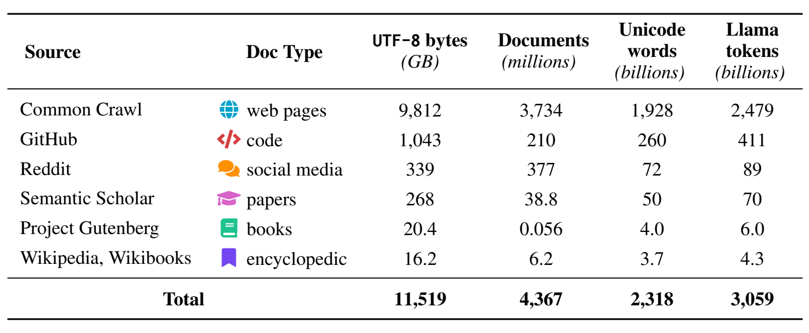
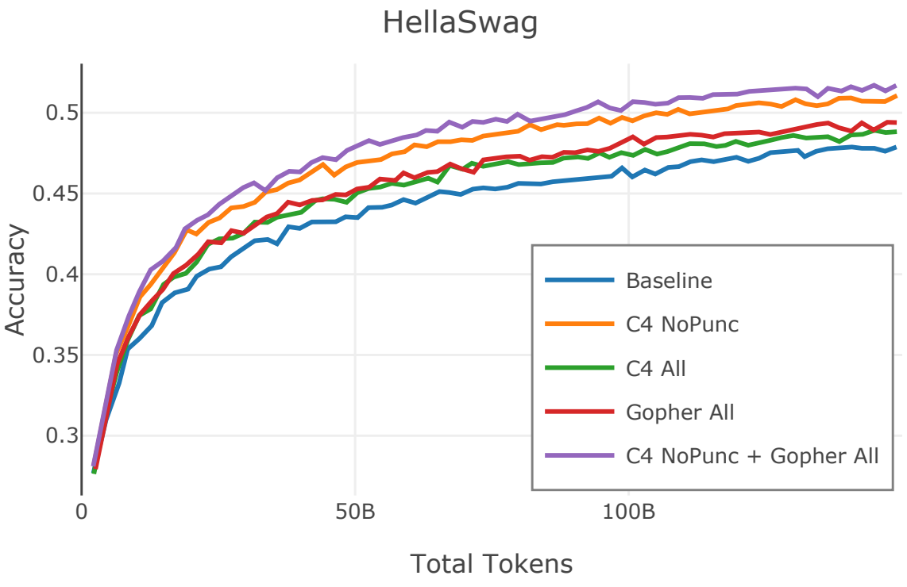
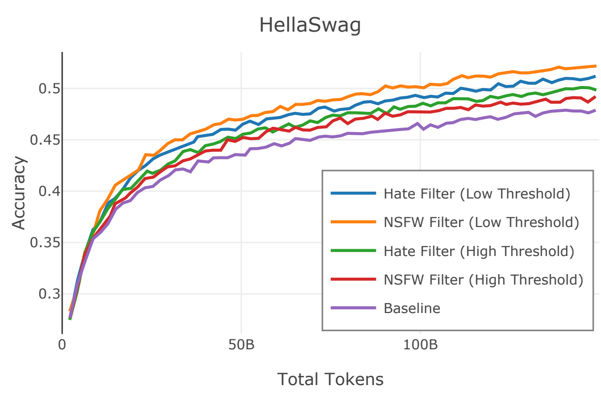
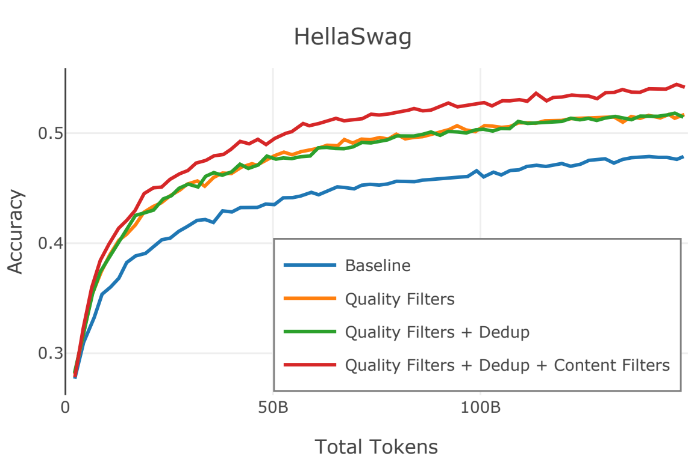
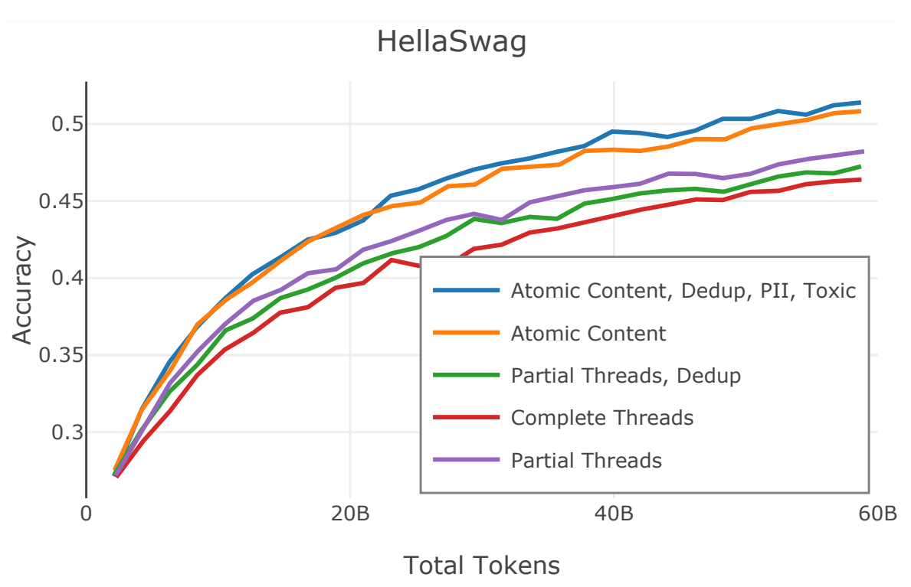
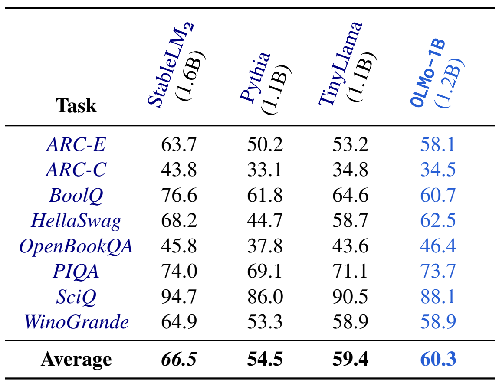
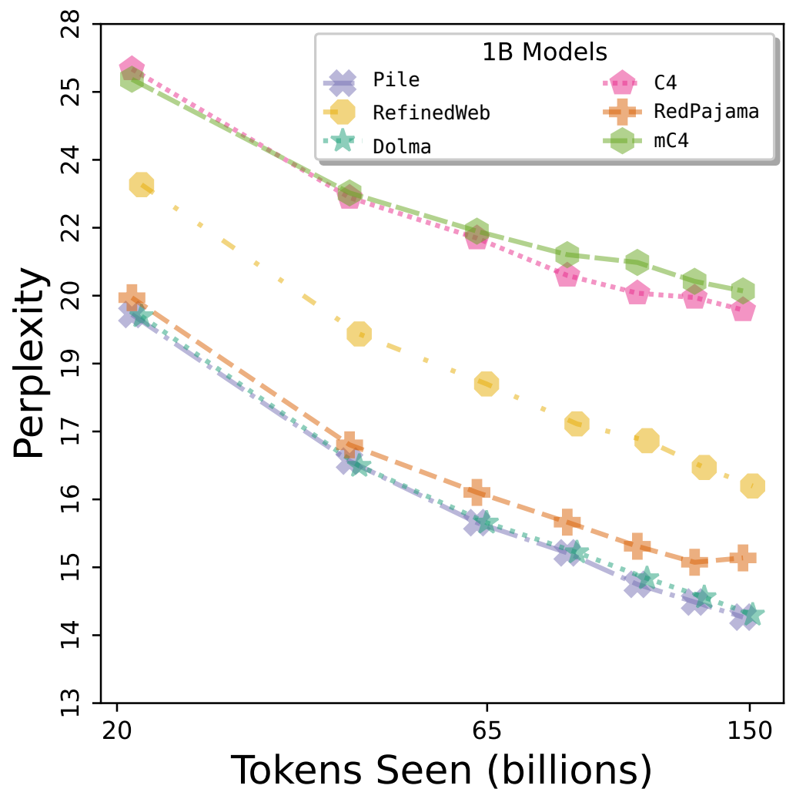

# Dolma：包含三万亿Token的语言模型预训练研究开放语料库

## 摘要

关于训练当前最佳性能语言模型的预训练语料库的信息很少被讨论——商业模型很少详细说明它们的数据，即使是开源模型也往往在没有训练数据或再现方法的情况下发布。因此，要在语言建模方面进行并推进科学研究变得十分困难，比如理解训练数据如何影响模型的能力和局限性。为了促进语言模型预训练方面的科学研究，我们整理并发布了Dolma——一个包含三万亿token的英文语料库，该语料库由多样化的网络内容、科学论文、代码、公共领域书籍、社交媒体和百科全书材料构建而成。我们对Dolma进行了详尽的记录，包括其设计原则、构建细节及其内容概要。我们展示了针对Dolma中间状态的分析和实验结果，分享了我们在重要数据整理实践中学到的经验。最后，我们将我们的数据整理工具开源，以使我们的工作可以被复现，并支持更大规模的数据整理研究。

## 引言

语言模型现在是解决众多自然语言处理任务的核心，包括少样本学习（few-shot）、摘要生成、问答系统等。在大多数情况下，最强大的语言模型是由少数几个组织构建的，而这些组织往往不会公开大多数模型开发的细节。特别地，即便是像Llama 2这样的模型已经向公众发布使用，语言模型的预训练数据组成也常常被模糊描述。这妨碍了人们对预训练语料库组成如何影响模型能力和局限性的理解，进而影响了科学进步以及与这些模型互动的公众。我们的目标是通过开放的语料库来增加在语言模型科学研究中的参与度：

- 数据透明性有助于开发者和用户在依赖于语言模型的应用程序中做出更为明智的决策。例如，模型在与其预训练数据更相似的任务上表现得更好，或者预训练数据中的社会偏见可能在使用这些模型时需要额外的关注。
- 开放的预训练数据对于分析其构成如何影响模型行为是必要的，这使得训练模型的人能够审查并改进当前的数据处理方法。这类研究的例子包括记忆效应、去重、对抗性攻击、基准测试污染以及训练数据的归属分析。

为了支持在这些研究方向上更广泛的参与和探究，我们提出了“开放语言模型数据集”（Data for Open Language Models' Appetite，简称Dolma），这是一个包含三万亿token的开放语料库，旨在支持语言模型预训练研究。我们的大部分数据来源于与以往工作中类似的数据源，包括来自Common Crawl的网页文本、Semantic Scholar的科学研究、GitHub的代码、公有领域的书籍、Reddit的社会媒体帖子以及Wikipedia的百科全书资料。相较于其他公开可用的预训练语料库，Dolma在保持数据多样性的同时提供了更大数量级的token，且质量相当。总的来说，我们的贡献体现在两个方面：

我们发布了Dolma语料库，这是一个多来源、多样化的收集过程，包含了从六个不同的数据源获取的超过3万亿个token，覆盖了超过40亿份文档，这些数据源（i）常见于大规模语言模型的预训练中，（ii）向公众开放。表1提供了每个来源数据量的高层次概览。

<b>表 1: Dolma语料库一瞥。它包含了从多个领域采样的三万亿个token；在整理前来源于大约200TB的原始文本，最终缩减为一个11TB的数据集。该数据集已经过广泛清洗，适用于语言模型的预训练。token数是使用LLaMA tokenizer计算得出的。</b> 

我们开源了Dolma Toolkit，这是一个高性能、可移植的工具，旨在高效地整理用于语言模型预训练的大规模数据集。通过这个工具包，从业者不仅可以重现我们的数据集，还可以研究和改进数据整理。

## 近期工作

**在语言模型预训练研究中封闭的数据整理。**语言模型研究的预训练数据在数据访问以及关于数据本身或其整理的关键细节的文档方面变得越来越封闭，这些细节本可以使再现工作或进一步的科学研究成为可能。闭源的模型（如GPT-4，OpenAI，PaLM 2，Claude，Anthropic）几乎不披露任何信息（甚至不包括语料库大小或数据来源），也不共享数据。尽管强大开源模型的发布在增加，但很少有模型会随同其训练数据一起发布；例外情况包括基于C4的T5、基于ROOTS的BLOOM、GPT-J、GPT-NeoX、基于The Pile的Pythia以及基于RedPajama v1的INCITE。最强大的开源模型（如Llama 2、Mistral、Yi、Qwen）不共享它们的数据，也没有提供足够的细节来进行再现。在大规模语言模型预训练过程中，公开数据整理文档的情况包括LLaMA（已发布的模型，未发布的数据）、Gopher（未发布的模型和数据）以及Falcon（已发布的模型，部分数据已发布）。附录§C进一步说明了开放模型和封闭模型的数据整理实践中存在的诸多未知数，以及促使我们工作的远离开放数据实践的近期趋势。

**用于语言模型预训练的开放式语料库。**我们认识到之前在整理、记录和发布开放语料库以支持语言模型预训练研究方面的努力。然而，这些先前语料库中存在的局限性促使我们整理一个新的数据集：

- C4（175B tokens）和The Pile（387B tokens）是高质量的数据集，并且已经在训练语言模型中得到了验证，但遗憾的是它们在规模上有所限制。ROOTS虽然规模较大（约400B tokens），但由于其多语言的特点，其英语的部分只占数据集的30%，因此对于仅训练英语的模型来说提供的token太少。我们认识到，规模和英语的集中度并不意味着“更高品质”的数据集；相反，某些研究方向需要这些重点，这促使我们创建新的语料库（详见§3）。

- 虽然Falcon（580B token）和RedPajama v2（30T token）满足我们的规模标准，但它们完全是从Common Crawl的网页中提取的，因此缺乏在为最大的语言模型整理数据时通常所针对的数据源多样性（例如，科学论文、代码）。我们还注意到RedPajama v2只是经过了轻微的整理，大多是以原样分发CCNet输出的内容，因此将过滤的负担放在了模型开发者身上，让他们在训练前自行决定过滤规则。

- RedPajama v1（约1.2T tokens）与我们的目标最为相似，并且在设计Dolma时为我们提供了灵感。虽然RedPajama v1是对LLaMA训练数据的具体再现，但我们有着更广泛的再现目标，这需要我们深入探索RedPajama v1未曾追求的数据源，包括更大规模的科学论文和社会媒体论坛，如Reddit（详见§3）。此外，最近的工作发现了数据质量问题，建议在进行昂贵的语言模型训练之前，对RedPajama v1进行显著的额外清理。

在本文稿接受审查期间，有几个其他用于语言模型的开放语料库已经被发布，包括FineWeb、Zyda，以及用于训练LLM360 Amber、LLM360 K2和MAP-Neo模型的数据集。

## 数据设计目标

我们提出了Dolma的设计目标，并讨论了这些目标是如何指导我们在数据整理过程中的决策的。通过分享这些目标，我们希望能让Dolma的使用者了解其优势和局限性，同时也希望强化在数据集整理研究中关于此类披露的内容（参见Bender和Friedman中的整理理由以及Gebru等人中的动机问题）。

**与之前的语言模型预训练方法保持一致。**通过匹配已知的其他语言模型语料库所使用的数据源和方法，我们使更广泛的研究社区能够利用我们的成果来研究（甚至是审查）当今开发的语言模型，包括那些在封闭环境中开发的模型。在这个再现过程中，我们在已知范围内遵循既定的做法。值得注意的是，这也意味着将Dolma的范围仅限定在英语文本上，以便更好地利用已知的数据整理实践，并最大化在Dolma上进行的科学研究对现有语言模型的通用性。

**若有疑问，做出有证据支持的决定。**尽管如此，仍然存在许多数据整理决策是没有单一明确方案的，无论是因为最佳实践尚未可知，还是因为实现方式在细微之处有所不同。在这种情况下，我们优先考虑那些能够使在Dolma上训练的语言模型在多种任务和数据集上表现最优的决策（见§4.2）。

**用大规模数据训练大型模型 。**Hoffmann等人（2022）提出，可以通过保持语言模型大小（以参数计）与最小训练token数之间的固定比例来训练计算最优模型。近期遵循这些“扩展法则”的工作，例如Llama 2，表明通过增加训练token的数量仍有提升性能的空间。我们旨在建立一个足够大的语料库——2~3T token——以允许进一步研究模型大小与数据集大小之间的关系。

**作出必要的调整以保持开放性。**我们工作的核心原则是开放性，我们将其定义为（i）共享数据本身和（ii）记录整理数据的过程。这一要求意味着，由于在公开进行数据集研究时会出现额外的实际、法律或伦理考量，我们有时必须偏离已知的方法。例如，尽管像Books3这样的数据源被用于训练如LLaMA这样的语言模型，但由于围绕人工智能使用受版权保护材料的持续法律案件，我们避免使用此类来源。同样，尽管以前的方法中没有讨论过个人身份信息的移除，我们还是会执行这种过滤，以减轻与数据发布相关的风险。

## 数据整理方法

### Dolma工具箱

预训练数据整理需要定义复杂的管道，将来自多个来源的原始数据转换为单一的、清理过的纯文本文档集合。为了整理Dolma，我们创建并开源了一个高性能的工具包，以促进对数百太字节文本内容的高效处理。我们的工具包将常见的数据整理步骤统一为“过滤”和“混合”操作：

**过滤操作**：我们将常见的数据转换统一为单一的实现，如语言、质量或内容过滤。给定一个配置——一个文本单元（例如，文档、段落、句子等）、一个评分方法（例如，线性分类器、语言模型困惑度、正则表达式匹配）和一个删除策略（例如，删除、替换为字符串），我们的工具包通过识别和移除大规模的不需要的文本，实现了过滤操作的并行化。对于Dolma，我们使用这些方法在文档和子文档级别过滤非英语、“低质量”或不自然、有毒性和个人身份信息（PII）。在内部测试中，为了复制C4的方法，我们的工具包以每（TB）122个CPU小时的速度执行过滤；作为参考，使用具有192个vCPU的c6a.48xlarge实例处理总计200TB的全部“原始”Dolma文件将需要5天的时间。

**混合操作**：我们将常见的跨文件操作统一到单个的Rust模块中，这些操作包括增/减采样、去重和净化，该模块可以在文件之间“混合”内容，形成更小的文件集。例如，我们可以通过在混合过程中重复读取相同的文件路径来实现增采样。我们还实现了一个与我们的混合器兼容的布隆过滤器，这使得能够在线性时间内进行重复项的概率检测。我们可以通过首先用测试样本来填充布隆过滤器，然后在混合预训练数据时标记任何检测到的重复项，从而将此方法重新用于测试集的净化。

### 数据消融

为了帮助我们做出知情决策，我们会进行数据削减实验，即在遵循特定数据整理决策或干预措施的数据集上训练语言模型，并评估所得模型在一系列测试数据集上的性能，以此对比基线数据集的表现。通过在控制模型架构和训练不变的情况下比较干预结果和基线结果，我们可以隔离特定数据集整理决策对下游模型的影响。

**模型训练。**我们使用开放语言模型OLMo系列中的一个含有1.2B参数的decoder-only模型来进行数据消融实验。这与之前工作中用于消融实验的模型大小是一致的。由于完成此类模型的训练成本非常高，尤其是在每次重要的数据整理决策都需要进行这些实验时，我们在达到150B token之前就提前终止模型训练。更多关于我们的训练设置的细节见附录D.1。

**任务和测试数据集**。为了选择我们的评估任务和数据集，我们优先考虑那些（i）已被用于先前的语言模型预训练评估的数据集，（ii）能够捕捉语言模型知识和能力的多样范围，以及（iii）我们可以避免测试集污染的数据集。我们最终选定了8个数据集用于我们的评估过程（详见附录§D），这些数据集此前已被用于语言模型研究（例如，LLaMA，Llama 2等），并且涵盖了多种能力（例如，问答，常识推理等）。完整的测试集污染分析验证了我们对数据集的选择，详见附录§L。

**测评。**我们使用zero-shot来评估我们的数据削减模型，将每一项任务转化为文本分类，遵循Min等人提出的在截断方法，使用Prompt Source提供的提示，并采用类似于Eleuther评估框架的内部评估系统。

## 构建Dolma-Web

在本节中，我们描述Dolma的网页子集，它包含来自Common Crawl的2.28T个Tokens，Common Crawl是一个收集了自2007年以来爬取的超过250B个网页的数据集。Common Crawl以snapshots的形式组织，每个snapshots对应对其URL的一次完整爬取；截至2024年2月，共有97个snapshots。我们使用了从2020-05到2023-06之间的25个snapshots。

### 数据下载和语言过滤

我们的网页管道利用CCNet进行语言过滤和初始内容去重。CCNet被用于开发其他语言模型数据集，例如LLaMA、RedPajama v1和RedPajama v2的数据集。CCNet使用FastText语言识别模型来处理每个网页，以确定每份文档的主要语言；我们保留所有英语文档得分大于或等于0.5的页面（按字节大小计算，去除了61.7%的数据）。此外，CCNet通过将每个snapshots中的碎片分组为小型集合并移除重复的段落来识别并移除非常常见的段落。这一步骤大约移除了70%的段落，主要由标题和导航元素组成。总体而言，CCNet管道从Common Crawl的175.1 TB内容中过滤出了84.2%的数据，最终保留了27.7 TB。更多细节请参见我们的数据清单§N。

### 质量过滤

网络爬取的数据在用于语言模型训练之前需要进行大量的清理工作；不希望的内容范围从HTML转换为纯文本时引入的无关内容（例如，页面标题、格式错误的文本）到缺少内容的页面（例如，模板文本、短片段）。根据Rae等人（2021）和Almazrouei等人（2023）提出的反对基于模型的质量过滤的观点，我们通过结合Gopher和C4引入的启发式方法来进行质量过滤。具体来说，我们保留了所有的Gopher规则（Gopher All），并保留了C4中的单一启发式规则，该规则用于移除非以标点符号结尾的段落（C4 NoPunc），而不是采用整套的C4规则（C4 All）。所有过滤规则的实现细节都在我们的数据表§N中提供。

<b>图 1: 我们发现在整个训练迭代过程中，相对于无过滤基线，网页数据的质量过滤对1.2B参数模型的性能有正面影响。在这里我们只展示了HellaSwag的结果；其他评估数据集的所有图表都在附录§O中。</b> 

消融实验的结果如§1所示，验证了我们的过滤策略：我们发现仅使用C4 NoPunc在困惑度和下游任务上的表现都优于C4 All以及Gopher All。最后，将Gopher All与C4 NoPunc相结合提供了最佳的性能。总的来说，Gopher All标记了15.23%的UTF-8字符以供移除，而C4 NoPunc标记了22.73%的字符以供移除。

**模型过滤器和启发式过滤器是正交的。**CCNet还使用KenLM困惑度提供质量评分，该评分依据的是文档与Wikipedia的相似度；这些评分通常被解释为高质量（21.9%）、中等质量（28.5%）或低质量（49.6%）的内容，其中更接近Wikipedia的内容通常被认为质量更高。令我们惊讶的是，我们发现我们的启发式过滤规则并未影响这些比例，这表明基于模型的质量过滤可能捕捉到了与启发式过滤正交的其他信号。

### 内容过滤

**过滤有害内容。**从网络采样的数据通常包含有害或有毒内容。这些内容通常会被过滤掉，以尽量减少下游语言模型生成有毒内容的可能性。为了从Dolma中删除此类内容，我们在Jigsaw有毒评论数据集上训练了自己的FastText分类器，生成了两个模型，分别用于识别“仇恨”和“NSFW”内容。实施细节见附录§H。我们在Common Crawl句子上运行这些分类器，并删除任何得分超过设定阈值的句子。

<b>图 2 : 我们发现网络数据内容过滤器对 1.2B 模型的性能有积极影响，与无过滤基线相比，在训练迭代中进行评估。我们在此仅展示了HellaSwag的结果；其他评估数据集的所有数据见附录§O。</b> 

为了探索过滤阈值对Dolma的影响，我们进行了数据消融实验，选择了两个非常不同的阈值来进行内容过滤（§2）。我们发现“高阈值”（τ = 0.4）移除了较少的内容（5.5%至7.3%），但通常比“低阈值”（τ = 0.0004）带来的下游性能要低，后者移除了更多的内容（29.1%至34.9%）。

在权衡数据集规模（“高阈值”）与性能最大化（“低阈值”）之间的折衷后，我们采用了较为宽松的“高”阈值，以确保我们满足最低标记数量的要求。这种情况的发生令人意外：我们的质量、内容和去重过滤器在移除的文本上几乎没有重叠（图9），导致在组合使用时产生了复合的过滤效果。在未来的Dolma版本中，我们将从更多的Common Crawl开始，并采用更严格的过滤阈值。

**过滤个人身份信息。 **从网络中抽取的数据也可能泄露用户的个人身份信息（PII）。PII的痕迹在大规模数据集中十分普遍，而且语言模型也被证明会在推理时再现PII。Dolma的规模使其无法使用Presidio这样的基于模型的PII检测器；相反，我们依赖精心设计的正则表达式，虽然牺牲了一些准确性，但获得了显著的速度提升。根据Subramani等人（2023）的研究，我们专注于三种可以用高精度检测的PII类型：电子邮件地址、IP地址和电话号码。对于包含5个或更少PII片段的文档，我们用特殊标记替换这些片段（例如，|||EMAIL_ADDRESS|||）；这影响了0.02%的文档。否则，我们移除包含更多PII片段密度的整个文档；这影响了0.001%的文档。在数据削减实验中，我们发现关于PII（例如，移除与特殊标记替换）的执行细节对模型性能没有影响，考虑到受影响数据的比例极小，这是可以预期的。有关实现细节，请参见附录§I；所有评估套件结果的数据均在附录§O中。

### 重复数据删除

在模型训练过程中，重复数据删除已被证明能有效提高token效率；因此，它已成为预训练数据配方中的常见做法。在Dolma中，我们进行了三个阶段的重复数据删除：

（i）精确的URL去重过滤掉了53.2%的文档。

（ii）精确的文档去重过滤掉了14.9%的已URL去重的文档，包括空文档。

（iii）精确的段落去重过滤掉了18.7%的来自已URL去重文档的段落，包括空段落。

这种多阶段的方法旨在提高效率：阶段（i）因其计算效率而通常首先使用。阶段（i）和（ii）的设计目的是移除相同项目的副本，例如同一URL的重复爬取和具有多个URL的相同页面（例如，在多个在线新闻网站上的同一新闻文章）。在任何内容或质量过滤之前尽早执行这些步骤大大减少了需要处理的文档数量。相比之下，阶段（iii）移除常见的模板内容（例如，同一作者所有文章下的署名）；由于段落移除可能会扰乱内容分析，所以我们将其放在最后执行。我们按照§4.1中所述使用布隆过滤器来执行这三个阶段的操作。

### 整合操作

总之，Dolma网络管道通过URL和文档级重复数据删除，然后是质量和内容过滤，最后是段落级重复数据删除，对CCNet的输出进行转换。

<b>图 3 : 我们发现，与不进行过滤的基线相比，在将质量过滤、内容过滤和段落级重复数据删除叠加在一起时，1.2B模型的性能（在各次训练中进行评估）会产生积极的复合效应。我们在此展示了在HellaSwag上的结果；其他评估数据集的所有数据见附录 §O。</b> 

我们展示了我们的网页管道所有阶段对下游模型性能的积极复合效应，这是通过我们的数据消融实验（§4.2）来评估的。我们在附录§K中提供了汇总统计信息。

## 构建Dolma-Code

在本节中，我们描述Dolma的代码子集，它包含来自GitHub的411B个tokens。

### 数据下载和语言过滤

如同之前的代码语言模型工作（例如，StarCoder），我们也通过Stack获取代码，Stack是一个去重但除此之外未经筛选的许可宽松的GitHub仓库集合。该数据集的原始版本是在2023年3月收集的。我们过滤掉了诸如JSON和CSV等扩展名的数据密集型文件。

### 质量筛选

我们应用了从RedPajama v1和StarCoder的代码子集中得出的启发式规则。RedPajama v1使用规则来移除重复的文件前言，比如许可证声明，以及包含过长行或主要是数字内容的文档。总体而言，RedPajama v1移除了主要是数据或通过模板生成的文件。为了选择高质量的代码片段，我们也使用了StarCoder流水线中的规则；这些启发式规则过滤掉了没有或只有少量星标的GitHub仓库，评论过少或过多的文件，以及代码与文本比率较低的HTML文件。所有过滤规则的实现细节都在我们的数据表§N中提供。

在进行数据削减实验时，我们发现，相比仅使用RedPajama v1的规则，结合RedPajama v1和StarCoder的规则会导致在代码数据集（例如，HumanEval）上的困惑度降低，并且在我们评估中的数据集上表现更好。因此，我们选择在这部分Dolma代码子集中使用这两种过滤规则的组合。

### 内容过滤

我们应用了与网页子集（§5）中相同的启发式方法来过滤和屏蔽PII（个人身份信息）。此外，我们通过运行detect-secrets库来过滤包含代码秘密和特定于软件的个人信息的任何文档，并移除任何匹配的文档。

### 重复数据删除

我们从Stack的已经去重的版本开始，该版本使用了Allal等人（2023）首次引入的管道，该管道使用MinHash和局部敏感哈希（Locally Sensitive Hashing）来查找相似的文档。

## 构建Dolma-Social

在本节中，我们描述Dolma的社交媒体子集，它包含来自Reddit数据的80B个tokens。

### 数据集下载和语言过滤

我们从2005年12月至2023年3月通过Pushshift获得的378M篇帖子中提取了这个子集。我们包含了提交的内容——即Reddit对话中的初始消息——以及评论（即对消息的回复）。Reddit帖子的树状结构允许根据线程的各个组成部分如何被线性化用于语言模型预训练，有多种可能的数据格式。为了更好地指导这一转换，我们对几种方法进行了数据削减实验。

- **原始内容**：将所有评论和提交的内容作为独立的文档处理。
- **部分主题**：将同一个对话中的评论组合成用户间的多轮对话。提交的内容作为独立的文档处理。
- **完整主题**：将提交内容与其所有子评论合并为一个文档。

有关实现细节，请参见附录§E。从图4的结果来看，我们将提交内容和评论作为独立的文档处理（原子内容）会带来更好的评估套件性能。我们假设在合并线程元素时引入的人工格式对语言模型训练产生了负面影响；我们把进一步的研究留待将来的工作。最后，我们使用§5.1中的方法来过滤非英语内容。

<b>图 4 : 使用1.2B模型对不同的Reddit采样方法进行实验，在训练迭代中进行评估。我们在此只展示了在Hel- laSwag上的结果；其他评估数据集的所有数据见附录§O。</b> 

### 质量过滤

就像网络爬取的数据一样，社交媒体帖子在进行语言模型训练前也需要大量的清理工作。我们借鉴了Henderson等人（2019）引入的管道来过滤提交内容和评论。我们移除了短于500个字符的评论，以及短于400个字符的提交内容。我们还移除了超过40,000个字符的文档。

我们移除了得票少于3票的评论，因为得票较低的评论更可能是深度嵌套在对话线程中的内容，或者是更可能导致情绪化讨论的内容。投票已经被用作构建WebText和OpenWeb-Text语料库的一个信号。我们丢弃了作者删除的、版主移除的，或者作者标记为“18岁以上”的文档。我们排除了任何源自26123个被禁或不适合工作的（NSFW）子论坛的文档。

### 内容过滤

我们应用了与§5.3中相同的内容过滤方法，但由于许多Reddit文档的长度较短，因此我们不是屏蔽PII，而是完全移除这些文档。

### 重复数据删除

我们采用了与网页管道中（§5.4）相同的战略。由于提交内容和评论比网页文档要短，我们只在文档级别进行去重。这一策略有助于减少“copypasta”现象（为了喜剧效果而在评论和子论坛中重复相同的文字）以及其他重复信息的出现频率。

## 汇集其他数据源

在本节中，我们简要总结了用于生成Dolma的其他高质量来源。关于收集和处理的更多细节请参见数据表§N。

**C4用于精选的网页内容**：类似于LLaMA和Llama 2的数据整理方法，我们使用C4来补充我们的网页子集。我们进一步通过我们的完整网页管道重新处理这些数据（不包括URL去重）（§5），这移除了更多的低质量及重复文本，并执行了PII（个人身份信息）的屏蔽。

**学术文献的语义学者**：peS2o数据集是一个包含了大约40 million开放访问学术论文的集合，这些论文经过了清理、过滤、去重和格式化，以便用于预训练语言模型。它来源于Semantic Scholar Open Research Corpus。由于这个数据集是为了语言建模目的而创建的，我们直接使用它而不做修改。

**Gutenberg计划**：Project Gutenberg是一个包含了超过7万本公共领域书籍的仓库。我们在2023年4月收集了Project Gutenberg的存档。我们使用英语书籍，并采用§5.1中描述的相同方法进行过滤。我们基于书名的确切匹配来对此数据集进行去重。

**维基百科和维基图书的百科全书式内容**：这个数据集是从2023年3月的Wikimedia备份中衍生出来的。我们使用“English”和“Simple”版本的Wikipedia和Wikibooks作为Dolma百科子集的基础。数据源是使用WikiExtractor处理的。我们移除了任何包含25个或更少UTF-8分段单词的文档，因为我们发现较短的页面要么是短模板页面的结果（例如，只包含几个词和一个信息框的页面），要么是XML解析错误。按设计，这个数据集中不包含重复的文档。

## 在Dolma上训练语言模型

作为Dolma管道的最终验证步骤，我们训练、评估并发布了一个Decoder-only的自回归语言模型，我们称之为OLMo-1B。我们展示了OLMo-1B在一系列下游任务上的zero-shot实验结果，表明其质量与已发布的同尺寸的其他语言模型相当。

### 评估 OLMo-1B

在表2中，我们将OLMo-1B与其他1B参数量级的模型进行了比较。我们注意到，尽管所有模型的参数数量大致相同，但只有TinyLlama与OLMo-1B训练所用的tokens数相近。Pythia所使用的tokens数几乎是OLMo-1B的十分之一，而StableLM在一个包含2万亿tokens的数据集上训练了两轮（未共享数据组成）。不过，我们发现OLMo-1B在平均表现上优于最相近的模型TinyLlama，在我们评估套件§4.2中的8项任务中有4项表现超过了TinyLlama。尽管对于较小的1B参数模型来说，这类任务的zero-shot评估往往具有挑战性，但我们看到所有任务和模型的表现都高于简单的随机水平。

### 衡量领域适应度

在§3中，我们阐述了整理Dolma以涵盖多样化来源的决定理由。在本节中，我们使用OLMo-1B来评估Dolma的文档分布是否会导致预训练语言模型更好地适应多样化的文本域，相比于使用其他开放语料库进行训练的情况。为了代表多样化的领域，我们使用Paloma，这是一个包含数百个细粒度文本来源的分层集合；因此，在更多样化的数据集上训练应该会产生在Paloma上有更低整体困惑度的模型。我们重复了我们的数据削减方法，在来自C4、mC4（仅限英文）、RedPajama v1、RefinedWeb、The Pile和Dolma的150B Token样本上训练1.2B参数的模型。

<b> 表 2 : OLMo-1B 和其他类似大小的语言模型在我们的评估工具上的比较。</b> 

从图5的结果中，我们观察到以下几点：（1）尽管The Pile的总体规模较小，但由于它包含了许多多样化的来源，因此在这个数据集上训练的模型表现良好。（2）较大的多来源数据集，如Dolma，以及在较小程度上的RedPajama v1，产生的模型在多样化的领域覆盖上与The Pile相似。（3）最后，在单来源语料库如C4、mC4（仅限英文）和RefinedWeb上训练得到的模型，在适应多样化领域的表现较差，这体现在较高的平均困惑度上。

<b> 表 5 : 1.2B参数的语言模型在Dolma和其他开放语料库中的150B个tokens上进行了训练，并在Paloma的不同领域上通过训练迭代评估了其困惑度。</b> 

我们控制的困惑度揭示了包含来自多种精选来源的非网络数据的重要性。我们从Paloma使用的指标显示了模型如何更好地适应更多样化的数据，因为它等量地从每个来源的token领域中采样，而不是按照来源中不平衡的比例。直观上来说，那些在“The Pile”数据集上训练的模型非常适合这样的数据，因为该预训练语料库主要来源于类似的较小规模、精心挑选的数据源。但是当我们希望扩大语料库中的总token数时，挑战就变成了如何在不损失如Paloma这样多样化评估的采样效率的情况下，整合更多的可用网络数据。在这种情况下，我们看到尽管包含了更大比例的网络数据，OLMo-1B的困惑度曲线几乎与The Pile模型相匹配。

## 结论

在本文中，我们介绍了Dolma，这是一个包含三万亿个tokens的英文语料库，用于语言模型的预训练。Dolma语料库包含多样化的资源，包括网页文档、科学论文、代码、公共领域的书籍、社交媒体以及百科全书式的资料。基于一份明确的需求列表，我们记录了数据整理流程，并提供了支持我们决策的实验结果。作为OLMo项目的一部分，我们免费发布了Dolma并开源了所有用于整理此数据集的工具。自撰写之时起，我们对Dolma进行了改进并持续发布更新；例如，Dolma v1.7的后续版本在保持模型不变的情况下，在下游任务上带来了显著的性能提升。我们希望这一系列的工作能够促进语言模型领域的透明度、可重复性和进一步的研究，并解决商业和开源语言模型预训练数据可用性上的现有差距。我们在ODC-By许可下发布Dolma，并在Apache 2.0许可下发布我们的工具包。

## 局限性

**仅收集了英文。**Dolma被整理时仅包含英语数据。但由于语言识别工具可能存在误漏检的情况，Dolma中可能会包含少量的非英语数据。这些非英语数据的痕迹不太可能对任何在Dolma上训练的模型在处理非英语任务时产生有意义的表现。因此，Dolma强化了英语作为自然语言处理“默认”语言的前提条件。

**Dolma信息源的代表性。**如第3节所述，要整理出一个能够代表所有语言模型数据整理实践的语料库是不可能的。此外，许多开源和专有的语言模型都是在一些无法获取或重新分发的内容上进行训练的，因此这些内容不能被包含在Dolma中。

**用于消融实验的单一模型配置。**我们用来验证数据整理流程的实验设置只覆盖了用于创建语言模型的模型类型的一个子集。例如，虽然许多语言模型的参数量范围在7B到70B之间，但我们训练的是1B参数的模型；此外，我们没有研究任何除密集自回归变换器模型之外的替代架构。这一选择是由需要高效地迭代多种可能配置所决定的，但这可能导致的设计决策在更大规模的模型上并不适用。我们期望下游模型开发者在使用Dolma训练他们的语言模型之前对其进行仔细审查，类似于我们在第9节中概述的过程。

**评估工具中包含的任务有限。**如第4.2节所述，我们选择了之前用于评估基础语言模型的任务，并且这些任务并未出现在我们的训练数据中（即，Dolma并未针对它们受到污染）。因此，我们只能评估语言模型常规用途中的一部分任务。例如，加入代码对预训练数据的影响无法完全衡量，除非模型能够生成可执行的代码；这种能力通常只有在模型经过指令跟随的微调后才能观察到。

**手动检查和评估Dolma是不可行的**。鉴于语料库的规模，全面检查Dolma以评估其内容是不可能的。虽然像WIMBD和Data Portraits这样的工具可以辅助对数据子集进行程序化检查，但它们无法提供对语料库中所有文档的评估。因此，我们无法完全描述Dolma在数据分布、内容质量和由于包含或排除特定内容而可能产生的危害方面的特性。

## 伦理方面的考虑

**在数据整理过程中最小化对个人的危害风险。**整理预训练语料库可能会通过便利访问语料库中存在的信息或者使训练出泄露个人信息或生成有害内容的模型而给个人带来风险。为了在满足我们既定目标的同时将这些风险最小化，我们在项目早期阶段就与法律和伦理专家进行了合作，并根据他们逐案提供的反馈来评估数据设计决策。总体而言，当有公认的实践时我们会遵循（例如，对某些个人身份信息进行遮罩），而在文献中存在不同意见时，我们会采取审慎的态度（例如，识别和移除有害内容最有效的方法）。此外，我们将提供请求移除数据的工具。我们认为，在个人可能遭受重大伤害的情况下，应该在模型可再现性、性能和扩展性等理想的研究成果属性上作出妥协。

除了基于风险的方法外，还提出了其他框架来考虑语言模型数据的伦理影响。数据管理试图建立一个框架来收集和反映数据所有者的显式利益。数据信托或数据许可也可以在共享数据用于人工智能训练时实现显式同意。由于目前没有任何最先进模型是在通过这些框架收集的数据上进行训练的，因此这些方法会限制第3节中陈述的代表性目标。随着这些原则的采纳，我们将考虑将其应用于Dolma的未来版本。

**版权和公平使用考量。**截至撰写之时，适用于语言模型的版权法和公平使用原则（也称为“公平交易”）的法律环境大多尚未确定。在美国，法律学者和从业者提出，使用受版权保护的内容来训练模型可能构成公平使用，同时也认识到在此应用中现行原则的局限性。此外，关于在语言模型中使用受版权保护的数据的法律评估因司法管辖区而异：在2024年初，以色列和日本允许使用受版权保护的内容作为AI训练数据，尽管后者目前正在重新考虑这一框架。虽然我们使用的大多数数据集都是考虑到版权和许可问题而整理的（例如，peS2o中的开放存取论文，Stack中的开源存储库）或是已经获得了许可（例如，维基百科是在知识共享许可下发布的），我们意识到大规模的网络抓取也可能包含受版权保护的材料。然而，鉴于现有的工具，要在如此大规模的语料库中可靠或可扩展地检测出受版权保护的材料是不可能的。我们决定整理并发布Dolma是基于几个考量因素，包括我们所有的数据源都是公开可用的，并且已经在大规模语言模型的预训练中使用（无论是开放还是封闭的模型）。我们认识到，有关AI的法律环境正在迅速变化，特别是关于使用受版权保护的材料来训练模型的规定。