# 预训练数据指南：衡量数据时效性、领域覆盖率、质量和毒性的影响

## 摘要

预训练是开发高性能语言模型（LM）的初步和基本步骤。尽管如此，预训练数据的设计却严重缺乏记录，而且往往是以缺乏经验支持的直觉为指导。为了解决这个问题，我们对28个1.5B参数的Decoder only模型进行了预训练，训练数据包括：（1）不同时间；（2）使用不同毒性和质量过滤器；(3) 不同领域组成的数据。首先，我们量化了预训练数据时效性的影响。评估数据和预训练数据之间的时间变化会导致性能下降，而微调并不能克服这一问题。其次，我们探讨了质量和毒性过滤器的影响，结果表明在标准基准性能和毒性风险之间存在权衡。我们的研究结果表明，过滤训练数据并不存在放之四海而皆准的解决方案。我们还发现，不同类型的过滤器效果无法从文本特征中预测。最后，我们通过实证验证了纳入书籍和网络等异构数据源具有广泛的益处，值得优先考虑。这些发现是对文本预训练进行验证、量化和揭示许多未被记录的直觉的最大规模实验，我们希望这些发现将有助于在LM开发中支持更明智的以数据为中心的决策。

## 引言

语言模型（LM）的强大性能和创新能力取决于在海量文本数据集上的自监督预训练。所有模型开发人员都会或隐或显地决定这些数据集的组成：包括哪些数据源，是否要过滤质量和毒性等属性，以及何时收集新文档。虽然许多最著名的模型都没有记录它们的整理程序，或者只记录它们使用了哪些程序，但它们很少记录为什么要选择这些规程或这些规程有什么作用。这种文件记录上的欠缺使得实践者只能凭直觉和先例行事，而无法对其进行全面评估。鉴于预训练数据在现代语言模型中的重要作用，我们认为这种忽视数据使用的做法有损负责任的数据使用，并阻碍了高性能模型的开发。

在社区使用和讨论的少数通用LM中，普遍关注的焦点是预训练数据的规模和优化步骤的数量。在这项工作中，我们系统地测试了常见数据设计决策对模型性能的影响，特别是：收集时间、内容过滤策略（毒性/质量）和领域组成。我们从两个方面研究了这些影响。首先，我们对现有质量和毒性过滤方法的效果进行了观察测量（第 3 节）。我们记录了这些过滤方法如何影响两个主要预训练数据集（C4 和 Pile）的一系列特征。其次，我们在下游任务中严格评估了这些数据集设计决策。为此，我们评估了Decoder only的自回归语言模型，每个自回归语言模型都在沿时间、毒性、质量或领域组成的一个维度在修改的数据集上进行了预训练。

数据集的时效性（第4节）。如果评估数据是在预训练数据收集之前或之后收集的，我们就会看到性能下降的现象，而且这种缺陷并不能通过大量的微调来克服。此外，这种现象在大型模型中更为严重。虽然这种现象很少被承认，但我们发现它的影响会使新旧模型之间的比较变得复杂，这取决于评估数据集的时效性。

质量过滤和毒性过滤（第5节）。文档的质量过滤和毒性过滤对模型行为有着显著但相反的影响。质量过滤，即移除低质量文本，尽管减少了训练数据量，却大幅提升了我们在测试任务中的有毒内容生成和下游任务的表现。相反，移除有毒数据则是在减少有毒内容生成的同时，牺牲了一定程度的泛化性能。而反向毒性过滤，即移除最无毒的内容，则显示出特定的好处。此外，在高质量文本数据集上的评估结果并不一定因为移除了低质量文本而得到提升。质量过滤带来的性能影响大多是积极的，但这些好处并不能从文本特征上进行预测。这些发现表明，并没有一种通用的过滤方法适合所有情况，因此从业者需要为其具体任务开发更具针对性的质量或反向毒性过滤器。

领域组合（第6节）。表现最佳的领域包括高质量（书籍）和多样化的（网络）数据。然而，这些文本来源也是有毒内容生成的主要贡献者。尽管如此，我们发现使用这些数据源进行训练的好处通常大于针对某一特定领域的数据收集工作。因此，我们建议从业者在未来的数据收集工作中重点关注更多的书籍和多样化的网络数据。另外，我们表现最好的模型仍然使用了所有的数据源（即使在相对较小的1.5B参数规模下），因此我们建议从业者在选择数据源时应尽可能地广泛包含，即便某些数据源与下游任务的相关性较低。

据我们所知，这些实验构成了迄今为止最大规模的公开记录的语言模型数据整理研究，涵盖了28个拥有1.5B参数的模型。它们的经验结果，挑战了一些根深蒂固的、未经充分审查的预训练假设；我们认为这些结果证明了其计算成本（第8节）。由于大多数社区成员已经采用了一小部分模型来进行大部分的研究和应用（如BERT、T5、GPT-2、GPT-3），因此预训练数据整理的决策具有长期影响。我们希望这些结果能够更好地指导正在训练新一代语言模型的开发者们。

## 方法

我们测量了预训练数据整理的选择如何影响下游任务的表现。图1展示了我们的方法：每个实验都是从一个预训练数据集开始，应用一个过滤器来移除文档，然后在整理后的数据集上对语言模型进行预训练，最后在下游任务上评估该模型。

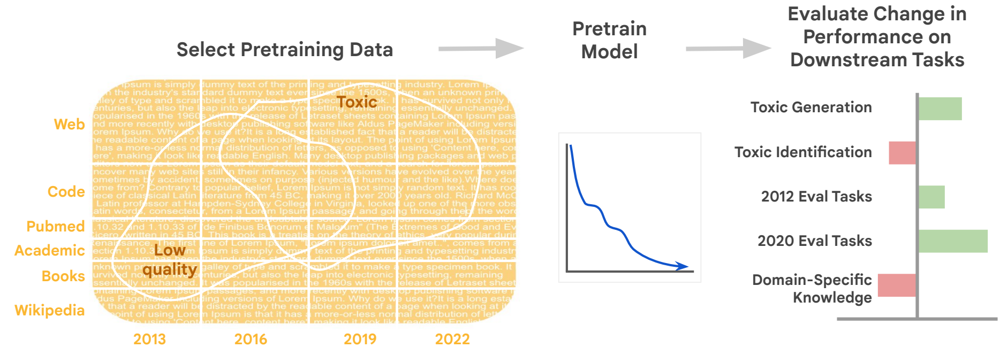

<b>图 1: 实验性的预训练数据整理流程包括三个步骤：从C4或The Pile中选取数据作为子集，预训练一个语言模型，并在多个基准上评估其性能变化。</b> 

### 预训练数据集

我们从两个常见的公开预训练数据集开始： C4 和 Pile。这两个数据集都已针对英语语言和内容质量进行了基本的启发式初步过滤。我们使用模糊重复算法对这两个数据集进行进一步去重。

English Colossal Clean Crawled Corpus (C4) 是2019年Common Crawl的存档，其中包括新闻、法律、维基百科和通用网络文档的混合文档，并对格式良好的英文文本进行了过滤。C4是用于文本训练的最广泛采用的完全开放源码数据集之一，因为它有许可授权。如表1所示，它是许多LM的关键组成部分。

<b>表 1: 以下是一份知名语言模型列表及其预训练数据的定量分析，包括所涵盖的领域；使用The Pile或C4，还包括多语言（非英语和非代码）数据的百分比；是否使用了毒性或质量数据过滤，无论是自动启发式过滤（H）还是分类器（C）；数据集是否公开（Pub），以及数据收集截至的年份。如果数据集是“部分”公开的，则表示其所有组成部分语料库是公开的，但最终的数据集混合版本不是。在所涵盖的领域中，参照自（Zhao等人，2023），其中“WEB”包括Common Crawl和其他网页抓取数据；“DIALOG”包括论坛、社交媒体和对话；“学术”包括研究论文、教科书和数学资料。</b> 

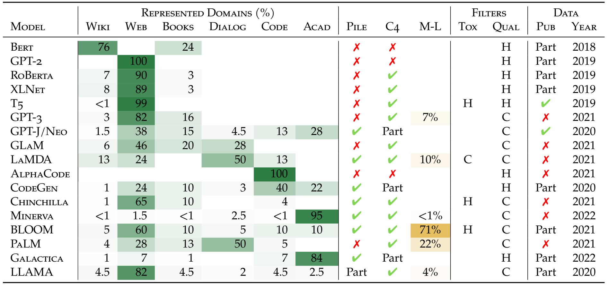

The Pile 是一个由22个来源组成的数据集，总容量为800GB。这些来源包括Common Crawl的网页抓取数据，以及更多样化的学术、图书、编程、医疗、法律和社会来源集合（见表8），这些更接近于像PaLM、Chinchilla和GPT-3系列这样的大型非开源模型所报告的数据来源。需要注意的是，The Pile的数据集构成是经过人工筛选的，并且基于数据过于有毒或过于露骨的原因排除了一些选项。

## 数据整理与筛选

我们根据3类干预措施来评估预训练数据的变化。

**数据时效性**：我们通过重新生成不同年份的Common Crawl来创建C4的新版本。而对于The Pile，则没有多个基于时间的集合可供使用。

**领域过滤**：C4 和 The Pile 都来源于多个不同的数据源，但The Pile明确界定了22个不同的来源，包括网页、维基百科文章、代码仓库、在线论坛、法律文本和研究论文档案。为了控制预训练集合的主题内容，我们有选择地移除了来自不同领域的文档（见表8）。

**内容过滤**：来自Common Crawl和其他弱管理互联网来源的数据集往往包含大量低质量、有毒或冒犯性的内容。因此，数据整理者常常会应用基于内容的过滤器。决定哪些内容应该包含，哪些不应该包含是一个具有挑战性和依赖上下文的问题：一篇“高质量”的Reddit帖子看起来并不像一篇“高质量”的学术论文；即使是学术论文，同行评审衡量的质量也有很大差异。

确定文档适宜性的方法有多种。最简单的过滤器使用诸如句子长度、停用词和标点符号的存在与否、以及重复性等特征来识别那些不含可用文本的页面。负面定义的过滤器识别出一类需要移除的文本，并假定其余的文本都是可用的。例如，Raffel等人（2020）移除了包含“不良词汇”列表中词语的文档。正面定义的过滤器则是识别出一类需要保留的文本，并移除其他所有内容。

在本项工作中，我们评估了两种文档级别的、基于分类器的过滤器对最先进的语言模型开发的影响，这两种过滤器被广泛使用。其中包括负面定义的有毒内容（含有亵渎、露骨、侮辱或威胁性质的文本）和正面定义的高质量内容（类似于已知“高质量”来源的文本）。重要的是要强调，我们并没有所谓的事实标准：在本文中，当我们使用有毒或高质量来描述文档时，是指触发了这些自动化分类器的文档，而不是指对人类读者来说确实具备这些特征的文档。

质量过滤：最近的大多数语言模型都创建了质量分类器来区分“高质量”语料和其他文档（见表1）。这些分类器通常应用于爬取的网页。高质量参考语料的例子包括：（1） GPT-3 使用的Wikipedia、WebText和书籍，（2） PaLM和GLaM 使用的Wikipedia、书籍和少数精选网站，以及（3）LLaMA 使用的作为Wikipedia参考资料的网页。在我们的工作中，我们采用了PaLM和GLaM使用的分类器，该分类器给每个文档分配一个从0（高质量）到1（低质量）的分数。我们试验了移除超过四个质量阈值的文档：0.975、0.95、0.9、0.7，同时还使用了一个逆向过滤器，该过滤器移除低于某一阈值的最高质量文档。

为了识别有毒内容，我们使用了Jigsaw的Perspective API，该API是基于在线论坛中的评论训练而成的，它会根据评论是否包含脏话/猥亵言语、基于身份的负面言论、侮辱或威胁来赋予相应的毒性评分。虽然Perspective API和其他任何分类器一样并不完美——它有时会将一些中立的文本错误地标记为有毒，并且其训练数据反映了标注者的规范性价值观——但它已被证明比基于启发式和规则的分类器更为准确。

Perspective API输出一个从0（不太可能是有毒的）到1（非常可能是有毒的）之间的分数。使用说明建议根据目标，可以采用0.3到0.9之间的分数阈值来过滤文档。我们尝试移除得分高于5个不同毒性阈值的文档，这些阈值分别是0.95、0.9、0.7、0.5和0.3。超过特定阈值的文档会被过滤掉，同时也会通过反向过滤来移除预测毒性最低、低于某一阈值的文档。

除了基于分类器的过滤器外，我们还试验了Raffel在C4数据集原始版本中使用的n元语法过滤器。这个过滤器会移除所有包含“脏话、下流、淫秽或其他不良词汇列表”中任意词汇的文档。

### 测评

为了衡量时效性、领域和毒性的影响，我们在英语任务上评估预训练模型，这些任务包括毒性识别、毒性内容生成、来自不同领域的数十个问答（QA）任务，以及带有时间注释的若干任务。在选择评估方法时，我们比较了不同模型的通用性，以及它们在预期受数据集特征影响的任务上的表现。由于我们是在比较不同预训练模型的表现，因此我们通过在每个任务相关的数据集上对每个预训练模型进行微调，并在相同的测试数据上进行评估（除非另有说明，均使用每个任务的默认划分）来评估其在下游任务上的表现。因此，任何系统性的差异只能归因于预训练的不同。对于所有任务，我们都展示相对于基线的平均性能，通常是指在未经过滤的数据集上训练的模型的表现。

**评估领域泛化能力**：我们在一个由两个问答基准合并而成的数据集上进行了评估：机器阅读问答（MRQA）和UnifiedQA，这两个基准共同包含了30个独特的问答数据集。这些问答数据集覆盖了多个领域，使我们能够衡量主题一致性的影响（见表9）。

**评估时效性的影响**：之前的研究表明，数据集的收集时间可能会影响下游模型的能力。有研究发布了一些数据集，在这些数据集中，微调时间和评估时间之间的时距增加会导致测试性能下降。我们从不同领域中选择了其中的5个数据集来评估预训练时间和评估时间之间是否存在类似的现象：PubCLS、NewSum、PoliAffs、TwiERC 和 AIC。

**评估有毒内容生成**：生成包含亵渎、性暗示、侮辱或淫秽文字，或是攻击特定群体身份或针对受保护的人类属性的文字，会限制语言模型的应用范围。我们通过设计旨在引发与性别、种族和宗教相关的偏见或有毒输出的语言模型提示来评估这种行为，并测量由Perspective API判定为高毒性分数的生成延续文本的比例。此外，我们还使用了RealToxicityPrompts数据集，该数据集包含了OpenWebText数据集中被Perspective API标记为有毒的文字摘录。

**评估毒性识别**：虽然某些应用要求语言模型不得生成有毒文本，但在其他应用中，语言模型识别此类语言的能力同样重要。毒性识别已成为主要交流平台内容审核过程中的关键步骤。定义会因环境而异，可能针对仇恨言论、刻板印象、社会偏见或某种毒性的定义。我们通过多种毒性解释来评估这一能力，使用来自Social Bias Frames、DynaHate和Toxigen的数据集进行训练和测试。

### 模型

在所有实验中，我们使用了两种规模的Decoder only、基于Transformer的语言模型，这些模型是在T5X代码库中训练的。我们的主要实验采用了LM-XL，这是一个拥有1.5B参数的Decoder only模型，类似于使用自回归预测目标训练的t5.1.1-XL架构配置。为了测量扩展效果的实验，我们使用了LM-Small，这是一个拥有20M参数的Decoder only模型，类似于t5.1.1-small配置。这些配置很受欢迎，表现出良好的性能，并且可以在没有额外微调的情况下生成文本。关于预训练和微调的更多细节可以在附录C中找到。

## 数据整理对数据特性的影响

**章节要点**

Pile中的文档平均来说比C4中的文档更长、更易读且质量更高，但包含更多的个人可识别信息（PII）。

- 书籍是一个特例领域，拥有最长、最易读、毒性最大且包含最多PII的文档，同时也包含高质量的文本。
- 高毒性及低质量的文档具有相似的大量PII，但在平均长度、质量和毒性水平上则有很大的不同。
- 最新抓取的网页文本更加多样且毒性更低，但质量也相对较低。

在评估数据删减对模型的影响之前，我们先展示了关于预训练数据集本身的观察统计数据。这一分析揭示了Pile的不同领域与C4之间的对比情况，以及数据过滤如何影响数据的特点，有时候这种影响是无意的。我们发现各种筛选之间存在显著的相互作用。

我们会计算每份文档的一系列特征，包括毒性和质量指标；个人身份信息 (PII) 类别；以及平均单词长度、可读性、类型标记比和情感等文本统计数据。有关这些特征的更多详情和分析，请参见附录 D。

**C4与The Pile的对比**：图9展示了这两个源数据集之间的差异。Pile中的文档平均来说更长（2.4倍），包含更多的非ASCII字符（1.9倍），这表明其语言范围更广，并且质量（1.2倍）和可读性（1.8倍）的评分也更高。Pile中的文档还包含更多的个人可识别信息（PII），特别是人名、地址和电子邮件。

**毒性与质量**：尽管可以合理假设高毒性应该与低质量相关，但图2显示了两者间的关系更为复杂：事实上，毒性和质量彼此之间并不一致。高毒性的文档比低毒性的文档具有更高的文本质量。此外，在被分类为低质量与高质量的内容之间，在脏话、毒性及性暗示内容等方面的特征测量几乎没有可辨别的差异。

**领域**：从图2中按领域查看Pile的特性，可以给出一种解释。书籍子集因其含有大量亵渎、有毒和性相关内容而显得特别突出，但同时其预测质量也较高。尽管我们可能会认为书籍在质量上应该是高的，因为它们通常包含有意义且经过良好编辑的句子，但它们同时也包含强烈的语言和情色主题。这也可能解释了为什么在C4和Pile中被分类为高毒性的文档要长得多（分别为2.5倍和3.5倍），包含更多亵渎词汇（5倍和4.4倍）、性暗示内容（4.6倍和4.2倍）和有毒内容（3.6倍和3.5倍）。然而，Pile中高毒性的文档出现各种个人可识别信息（PII）的可能性高1.4至1.9倍，而在C4中则不是这样。在C4中被分类为高质量的文档较长（1.3倍和1.2倍），并且包含更多姓名（1.6倍和1.8倍），但电子邮件、地址和电话号码较少。

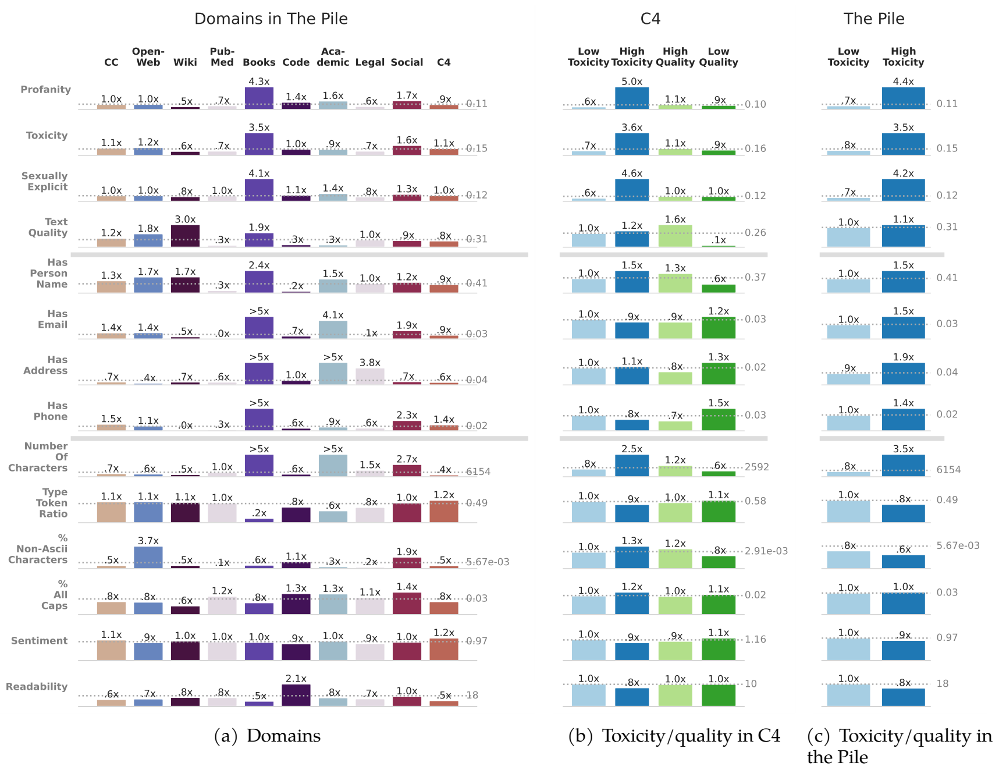

<b>图 2: 预训练数据集各部分的特征差异。柱状图显示了切片的平均特征值与数据集（Pile或C4）的平均值之间的比率，数据集的平均值由一条灰色的水平线表示。例如，Wiki文本中的脏话是一般Pile平均值的一半，而质量值则是平均值的三倍。</b> 

在我们研究的数据集中，OpenWeb提供了最多的词汇和语言多样性，具有最高的非ASCII字符和类型标记比率。在书籍和OpenWeb之前，维基百科呈现出最高质量的文本。像PubMed、Code和Academic这样的技术领域在预测质量评分上较低，这表明对网页文档过度特定的正面定义过滤器可能会移除大量的潜在有用的专业文本。

在我们研究的领域中，OpenWeb提供了最多的词汇和语言多样性，具有最高的非ASCII字符和类型-标记比率。在书籍和OpenWeb之前，维基百科呈现出最高质量的文本。像PubMed、代码和学术这样的技术领域在预测质量评分上较低，这表明对网页文档过度特定的正面定义过滤器可能会移除大量的潜在有用的专业文本。

**时效性**：比较C4在不同收集时间的数据（如图9所示），我们可以看到几个持续的趋势。近年来，非ASCII字符的百分比稳步增加，而文本的质量测量却在下降。这种增长可能是由于非英文内容的增加，但也可能对应着表情符号和非ASCII标点符号使用的增多。同时，毒性评分在近年略有下降，而情感评分则有所上升。

## 数据集时效性对预训练模型的影响

**章节要点**

- 无论是模型还是评估数据集都会变得过时。 
- 预训练数据与评估数据之间的时间错位并不能通过微调来克服。 
- 时间错位使得评估不同时间段训练的模型变得复杂，因为较旧的评估数据集可能会变得过时，而较新的评估数据集可能低估了旧模型的性能。
- 时效性对预训练的影响对于大规模模型而言比小规模模型更为显著。

虽然模型可以频繁且低成本地用新的微调数据进行更新，但由于预训练的成本较高，自然语言处理（NLP）社区一直依赖于相对少数的静态预训练模型，这些模型很少被更新或替换。BERT、RoBERTa、GPT-2 和 T5 变体，这些都在2020年之前预训练完成的模型，构成了HuggingFace上下载的所有模型中的大多数（截至2023年4月16日估计占比约为58%）。先前的工作表明，语言使用会随着时间变化，并且微调数据与评估数据之间的时间错位与性能下降有关，这种现象在不同的环境和领域中都能观察到。相比之下，我们考察了预训练数据与评估之间的时效性。在评估跨数据域的预训练时间影响时，我们可以量化这一设计对NLP领域的广泛影响。

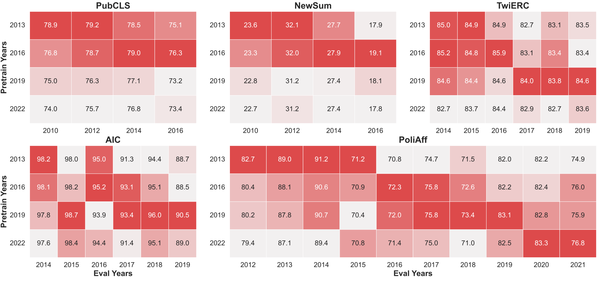

<b>图 3: 预训练与评估之间的时间错位导致性能下降。四个LM-XL分别在C4的不同时间段上进行预训练，并在五个数据集的各个时间段上进行评估。热图颜色按照列进行归一化，遵循Luu等人（2021）的方法，以显示出每个评估年份的最佳预训练年份。</b> 

我们使用四个不同年份版本的C4数据集预训练了四个自回归语言模型：2013年、2016年、2019年和2022年。对于每个版本，我们从Common Crawl数据开始，并移除所有在截止年份之后抓取的数据。遵循Luu等人（2021）的方法，我们通过使用训练集和测试集按年份划分的评估任务（来自新闻、推特和科学领域）来测量时间错位的影响。预训练后，我们将每个模型分别在每个数据集的训练年份分割上进行微调，然后在每个测试年份分割上进行评估。完整细节和结果分别见附录C.4和附录E.1。

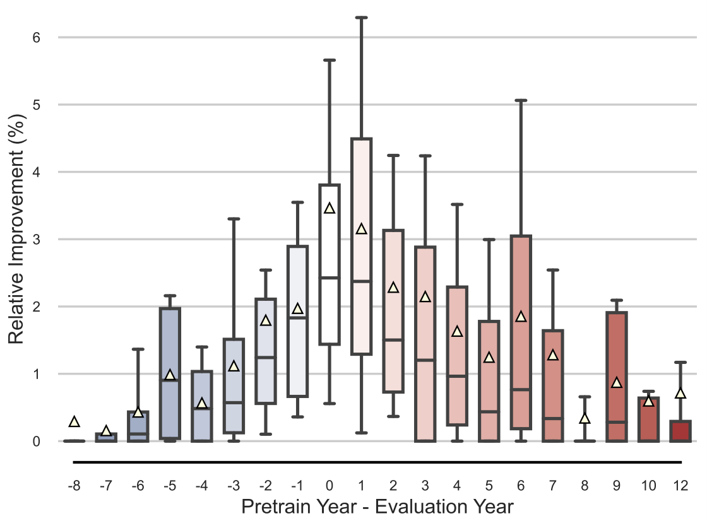

<b>图 4: 当时间错位（x轴）接近零时，5个数据集上的平均相对性能（y轴）提高。箱形图显示了中位数（实线）、平均值（三角形）、四分位数范围（box）以及其余分布（须）。请注意，每个数据集有不同的评估年份范围。</b> 

性能下降与预训练时间错位密切相关，其影响不容忽视。Luu等人（2021）对时间退化（TD）进行了形式化的定义，该定义衡量的是微调年份与评估年份相差一年时所观察到的性能变化。我们将TD推广，用来衡量预训练时间和评估时间相差一年时的效果变化，具体描述见附录C.4。此外，我们测量了性能差异与时间差异之间的皮尔逊相关系数r，以理解相关性的强度。在表2中，我们发现时间退化在微调时最高（平均为2.8），这是预料之中的，但令人惊讶的是，预训练一年的时间退化也很高（0.4）——尤其是在新闻领域。平均0.61的皮尔逊相关系数表明预训练时间错位与性能下降之间存在强烈的相关性。所有五个任务都通过了一侧Wald检验，p值<0.05，验证了斜率大于零。

<b>表 2: 时间退化（TD）衡量的是一年时间错位所带来的预期性能下降。我们首先报告了LM-XL和LM-Small在五个任务上微调与评估之间，然后是预训练与评估之间的时间退化。皮尔逊相关系数r表明了性能与时间变化之间的相关性强弱。由于预训练造成的时间退化在各个领域内是显著且持久的。所有相关性在p<0.05时都是显著的，除非另有标注。</b> 

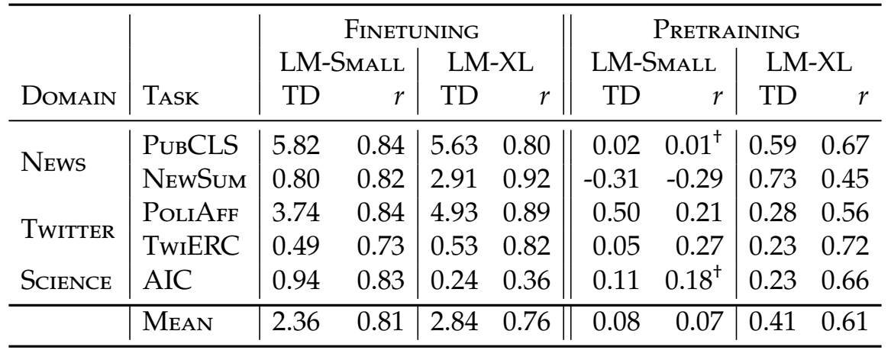

**预训练时间错位无法通过大量的微调来克服**。由于预训练造成的时间退化表明，那些在与目标评估相同时间段的数据上进行预训练的模型，相比于在远早或远晚的数据上训练的模型会有优势。值得注意的是，这种效应出现在那些已经在完整的、时间相关训练集上进行微调的模型中。这表明，即使是大量的微调也无法克服时间错位的预训练数据带来的影响。

**预训练时间错位的影响是不对称的**，并对NLP评估有影响。无论预训练数据是在评估数据之前还是之后收集的，我们都会观察到性能下降的情况。虽然我们不期望2019年的检查点在涉及COVID的问题上表现良好，但我们同样发现2022年的检查点在奥巴马时代的评估中表现不如早期的模型。特别是在图4中显示，性能下降是不对称的：当评估年份在预训练年份之后（蓝色条）时，其下降趋势比相反情况（红色条）更为陡峭。这一发现表明，模型和评估都会变得过时：旧模型在新的评估中表现不如新模型，而新模型在旧评估上的表现也不佳。这一现象对于比较不同时间预训练模型的NLP实验可能有微妙的影响。例如，对于既定但不够新的模型来说，新的评估集看起来可能比旧的评估集困难得多。同样地，旧的评估可能会低估新模型的能力。

**时间退化对大规模模型影响更大**，我们发现在LM-XL（1.5B参数）上的时间退化比在LM-Small（20M参数）上更明显。如表2所示，我们并未在LM-Small模型上发现同样的预训练时间退化效应。这表明，大规模模型可能比小规模模型对时间信息更敏感，后者可能不具备利用细微时间特征的能力。LM-Small实验的全部结果在附录E.1中提供。

## 质量与毒性过滤器对预训练模型的影响

**章节要点**

- 质量和毒性过滤器具有截然不同的效果。
- 尽管移除了一部分训练数据，质量过滤器仍显著提升了性能。
- 质量过滤器的效果无法简单通过数据集特性来预测。未来的过滤器应考虑质量的多个维度。
- 毒性过滤是一种折衷方案，它以降低有毒内容生成的风险来换取泛化能力和毒性识别能力的提升。
- 当优化毒性识别任务时，从业者应当使用反向毒性过滤。

大多数现代大型语言模型在其预训练数据集上使用了某种形式的质量和/或毒性过滤（见表1）。为了减少毒性，T5使用了n元语法过滤器，Gopher和Chinchilla使用了SafeSearch过滤器，而LaMDA使用了“安全鉴别器”。对于网络抓取的数据，质量启发式规则普遍适用，较新的模型如LLaMA、GPT系列和PaLM系列全都依赖于质量分类器。为了比较和量化这两种过滤类型的效应，我们按照第2.2节中描述的方法，在不同的阈值上实现了质量和毒性过滤器，以此来改变在Pile和C4上预训练模型时存在的有毒和低质量文本的数量。

**尽管减少了训练数据的数量和多样性，质量过滤器几乎在所有任务上都显著提高了性能**。我们看到质量过滤器几乎改善了所有下游任务：毒性识别提高了$2\%$（图5，右），大多数问答任务类别提高了$1\sim6\%$（图6）。最值得关注的是，尽管去除了$10\%$以上的训练数据，这些改进仍然得以实现，即便我们发现移除数据通常会导致性能下降（第六节）。虽然问答任务的平均性能在$T=0.975$时达到峰值，但更强的质量过滤总体上仍然优于未经过滤的基线。对于毒性识别实验，在$T=0.7$之后，即数据集中已有$55\%$被过滤掉的情况下，性能仍在提升。

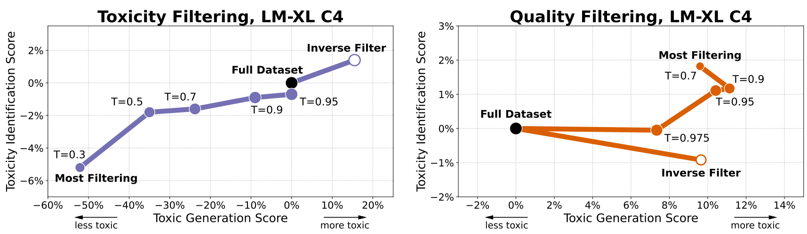

<b>图 5: 对预训练数据集进行毒性过滤会降低LM-XL识别毒性和生成毒性文本的能力。质量过滤则出人意料地提高了这两种能力。得分低于给定阈值的文档会被过滤掉。</b> 

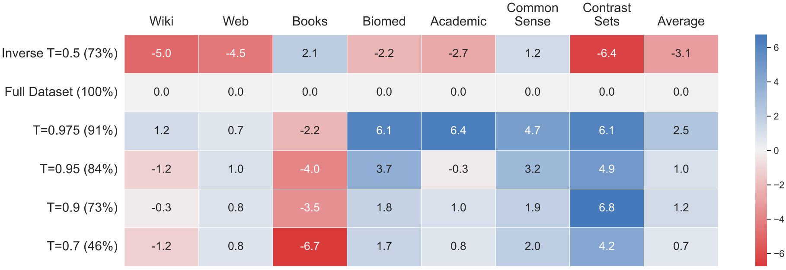

<b>图 6: 在C4上进行质量过滤提高了LM-XL在所有问答任务领域中的下游性能，除了书籍领域。X轴表示质量过滤的阈值，并在括号中注明了剩余的训练数据百分比。每一列代表一个来自特定领域的问答评估集。“完整数据集”表示未经过滤的数据，而“反向”过滤则是移除了质量最高的数据。</b> 

**数据集的质量特征并不能显著的表明过滤效果。**在第3节中，书籍、维基百科和网络数据被归类为最高质量的数据。然而，图6显式，质量过滤对这些类别的问答任务带来的好处最少，甚至对书籍领域的性能有所损害。相反，学术和生物医学数据被列为质量最低的数据之一，但其问答任务却从质量过滤中受益最多。

**仅针对单一质量指标进行优化不足以预测或提升跨领域的性能。**最有趣的是，维基百科和网络问答任务是受反向过滤影响最大的——这表明这些领域受最低质量数据缺失的影响不如高质量数据存在所带来的影响大。同样出乎意料的是，无论是质量过滤还是反向质量过滤都导致了模型产生更高毒性倾向（如图5右所示）——这意味着由质量评分所捕捉到的一维质量度量不足以解释这种行为。这表明从业者应当超越单一的质量衡量标准，考虑多种标准。

**一刀切并不适用。**毒性过滤会导致毒性识别与毒性生成目标之间的权衡。使用毒性分类器进行过滤时，我们发现了一个权衡：从经过重度过滤的预训练数据集中训练的模型具有最低的毒性生成概率，但同时也具有最差的毒性识别能力（如图5左所示）。类似地，图7显示，与毒性无关的问答任务的性能因毒性过滤而受损，尽管这可能是由于整体训练数据减少所致。最终，模型的目标行为应指导过滤策略，而不是采用一刀切的方法。最有趣的是，每个数据集在毒性识别上的最佳表现来自于逆向毒性过滤。**为了在毒性领域优化性能的从业者应当有意地应用逆向过滤。**

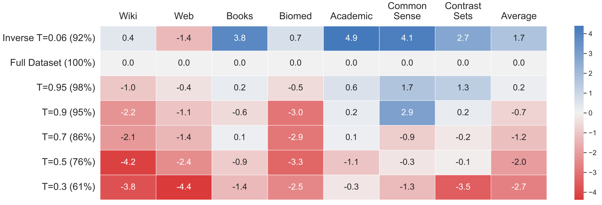

<b>图 7: 在C4数据集上进行毒性过滤降低了LM-XL在大多数问答任务领域中的下游性能。X轴表示毒性过滤的阈值，并在括号中注明了剩余的训练数据百分比。每一列代表一个来自特定领域的问答评估集。“完整数据集”表示未经过滤的数据，而“反向”过滤则是移除了毒性最低的数据。</b> 

## 领域混合对预训练模型的影响

**章节要点**

- 包含Common Crawl、OpenWeb和书籍数据对下游性能有最强的正面影响。数据源的多样性比数据质量和数量更为重要。

- 有针对性的数据有助于特定的评估，但并不总是像包含多样化的网络领域那样有效。

- 尽可能多地纳入预训练数据源是有益的。

如表1所示，预训练数据集通过结合来自多个领域的数据来力求在广泛的下游任务中实现泛化。预训练源领域的选择如何影响下游性能？我们通过逐一移除“The Pile”中的预训练来源，并测量其在来自不同领域的27个问答任务中的下游性能变化，从而经验性地回答了这一问题。

首先，我们将“The Pile”的数据源分为九个领域，这些领域代表了从业者可以选择获取许可或抓取更多数据的概念性来源：Common Crawl（CC）、OpenWeb、Wikipedia、Books、PubMed、Academic、Code与Math、Legal和Social（详见表8）。这些领域按照数据规模从小到大排序。我们选择保持这些来源的大小差异，主要是因为它们反映了现实情况：精心编排的维基百科内容本质上是有限的，而网络和书籍则要丰富得多。接着，我们使用除去每一类数据后的完整数据集来预训练LM-XL，从而得到九个模型，然后使用Natural Questions对每个模型进行微调以用于问答任务。最后，我们在来自MRQA和UnifiedQA的27个独立数据集上评估了这些模型，这些数据集也被划分到了不同的领域。详细信息记录在附录C.5中。

Common Crawl、OpenWeb和Books数据对下游性能有最强的正面影响。图8显示，当我们移除像Common Crawl、Books和OpenWeb这样的基于网络的数据域时，平均下游性能下降最为明显，这证实了Xie等人最近的研究成果。特别是，这些数据源提升了在具有挑战性的常识性和对比性任务上的表现。尽管Common Crawl是“The Pile”中最大的文本部分，书籍和OpenWeb虽然规模较小，但提供了最多样化且预期质量较高的内容（见第3节）。这些结果表明，更多的数据不一定比多样性和质量的结合更为重要。

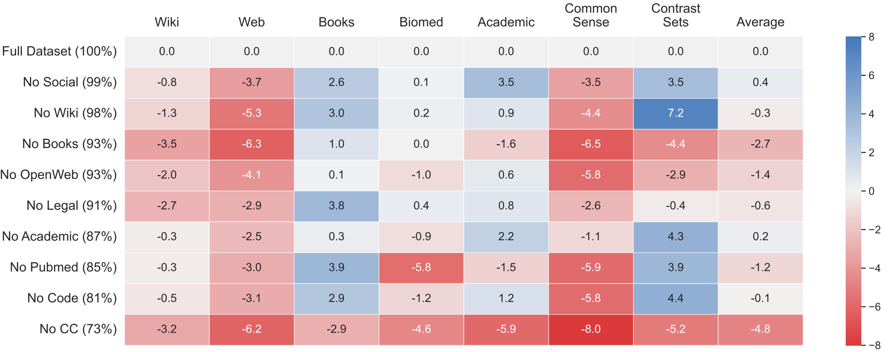

<b>图8: 在预训练LM-XL时移除特定领域会影响问答任务的表现。每一行代表了一个在预训练时移除了某一领域的模型，在左侧括号内显示了剩余数据集的大小。每一列代表了一个来自特定领域的问答评估集。“完整数据集”模型表示未经过滤的Pile LM-XL模型，且所有得分都是相对于这一基础模型而言的。</b> 

**领域多样性往往比针对性的数据更有益处，即使对于特定的评估也是如此。**移除某个预训练领域会对下游问答性能产生不同的影响。可以预见的是，当我们移除与预训练和下游数据源高度一致的领域时，性能会下降：移除PubMed会影响到生物医学问答评估，移除维基百科会影响维基百科基准测试，而移除网络内容则会影响网络评估。然而，移除特定领域并不一定会对相关的下游领域产生同样显著的影响，反而移除大型多样化的领域会有更大的影响。例如，从预训练数据集中移除Common Crawl（CC），比起移除学术领域，对下游学术问答任务的性能降低程度更大。我们的假设是CC、OpenWeb和书籍包含了广泛的主题覆盖，因此移除特定的学术类别并不会移除所有相关的学术信息。

**表现最佳的模型使用了所有的预训练数据源。**尽管数据多样性非常重要，但平均表现最好的模型仍然是那些使用了全部或几乎全部数据进行训练的模型。例外情况是移除了一些特定的目标源领域，比如“The Pile”中的代码或学术（高级科学和数学期刊）领域。这些领域的数据量虽大，但可能与问答评估集不太匹配，因为这些评估集并不要求超出维基百科或网络来源所需的编程技能或科学严谨性。这一发现表明，开放源数据的数量和多样性仍然是当前预训练方法的一个瓶颈。

**网络和书籍领域在毒性识别与生成之间造成了最大的权衡。**接下来，我们考虑减少模型在预训练过程中接触有毒内容是否会影响其生成有毒语言的倾向或识别有毒语言的能力。表3显示，移除Common Crawl（占数据总量的26.9%）、OpenWeb（6.9%）和书籍（6.9%）导致了毒性生成和识别的最大降幅。这与第三节中观察到的现象一致，即网络和书籍数据中含有最高比例被预测为有毒的文字。这些结果表明了一种权衡：在问答任务（见第6节）和毒性识别上的更好表现是以增加生成更多有毒内容的风险为代价的。

<b>表 3: The Pile的领域构成对毒性识别和生成的影响。移除书籍、Common Crawl 和 OpenWeb 导致毒性指标的最大降幅。而移除维基百科则显著增加了毒性内容的生成。</b> 

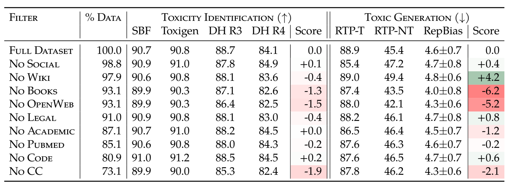

## 讨论

**凭直觉引导：预训练数据集整理工作一直是由直觉引导的**：收集的数据应当是大量的、多样化的和高质量的。决策往往出于对“足够好”的需求驱动，或是遵循了本身可能未经充分评估的先例。同样，模型开发者有时忽略了分享实例见解，维持了知识缺口，这种情况常被称为“文档负债（documentation debt）”。

我们的结果显示，预训练数据整理过程中所做的选择会对模型产生重大影响，而这种影响无法轻易通过后续的微调来消除。我们敦促模型生产者和使用者将数据集整理策略视为一种超参数，就像学习率或网络维度一样来看待。然而，适用于单一标量值的穷举搜索方法并不能扩展到影响大样本数据的整理策略上。尽管我们的研究结果证明了预训练数据整理的重要性，但还不足以回答所有的问题。因此，在本节中我们提出了具体的建议，但我们最主要的研究结论是我们需要更好的工具来建模数据与模型能力之间的关系。

**预训练语料库的新旧程度。**理想情况下，模型应该持续地用最新的数据进行重新训练。然而，考虑到数据收集和重新训练的成本，模型创建者必须在效率和模型陈旧性之间做出选择。更微妙的是，我们还发现使用较新的数据在评估回顾性任务时可能会引入“当下主义”偏见。即便有大量的针对特定任务的微调数据，陈旧性的影响也无法被克服，并且对于更大、更强大的模型来说，这种影响更加严重。这一结果补充了Schulman（2023）的研究发现，即在较新数据上进行微调可能会加剧对于预训练阶段没有良好基础的新数据的幻觉问题。这些初步的发现表明，对于更大规模的模型、更新颖的任务（较少的微调数据）以及指令微调模型而言，预训练语料库的时间属性越来越重要。目前的做法包括在提示词中加入检索到的最新数据，以帮助克服陈旧的预训练数据。虽然这种方法理论上可以帮助减轻陈旧性问题，但检索相关文本本身也是一个挑战。

我们建议模型创建者报告预训练数据的时间分布，而这目前还不是标准做法。用户应当能够预测在更新的数据集上可能出现的性能下降，或者意识到在预训练未覆盖的信息上微调模型的潜在副作用。

**数据源组成。**预训练语料库组成的决定会对下游性能产生实质性的影响。在本文中我们考虑的两个语料库中，C4只包含一个数据源，即Common Crawl的一次抓取数据，而The Pile则是由22个数据源组成的集合。汇集一个包含多种来源、写作风格和主题领域的语料库更加复杂且成本更高。实现这样的多样性也可能使模型更容易受到不够仔细的整理或从业者知识盲区的影响。

在我们的实验中，我们通过系统地在预训练前去掉The Pile的每一个组成数据集来进行消融实验，然后测量其对标准基准测试的影响。我们的结果表明，如果目标是在尽可能多的文本到文本任务上实现泛化，那么从业者不应省略任何数据源，并且未来的工作应专注于收集更多样化的网络和书籍内容，因为这些内容能带来最大的收益。这些发现与训练数据量仍然是一个限制因素，特别是在考虑到许可限制的情况下。

**毒性与质量过滤。**Common Crawl包含了大量的低质量文本（如广告、重复内容、非人类可读等）和有毒文本。许多最先进的语言模型会在训练前使用不良词汇列表等方式过滤掉这些文本。决定过滤多少文本以及过滤哪种类型的文本需要作出非简单的规范性决策，而所有这些过滤方法都涉及模型创建者有意修改其数据集及模型的偏差。

在我们的实验中，我们揭示了一个隐含的权衡，即模型的泛化能力和其生成有毒内容的倾向之间的权衡。这种行为受到质量和毒性过滤器的调节。实际上，对更具毒性的文档进行过采样会导致在毒性识别任务上取得最佳性能。这一观察结果，加上近期研究表明事后处理方法（例如指令微调或可导向解码器）被用来抑制不必要的有毒内容生成，表明从业者在预训练期间应优先考虑毒性识别而非抑制生成有毒内容的能力。

我们发现在尽管移除了大量训练数据的情况下，质量过滤器（与PaLM使用的相同，训练用于保留类似于维基百科和书籍的内容）仍然显著提高了各个领域的性能。令人困惑的是，书籍领域是上述观察结果中的一个例外，因为其内容属于最高质量之列。总体而言，数据的观察性质量特征不足以预测哪些领域将从质量过滤中获益最多。我们的分析表明，任务/领域的性能不仅仅受去除多少低质量数据（即不像维基百科/书籍的数据）的影响，还受到其他质量方面的影响，比如在这个特定度量尺度上，高质量或中等质量的数据有多少得到了体现。

## 限制条件

**计算成本与单次实验**：据我们所知，这是迄今为止最大规模的公开记录的语言模型预训练数据消融研究，涵盖了28个拥有15亿参数的模型——从零开始训练了比GLaM、miniBertas、MultiBerts乃至专注于保留数据组成和顺序，更多不同数据变体模型。必须承认，每一次预训练及其相应的微调和评估在计算资源和环境成本上都是昂贵的。鉴于此，我们谨慎地决定了要进行哪些实验——将我们的实验清单缩小到：语料库的新旧程度、质量过滤器、毒性过滤器以及源领域的选择。我们在事前就仔细策划了实验的选择，没有多次反思和重复的机会，而在许多自然语言处理实验设置中这种做法是常见的。因此，我们在计算成本和可重现的有效性之间尽可能地找到了平衡。我们希望证明我们选择的价值，并指出那些激发未来工作或深入探讨结果的意外发现。

**黑箱APIs**：另一个局限性在于我们使用了Perspective的API来评估生成内容的毒性。尽管我们的大部分毒性过滤和评估都在一个较短的时间段内完成，但Pozzobon等人（2023）已经证明了黑盒API的不可重现性，这些API可能会随时间改变其实现方式。我们也认为，尽管这是像RealToxicityPrompts这样流行的毒性生成基准测试的标准程序，但依赖于API和狭窄的评估设置可能对实际应用中的毒性生成的影响有限。就目前而言，这些是我们所能使用的最佳代理工具。

**英语数据与多语言数据**：我们的分析仅限于两个英语数据集。需要注意的是，对于多语言和非英语模型来说，训练数据的组成是一个更为关键的问题，在不同语言的语料库之间达到最优平衡，并找到足够大的高质量语料库是非常具有挑战性的。

我们的实验重点放在微调场景而非零样本或少样本提示（prompted）场景上。这一选择是基于微调对于1.5B参数的模型更为适用，并且在许多实际应用场景中也是如此。我们无法确定这些发现能在多大程度上适用于无微调的提示场景，但我们怀疑二者之间有很强的相关性。

## 近期工作

**预训练数据集整理**：已有数十个通用模型被训练用于自然语言理解和生成任务。早期的模型，如ELMO、BERT及其各种衍生模型，主要关注于在多种自然语言推理任务中的强大微调性能，以及语义上有意义的语言嵌入。这些系统是在诸如维基百科、BookCorpus以及来自十亿词基准的一系列新闻文章等半整理的数据集上进行训练的。XLNet打破了仅使用整理过的数据集的惯例，在其预训练数据集中加入了Common Crawl的文档。T5引入了C4数据集，是最早完全基于Common Crawl数据训练的预训练语言模型之一。T5和BERT的多语言版本分别在Common Crawl和维基百科上进行了训练。

GPT-2是首批主要用于生成任务的模型之一。鉴于Common Crawl数据过于杂乱而不适合用于训练生成模型，他们开发了WebText数据集，该数据集包含了来自Reddit高排名帖子中链接的网站。随后提出的生成模型建议将大量的Common Crawl数据与被视为高质量的小型语料库混合使用。GPT-Neo模型家族是在The Pile数据集上训练的，该数据集在Common Crawl的基础上增加了ArXiv、Stack Exchange、法律文件、书籍、GitHub及其他更为精选的来源。最近，OPT在加入了社交媒体数据的The Pile上进行了训练，而LLaMA则是在C4基础上增加了GitHub、Stack Exchange、书籍及其他来源的数据上训练的。Pythia则是在The Pile上训练的，包括有重复和无重复版本的数据。最后，BLOOM模型家族是在ROOTS Corpus上训练的，该语料库通过众包的方式收集了一系列“已标识”的数据集，这些数据集来源于多种语言中已知的高质量资源。

截至目前提到的所有模型都是公开可用的。然而，越来越多的公式开始使用专有数据集来训练其最佳模型，而对于这些数据的具体组成仅有有限的信息透露。在Alphabet，诸如Gopher、GLaM、LaMDA和PaLM等模型是在包含网页文本、书籍、新闻、代码、维基百科和对话数据的混合数据集上训练的。在OpenAI，GPT-3则是在Common Crawl、WebText（GPT-2的训练集）、书籍和维基百科上进行训练的。该公司的模型后续版本也包含了代码数据。这些模型大多承认使用了各种过滤技术来提高源自网络的训练数据的质量。这些技术包括设计用于排除看起来最不像“高质量”来源（如书籍或维基百科）的内容的分类器，使用谷歌的SafeSearch来识别有毒内容，以及基于文档长度和某些词语或字符的存在与否的各种启发式方法。

**预训练数据集分析**：Dodge等人（2021）发现在C4中有大量低质量的专利、军事和机器生成的文本，并且在过滤后，缺少来自美国少数族裔社区以及印度或尼日利亚等非西方社区的英文文本，因此建议不要进行过滤。相反，Luccioni和Viviano（2021）建议采取更严格的过滤措施，以遏制他们在C4中发现的大量仇恨言论和性暗示内容。同样地，Kreutzer等人（2022）发现多语言预训练语料库也充满了低质量文本，尤其是对于资源较少的语言。Lee等人（2022）；Kaddour（2023）展示了去重预训练数据集的好处，因为这些数据集中通常包含大量重复内容。最后，Zhao等人（2023）综述了预训练数据来源、质量过滤策略以及数据分布的重要性。他们的总结证实了我们关于领域组成和质量过滤的发现。

**数据、毒性与质量**：关于数据集及其生成模型的质量和毒性的研究得出了混杂的结果。所有主要的模型都报告了使用了重要的数据预处理和毒性/质量过滤，包括BERT、T5、BLOOM、OPT、ChinChilla、PaLM、LaMDA以及GPT-3系列，其中最大的一些模型现在使用了分类器。这一广泛采用表明存在显著的隐性好处，尽管这些好处并不经常对外报告。GLaM确实从实证上报告了过滤带来的性能提升，特别是在自然语言生成（NLG）任务上。

然而，在学术界，一些研究警告不要使用包括数据过滤在内的脱毒技术，因为这些技术可能会降低模型在代表性不足的群体上的困惑度。Welbl等人（2021）报告称，毒性分类器比应用数据毒性过滤器更能减少毒性，但Xu等人（2021）表明，这样做会导致代表性不足的群体上的困惑度最差。Meade等人（2022）进一步证实，偏差基准测试的改进与一般语言建模能力的下降有关。此外，调查GPT-3所描述的质量过滤器时，Gururangan等人（2022）发现其质量判断与事实性或文学成就无关，而是与某种与富裕邮政编码更相关的语言意识形态相一致。视觉领域的研究显示，数据过滤在脱毒方面有重要作用，但可能会降低性能或引入其他偏差。总之，在开发无毒且高质量的模型时，预训练数据过滤几乎是普遍存在的，但它们有可能削弱模型服务代表性不足群体的能力，并可能引入新的偏差。

额外的研究表明，指令微调和多种形式的对齐微调都减少了不必要的有毒内容生成。

**数据的时效性**：自然语言随着时间推移而演变和变化是众所周知的。随着语言分布的变化，由于模型对最近事件、句法和语义实践的静态知识，它们在新测试集上的表现也被证明会下降。Luu等人（2021）；Lazaridou等人（2021）；Liska等人（2022）；Yao等人（2022）；Zhang和Choi（2021）；Jang等人（2022）提供了评估集来衡量这一现象。建议的补救措施包括在更近的数据上进行微调、适应性/连续预训练、数据增强、以及根据文本的时间戳来建模。据我们所知，还没有任何工作彻底研究了从零开始预训练时的时间退化效应。

**领域数据**：公共数据集如C4和The Pile的组成主要受许可证的引导，这严重限制了数据的可用性。即便如此，Villalobos等人（2022）；Nostalgebraist（2022）；Hoffmann等人（2022）提出，我们即将耗尽网络上的高质量文本数据来训练计算优化的更大语言模型，至少在现有训练效率下是如此。这构成了一个挑战，因为在强大的泛化能力方面高质量和多样化训练数据的重要性已被证实（Gao等人，2020；Papadimitriou和Jurafsky，2020）。大量的文献致力于将静态预训练模型适应新的下游领域，利用领域自适应预训练，寻找中间微调任务，动态平衡数据源，数据选择，数据增强和主动学习。另一条研究路径展示了在精心设计的合成数据上进行预训练的潜力。

与我们工作的这一部分最为相似的是，Xie等人（2023a）重新平衡了The Pile的数据组合，以实现更高效和更快的收敛。Xie等人（2023b）使用重要性抽样来选择The Pile中最有利于目标下游任务的子集，而不是使用质量过滤器，从而在下游任务上实现了2%的性能提升。Pruksachatkun等人（2020）系统地评估了中间微调任务的效果，这与我们评估不同预训练任务组合的效果的方式类似。

**模型和数据规模**：之前的工作探索了模型大小、预训练数据量或预训练步骤数量的效果。Chinchilla研究并报告了最优计算扩展定律，表达了模型和数据大小之间的关系。近期的研究表明，随着规模的扩大，新的能力会出现，但同时也发现许多这些优势可以被提炼或压缩进较小的模型中。在本工作中，我们研究了不同的模型尺寸如何影响预训练的时间错位变化，据我们所知，这一问题此前尚未得到解答。

## 结论

文档的相对年龄、内容过滤器和数据源都会对下游模型的行为产生重大影响。通过微调可以减少但不能消除这些影响。我们建议模型开发人员和用户在设计/选择与其需求最相关的模型时密切关注这些细节，因为每个决策都有具体的、可量化的权衡特征。例如，在改进毒性识别还是减少毒性生成、在全新数据源还是旧数据源上的性能、生物医学领域还是书籍文本领域之间做出决定可能很重要。在策划任何预训练数据集的过程中，这些无数的选择都是与生俱来的。虽然我们只能对其中的一小部分进行评估，但我们能够说明哪些选择是重要的，以及重要的程度有多大，我们希望能对评估数据集组成和预测预训练数据集模型行为的进一步工作有所启发。

