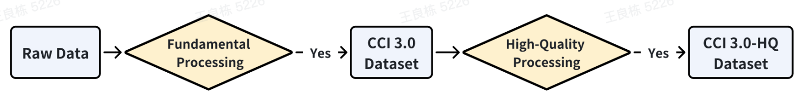
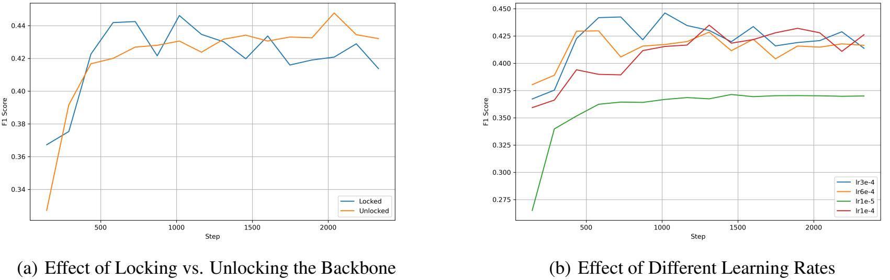
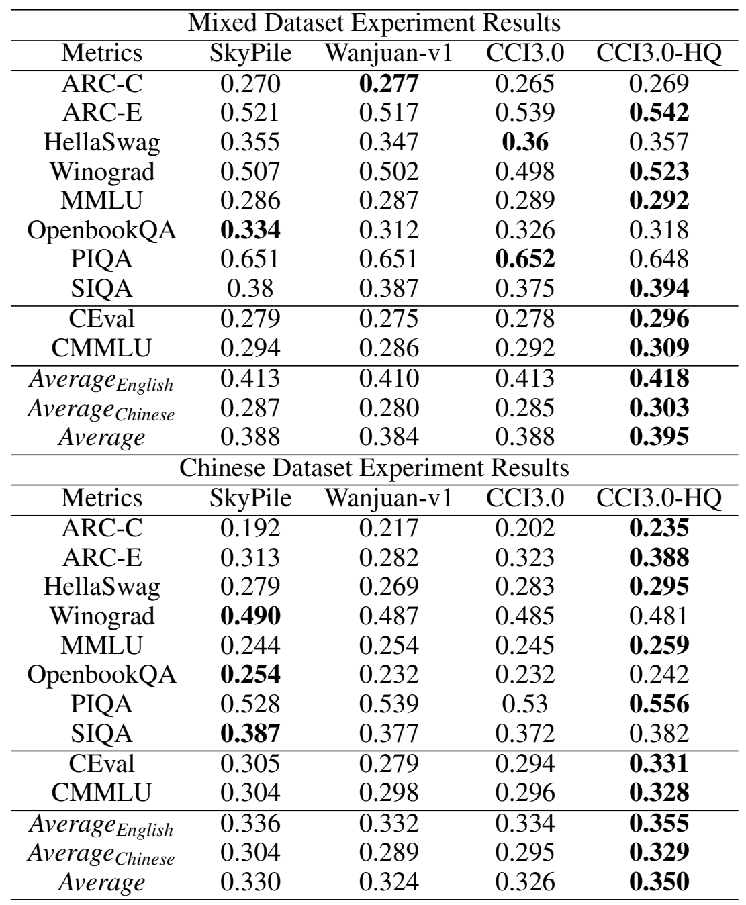
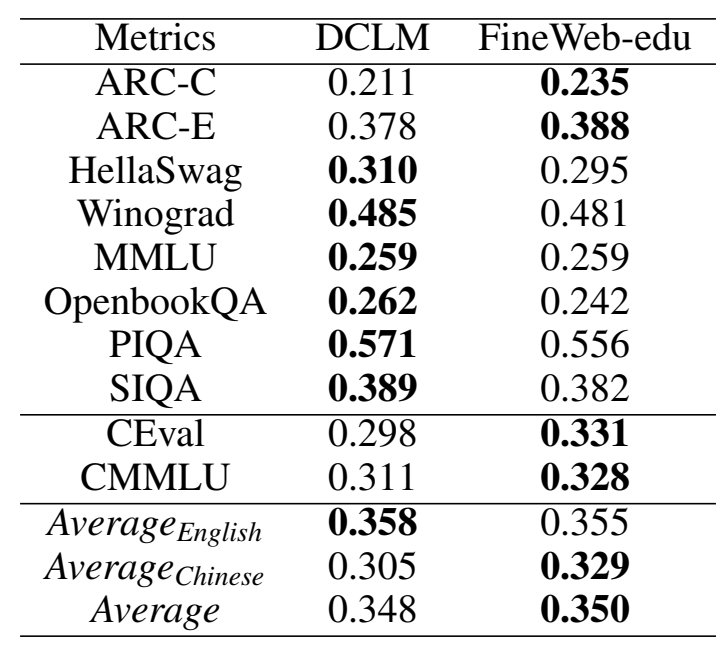
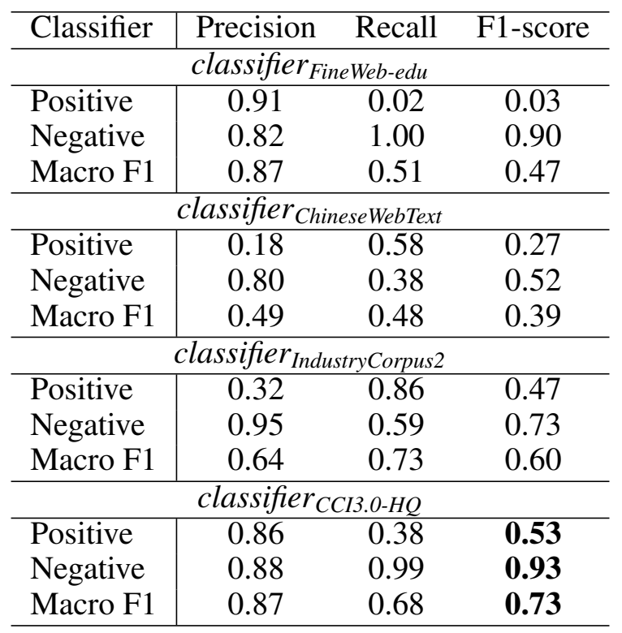

# CCI3.0-HQ：用于预训练大型语言模型的高质量大规模中文数据集

## 摘要

我们介绍了 CCI3.0-HQ，它是中文语料库互联网 3.0（CCI3.0）的一个高质量500GB子集，采用新颖的两阶段混合过滤管道开发，显著提高了数据质量。为了评估其有效性，我们在不同数据集的100B tokens上从头开始训练了一个0.5B参数的模型，在10个基准测试中取得了优于CCI3.0、SkyPile和 WanjuanV1的性能。高质量的过滤过程有效地将Qwen2-72B-instruct模型的能力提炼为一个紧凑的 0.5B模型，为中文网络数据分类取得了最佳的F1分数。我们相信这个开源的数据集将有助于更广泛地获取高质量的语言模型。

## 引言

大型语言模型（LLM）的成功主要归功于广泛且高质量的预训练语料库的可用性，这些语料库为其在各种任务中的基础知识和推理能力提供了支撑，从创意写作到复杂的问题解决。其中，像The Pile和Common Crawl这样的开源数据集，在推动LLM的发展中起到了关键作用，促进了合作并为创新设定了基准。

现有的研究人员更加注重扩大高质量数据的规模。最近，对预训练数据的需求已超过10万亿个tokens，这突显了英语预训练领域的两个关键趋势：扩大数据规模和提高数据质量。开源数据集迅速扩展，从像Pile（825GB）这样的集合发展到了更大规模的数据集，如FineWeb（15TB），后者大量来源于Common Crawl。与此同时，研究重点已从早期项目如Redpajama所采用的基于规则的过滤方法转向了以模型驱动的方法，如FineWeb-Edu所展示的那样。

尽管英语开源数据集取得了快速进展，中文数据在全球网络上的代表性仍然明显不足。现有的开源中文数据集，如WuDao、SkyPile150B和WanjuanV1，由于在线中文数据源的稀缺而在规模上受到限制。此外，针对改善中文网络数据质量分类的研究有限，导致数据质量不佳。这些挑战对高性能中文语言模型的发展构成了重大障碍，突显了对更有效的数据过滤和质量分类方法的迫切需求。

为了解决上述挑战，我们推出了CCI3.0-HQ，这是一个通过两阶段混合过滤策略创建的大规模中文预训练数据集：基础处理和高质量处理。基础阶段包括标准的网络数据管理实践，如安全过滤、文本提取、去重以及使用基础模型评分进行初步质量评估。第二阶段通过使用Qwen2-72B-Instruct来识别高质量样本，进一步提升数据质量，最终形成一个包含140k条样本的训练集和14k条样本的测试集。我们的分析显示，这些标注与GPT-4的标注一致性约为80%。因此，我们在14万条训练样本上训练了一个0.5B参数的质量分类器，以高效地过滤CCI3.0，从而生成一个高质量的数据集。

为了评估我们的数据集对训练大型语言模型（LLM）的影响，我们使用从头开始训练的一个0.5B参数量的模型进行了系列实验，该模型基于1000亿个标记并采用了特定的数据混合比例，评估其在零样本设置下的10个基准测试中的表现。广泛的实验结果显示，CCI3.0-HQ显著优于SkyPile和WanjuanV1等竞争的中文数据集。此外，我们提出的质量分类器classifierCCI3.0-HQ在性能上也超过了classifierFineWeb-edu、classifierIndustryCorpus2和classifierChineseWebText，F1分数更高。

总之，我们的主要贡献如下：

- 我们推出CCI3.0-HQ，这是一个开创性的500GB中文预训练数据集，利用先进的混合质量过滤方法来增强数据完整性。
- 我们进行了严格的实验评估，证明CCI3.0-HQ显著优于原始的CCI3.0数据集和其他知名开源中文语料库，从而为性能设立了新的标杆。 
- 我们引入并开源了CCI3-HQ分类器，这是一种先进的质量分类工具，能够显著改进LLM训练中的数据选择过程。

## Pipeline

如图1所示，数据处理流程包括两个主要阶段：基础处理和高质量处理。原始数据涵盖了广泛的中文语料，包括新闻、社交媒体和博客等内容，从而增强了我们数据集的覆盖范围和代表性。在完成基础处理步骤后，我们获得了CCI3.0数据集。该数据集通过基于模型的高质量处理进一步得到精炼，最终形成了CCI3.0-HQ数据集。接下来的部分将详细解释数据集构建工作流程中的这两个阶段。

<b>图 1: 数据集整理管道</b> 

### 基础处理

本节概述了基础处理阶段涉及的四个关键过程，这一阶段对于准备CCI3.0数据集至关重要，并支持后续的数据准备阶段。

- **安全过滤**：我们实施过滤器以排除可能包含不安全内容的网站数据，目标是那些根据安全标准被认定为有害的域名以及已知含有成人材料的域名，从而确保严格遵守安全标准。

- **文本提取与清理**：鉴于数据集来源多样，我们为每个来源设计了专门的解析器，以有效提取和清理内容。
- **文档级去重**：我们使用全局MinHash技术来识别并移除近似重复的文档，确保数据集的多样性和避免冗余。
- **启发式和基础质量过滤**：采用一系列启发式方法过滤掉低质量文档，消除异常值，并减少过度重复。随后，我们应用基于ChineseWebText的基础质量分类器，该分类器预测文本被可靠来源（如维基百科、电子书和新闻文章）引用的可能性。

### 高质量处理

此阶段专注于将Qwen2-72B-instruct的质量评分能力提炼到一个0.5B参数的模型中，以便有效地对大量数据进行评分。

### 高质量样本注释方法

高质量处理的主要焦点是在预训练上下文中精确定义“高质量”。在探索和比较领先方法之后，我们采用了FineWeb-edu的方法来定义高质量样本，并开发了一个针对中文高质量教育内容的分类器。这一做法旨在提升中文语料的整体质量。关于标注方法及其有效性的详细比较将在第3.3节中呈现。

确立了质量标准后，下一个挑战是如何高效地构建数十亿个符合标准的样本。为了解决这个问题，我们实施了一个结构化的过程，用于根据既定的基准定义和标注样本，确保它们与必要的教育和信息价值保持一致——这对于强大的中文语言数据集至关重要。工作流程如下：

我们使用Qwen2-72B-Instruct对CCI3.0数据集中随机抽取的145,000个网页样本进行评分，评分范围从0（非教育性）到5（高度教育性），使用的提示与FineWeb-edu相似。通过本地部署的Qwen2 API，结合vLLM，促进了标注过程的进行。最后，我们对标注结果的一部分进行了人工和GPT-4评估，达到了超过80%的一致率。

### 高效训练高质量分类器

使用像Qwen2-72B-Instruct这样大型的模型对所有样本进行质量标识的标注将会成本高昂。遵循FineWeb-edu的方法，我们通过自动化过程积累了数十万个标注样本，随后训练了一个较小的分类模型，以实现大规模高效标注。这种方法显著降低了成本，同时确保了高质量样本的正确识别，使得以实际资源投入进行全面数据集标注成为可能。

我们通过添加一个具有单回归输出的分类头来增强BGE-M3（约0.5亿参数），并在学习率为3e-4的情况下训练20个epoch。在训练过程中，embedding层和encoder器层保持冻结状态，专注于分类头的训练，未使用dropout。训练脚本可在GitHub上获取。最优学习率和中间检查点是根据两类的F1分数确定的，训练曲线也已记录。对于是否锁定骨干模型的配置（见图2），我们选择了锁定骨干模型，因为不解冻时性能提升很小，而选择锁定骨干模型可以节省大量的训练时间。考虑到模型的泛化能力，我们决定保持骨干模型的冻结状态。此外，我们还对学习率进行了网格搜索（见图2）。

最后，通过设定3分的阈值将模型转换为二元分类器，并将其应用于大约15亿个样本，这个过程需要9700个A100 GPU小时。

## 实验

在本节中，我们首先进行实验以评估我们精心整理的语料库在从头开始的大语言模型预训练中的有效性。接着，我们探讨并比较了两种高质量标注方法，详细说明了我们为何选择FineWeb-edu方法来定义和标注中文语料库中的高质量样本。最后，我们对现有的高质量分类器进行了比较分析，突出了我们训练的分类器的优越性能。

<b>图 2: 骨干网络冻结和学习率调整对分类器调整性能的影响</b> 

### 实验设置

#### 模型训练配置

在评估中，我们使用了Qwen2-0.5B的Tokenizer和模型架构，在一个包含100B个tokens的双语数据集上进行训练。这种配置确保了对中文和英文数据的有效处理，同时保持实验的一致性。关键的训练参数包括序列长度为4096，权重衰减为0.1，梯度裁剪值为1.0。训练集由2500万个样本组成，全局批次大小为1024。学习率起始值为3e-04，最小值为3e-05，预热阶段覆盖2,048,000个样本，之后按照余弦退火计划进行调整。

|        Parameter         |  Value   |
| :----------------------: | :------: |
|    attention_dropout     |   0.0    |
|       bos_token_id       |  151849  |
|       eos_token_id       |  151850  |
|        hidden_act        |   silu   |
|       hidden_size        |   896    |
|    intermediate_size     |   2432   |
| max_position_enmbeddings |   4096   |
|   num_attention_heads    |    14    |
|    num_hidden_layers     |    24    |
|   num_key_value_heads    |    2     |
|       pad_token_id       |  151643  |
|       rms_norm_eps       |   1e-6   |
|        rpoe_theta        |  10000   |
|   tie_word_embeddings    |   True   |
|       torch_dtype        | bfloat16 |
|        vocab_size        |  151851  |

<b>表 1: 预训练模型配置参数</b> 

#### 数据组成

我们进行了两项主要实验来评估数据集的性能：

- 混合数据集实验：该数据集包含60%的英文内容、10%的代码内容和30%的中文内容。对于英文部分，我们采用了FineWeb-edu，而代码数据则来源于StarCoder。
-  中文数据集实验：本实验使用了100%中文内容数据集，其中包括Wanjuan-v1、SkyPile、CCI3.0 和 CCI3.0-HQ。CCI3.0 数据集是一个基准数据集，因为它没有经过高质量过滤过程，可以直接评估质量改进对数据集完整性的影响。

#### 测评指标

我们使用lighteval库进行模型评估，评估设置与FineWeb数据集的使用情况相匹配，所有评估指标均基于零样本设置。评估指标包括：
- $Average_{Chinese}$：中文指标的平均得分，包括CEval和CMMLU。
- $Average_{English}$：标准英文指标的平均得分，如ARC-C、ARC-E、HellaSwag、Winograd、MMLU、OpenbookQA、PIQA和SIQA。
- $Average$：上述所有评估指标的综合平均得分。

此外，我们使用相同的测试样本计算F1分数，通过‘sklearn.metrics.classification_report’中的宏平均F1分数来量化性能差异，将我们的分类器与现有模型进行了对比。

### CCI3.0-HQ 对模型训练的影响

我们通过端到端的预训练实验对不同的数据集进行了直接比较，使用模型训练的最终检查点进行性能评估。详细的实验结果，包括数据集对比和指标细节，提供在第2部分。在分析数据集实验结果时，出现了三个关键点，突出了各个数据集之间的性能差异以及CCI3.0-HQ的优势：

混合数据集实验结果：在混合数据集评估中，CCI3.0-HQ在大多数指标上表现一贯良好。值得注意的是，它在ARC-E（0.542）、Winograd（0.523）、MMLU（0.292）和SIQA（0.394）上取得了最高分，展示了其在这些特定任务中的稳健性能。虽然CCI3.0在HellaSwag（0.36）上表现强劲，但总体上仍被CCI3.0-HQ超越。Skypile在OpenbookQA（0.334）上表现出色，但在其他指标上落后，表明其整体性能不够均衡。ARC-C指标关注更具挑战性的知识和问题，为了弥补当前该指标性能的不足，未来的工作计划增加高教育水平内容的比例以提升成绩。

中文数据集实验结果：在中文专项评估中，CCI3.0-HQ的表现尤为突出，特别是在ARC-C（0.235）、ARC-E（0.388）和CEval（0.331）上。这些分数超过了所有其他数据集，巩固了其在涉及中文任务方面的优势。Skypile在Winograd（0.49）和OpenbookQA（0.254）上表现良好，但在其他领域普遍效果较差，而Wanjuan-v1和CCI3.0在多数指标上都落后。

平均性能：CCI3.0-HQ以总平均分0.395的成绩脱颖而出，相比之下，Skypile和CCI3.0的平均分为0.388。在英语任务（AverageEnglish = 0.418）和中文任务（AverageChinese = 0.303）中，CCI3.0-HQ均保持明显领先，证实了其在多样化基准测试中的优秀泛化能力。这突显了CCI3.0-HQ数据集在多语言任务的语言模型训练中提升效果的有效性。

总之，结果清楚地表明，CCI3.0-HQ在英语和中文基准测试的关键任务中始终优于其他数据集，使其成为全面多语言评估和模型训练的优质数据集。我们还在附录5.1中详细比较了各数据集在训练期间不同中间检查点的评估性能。

### 质量注释技术评估

在预训练大规模自然语言模型的背景下，我们探讨了两种定义高质量样本的主要方法：FineWeb-edu和DataComp-LM(DCLM)。这两种方法基于最近出现的一种新方法，用于过滤大型语言模型的预训练数据集：使用合成数据来开发识别内容的分类器。

<b>表 2: 混合数据集和中文数据集实验中数据集对模型性能影响的比较</b> 

FineWeb-edu：FineWeb-edu对网页的教育质量进行0到5的评分，主要关注小学和初中水平的内容。为了确保不同复杂度的教育内容之间的平衡，在过滤过程中使用了3分的阈值。这不仅保留了中等教育水平的页面，还包括了一些高水平的内容，确保基础和高级知识都能包含在数据集中，以供进一步分析或训练之用。
DCLM：在DCLM论文中，比较了多个数据集以识别高质量样本，最终选择了OpenHermes 2.5数据集作为正向数据。然后，使用该数据集训练了一个二元分类器。训练好的分类器随后被应用于预训练语料库，以识别高质量内容。由于没有OpenHermes 2.5数据集的中文版本，因此将原始数据集翻译成中文，以用于进一步处理。

通过实验比较3，我们发现对于中文语料库而言，FineWeb-edu方法在AverageChinese方面尤其优于DCLM。表格突出了两种质量标注方法——DCLM和FineWeb-edu之间的性能对比。根据所示的指标，出现了两个关键点：

- 中文专项指标表现：在中文专项指标中，FineWeb-edu持续优于DCLM。具体来说，在CEval和CMMLU基准测试中，FineWeb-edu分别得分为0.331和0.328，而DCLM的得分分别为0.298和0.311。此外，AverageChinese得分显示，FineWeb-edu的表现显著更好，得分为0.329，而DCLM为0.305。

- 总体表现：就总体平均分而言，FineWeb-edu以0.350的得分略胜DCLM的0.348。虽然在以英语为中心的指标上的差异不大，但FineWeb-edu在中文基准测试，特别是CEval和CMMLU上的更强表现，证明了其在多语言评估中的优越适应性。

综上所述，FineWeb-edu方法在中文专项评估中显示出更强的结果，其总体表现证明了其有效性，尤其是在需要中文语言数据集更高精度的任务中。因此，我们决定在后续步骤中采用FineWeb-edu方法来识别高质量样本。

<b>表 3: 两种质量标注方法的比较</b> 

### 中文网络数据质量分类器评估

所有模型都使用3.0的得分阈值转换为二元分类器，并在同一组大约14,000个样本的测试数据集上进行评估。这14,000个样本是从一个大型中文文本语料库中随机抽取的，包含了原文本及其相应的标签。这些样本可以作为一个基准，用于后续文本质量的评估。我们的高质量分类器实现了最佳性能，详细结果见表4。表4提供了四个分类器的比较：$classifier_{FineWeb-edu}$、$classifier_{IndustryCorpus2}$、$classifier_{ChineseWebText}$以及我们的$classifier_{CCI3.0-HQ}$，评估了它们在正类和负类上的精确度、召回率和F1分数，以及宏观平均值。可以得出三个关键观察结论：

正样本性能：$classifier_{CCI3.0-HQ}$在分类正样本方面展现出显著优势，达到了0.86的精确度和0.53的F1分数。相比之下，尽管$classifier_{FineWeb-edu}$的精确度高达0.91，但其召回率仅为0.02，导致正样本的F1分数非常低，仅为0.03。这突显了$classifier_{CCI3.0-HQ}$在有效处理正类方面的平衡能力。

宏观平均性能：$classifier_{CCI3.0-HQ}$的宏观平均F1分数为0.73，在所有分类器中最高，表明其在正类和负类上的整体性能都很强。相比之下，由于在正样本上的表现不佳，$classifier_{FineWeb-edu}$的宏观平均F1分数仅为0.47。

平衡分类：虽然$classifier_{IndustryCorpus2}$在正样本召回率方面表现良好（0.86），但其较低的精确度（0.32）导致正样本分类的F1分数较低（0.47）。另一方面，$classifier_{CCI3.0-HQ}$在各类别中平衡了精确度和召回率，实现了更加一致和可靠的总体性能，特别是在宏观F1分数（0.73）方面，这表明它是跨所有数据集最稳健的分类器。

质量分类的重要性：与$classifier_{ChineseWebText}$相比，新增的$classifier_{CCI3.0-HQ}$在处理多样化数据和区分高质量内容方面表现出显著提升的性能。这一进步强调了适当的质量过滤在预训练中的核心作用，这也是CCI3.0-HQ数据集性能优于原始CCI3.0数据集的关键因素之一。

总之，$classifier_{CCI3.0-HQ}$展现了卓越的分类性能，特别是在更有效地处理正样本以及在所有指标上保持强大的宏观平均值方面。与主要在英文语料库上训练的$classifier_{FineWeb-edu}$，以及在中文语料库上训练的$classifier_{IndustryCorpus2}$和$classifier_{ChineseWebText}$相比，我们的分类器在区分正负样本的精确度和召回率方面都有显著提升。我们认为这归因于其更适合中文和数据分布，以及更多的训练数据量和模型调优。

<b>表 4: 评估不同的文本质量分类器</b> 

## 结论与局限性

我们发布了CCI3.0-HQ数据集，并将其开源，该数据集经过了复杂的混合质量过滤方法以提高数据的完整性。通过从头开始预训练小规模模型的比较和严格的实验评估，CCI3.0-HQ在性能上显著优于现有的知名中文开源数据集。此外，我们介绍了CCI3-HQ分类器并将其开源，该分类器相较于现有的开源中英文质量分类器表现出更优的性能，CCI3.0-HQ数据集展示了高质量过滤在中文大语言模型预训练中的重要性。作为目前可用的最大高质量中文预训练语料库，CCI3.0-HQ有望推动大语言模型的发展，尤其是专注于中文的模型。该数据集收集了截至2024年初的数据，这意味着它可能缺乏关于更新事件或趋势的信息。尽管进行了数据清理以提升数据集的质量，但仍可能存在一些低质量样本。我们将继续进行数据处理和质量过滤工作，以进一步支持高质量大语言模型的发展。作为未来的工作，可以利用Infinity Instruct数据集进一步优化质量分类器，这将带来Aquila系列大语言模型性能的额外提升。