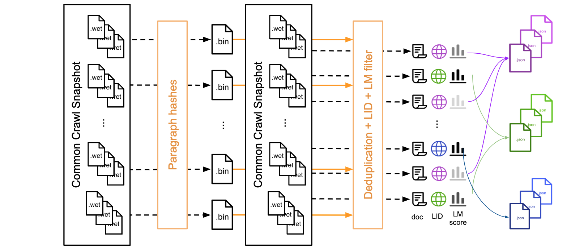
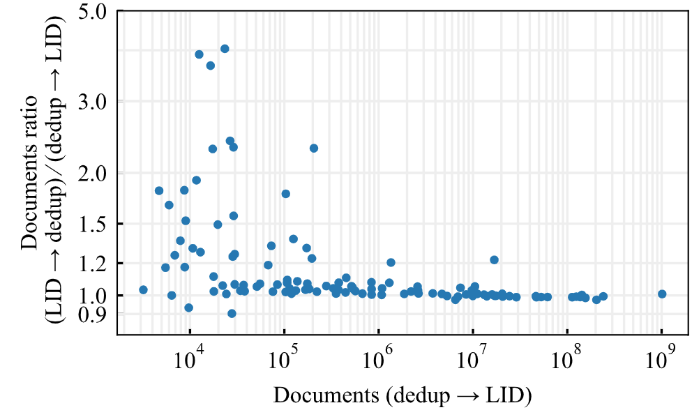
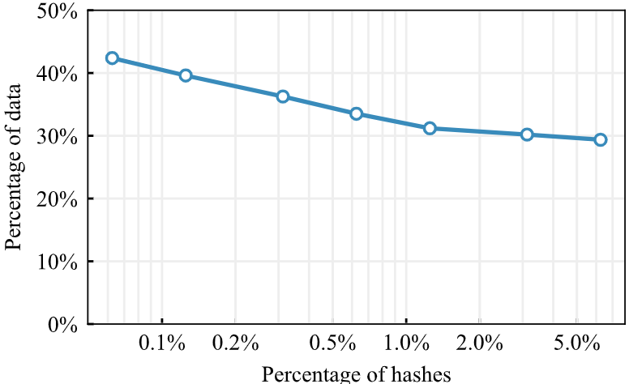
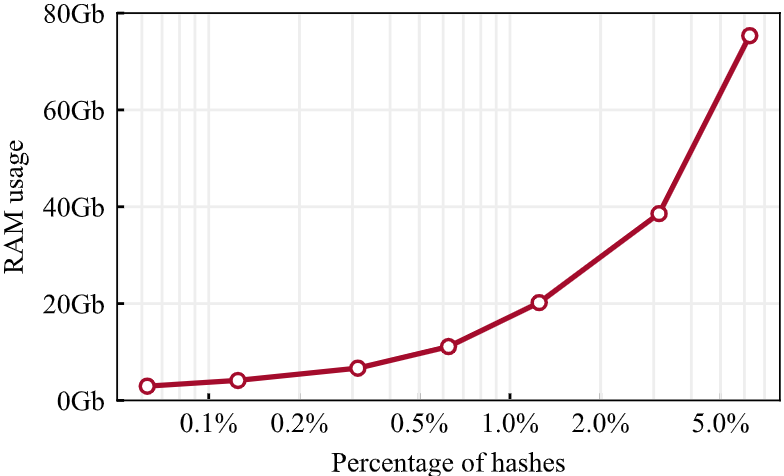
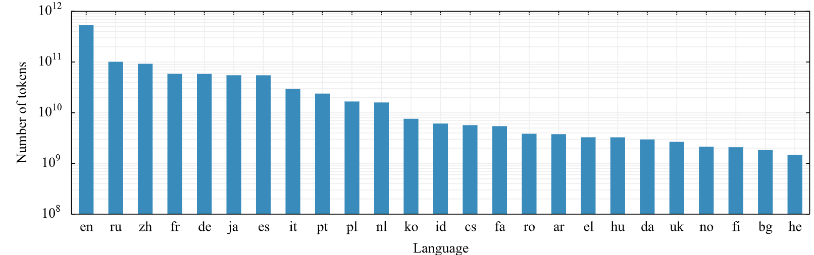
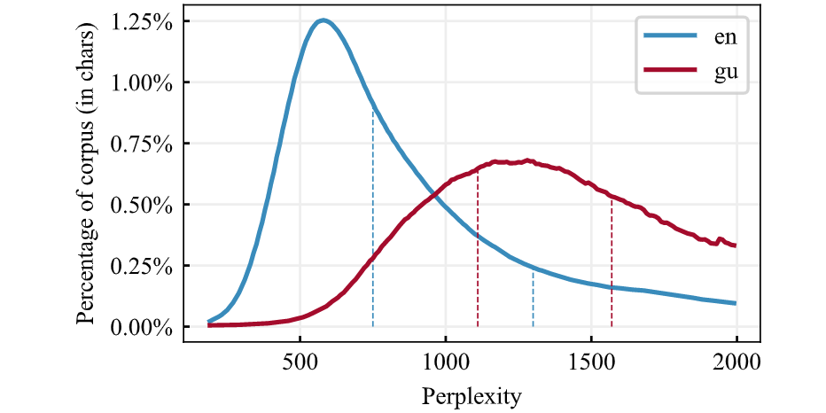
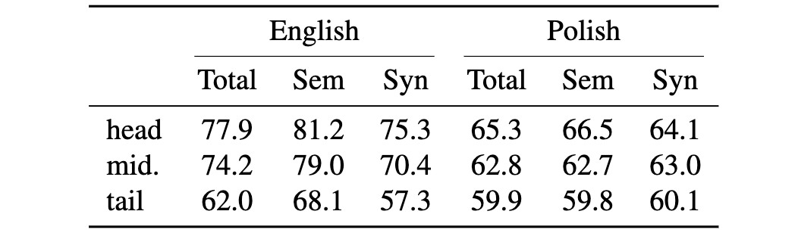
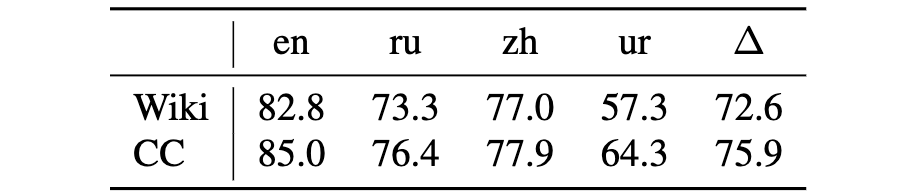
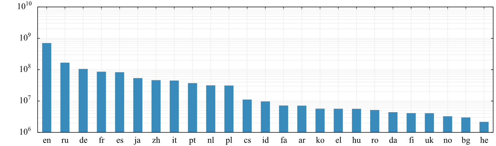

# CCNet：从网页数据中提取高质量的单语数据集

- 论文源地址：[CCNet: Extracting High Quality Monolingual Datasets from Web Crawl Data](https://arxiv.org/abs/1911.00359)

## 摘要

预训练文本表征已经为自然语言处理的许多领域带来了显著改进。这些模型的质量在预训练语料库足够大并且质量得到保证的前提下会大大受益。在本文中，我们描述了一种自动的管道，可以从 Common Crawl 中为多种语言提取大规模的高质量单语料库。我们的管道遵循 fastText ([Mikolov et al., 2017](https://arxiv.org/abs/1712.09405)；[Grave et al., 2018](https://arxiv.org/abs/1802.06893)) 中的数据处理方法，该方法对文档进行去重并识别其中的语言。我们通过增加一个过滤步骤对这一管道进行扩展，该步骤会筛选出像 Wikipedia 那样近乎高质量语料库的文档。

## 1. 引言

预训练的文本表征已在诸多自然语言处理任务上带来了显著的性能提升。自从 Transformer 模型和 BERT 模型的引入以来，随着预训练语料库规模的不断扩大，这些预训练模型的质量也在持续提升。然而，仅仅扩大规模并不足以确保更好的模型效果，数据的质量同样需要保持。因此，通常使用一些特定的方法创建数据集，比如将现有的高质量数据源像维基百科这样的资料进行整合。遗憾的是，对于资源匮乏的语言来说，并不能如此轻易地复制出这样的数据集，因为这些语言往往缺乏像维基百科这样丰富且经过精心维护的数据集。

在本文中，我们展示了一个数据收集管道，它能够收集到包括很多资源匮乏语言在内的多种语言的大规模高质量单语语料库。管道的原则具有通用性，我们展示了在 Common Crawl 项目所收集的数据中应用了该管道后的结果。Common Crawl 是一个包含多种语言网页的海量非精选型数据集，在网页的时间快照中混合在一起 (详见 [Common Crawl](https://commoncrawl.org/about/)）。我们的管道执行了类似于 [Grave et al., 2018](https://arxiv.org/abs/1802.06893) 的标准文档去重与语言识别工作，**但有两个不同之处：**

(1) 我们保留了文档级别的结构，以便能够训练类似BERT的段落级表示；

(2) 我们添加了一个可选的单语过滤的步骤，用于选择接近高质量来源（如维基百科）的文档。

这是通过在目标源上训练语言模型并将困惑度用作文档的评分函数来实现的。我们的管道可用于任意数量的 Common Crawl 快照，在 5000 个 CPU 内核上处理每个快照需要 8.5 个小时。例如，通过预处理2019年2月的快照获得的数据集由 174 种语言的 15 亿个文档组成。仅英语就有 7 亿个经过过滤的文档，相当于 5320 亿个 token，这比 [Devlin et al., 2018](https://arxiv.org/abs/1810.04805) 使用的数据大 120 倍。

本文的结构如下：我们首先介绍 Common Crawl 语料库，紧接着就是我们从中过滤高质量文档的整个管道。然后，我们描述了可用于根据目标语料库定制过滤的其他工具。最后，我们对预处理单个Common Crawl快照获得的数据集进行了深入统计。整个管道和相关工具开源在：[github](github.com/facebookresearch/cc_net) 。

## 2. 相关工作

用于训练文本表征的大规模数据集的预处理是在词嵌入的背景下发展起来的，例如 word2vec [(Mikolov et al., 2013)](https://arxiv.org/abs/1310.4546)，GloVe [(Pennington et al., 2014)](https://nlp.stanford.edu/pubs/glove.pdf) 以及 fastText [(Mikolov et al., 2017)](https://arxiv.org/abs/1712.09405)。我们的管道遵循 [Grave et al., 2018](https://arxiv.org/abs/1802.06893) 的 fastText 流程，使用基于 fastText [(Joulin et al., 2016a)](https://arxiv.org/abs/1612.0365) 的语言识别器将 CommonCrawl 拆分成单语言数据集。

CommonCrawl 已经被用来在语言建模中评估 n-gram 统计信息 [(Buck et al., 2014)](https://nlp.stanford.edu/pubs/crawl.pdf) 。最近，[Baevski et al., 2019](https://arxiv.org/abs/1903.07785) 根据 [Grave et al., 2018](https://arxiv.org/abs/1802.06893) 的方法对 CommonCrawl 进行了预处理，并预训练了一个类似 BERT 的模型。一般来说，随着预训练语料库的增大，文本的表征质量也有所提高（[Yang et al., 2019](https://arxiv.org/abs/1906.08237)；[Liu et al., 2019](https://arxiv.org/abs/1907.11692)；[Raffel et al., 2019](https://arxiv.org/abs/1910.10683)）。特别是，与我们的工作同时进行的 [Raffel et al., 2019](https://arxiv.org/abs/1910.10683) 使用了一个基于 CommonCrawl 的大规模数据集来训练文本表示。现有使用基于网络的数据集的工作通常采用针对英语的预处理方法，例如保留 Reddit 上共享的 URL 或使用手工编写的过滤规则。与这些方法不同，我们的管道可以很容易地应用于英语以外的多种语言。[Ortiz Suárez et al., 2019](https://inria.hal.science/hal-02148693/document) 的研究相对更接近我们的工作，他们改进了 [Grave et al., 2018](https://arxiv.org/abs/1802.06893) 的管道，并表明即使在资源有限的情况下，也可以从 CommonCrawl 中快速提取出大型单语语料库。我们的工作遵循类似的管道，并增加了一个选择高质量文档的步骤。

## 3. 方法

每个月，CommonCrawl 都会发布一个通过随机探索和采样 URL 获得的网络快照。每个网页以不同的格式提供：原始格式（WARC）、UTF-8 文本（WET）以及元数据（WAT）。每月快照之间几乎没有内容重叠，完整的存档包含了由网络爬取收集了超过 8 年的拍字节（即千万亿字节）级别的数据。这些网页是从整个互联网无限制抓取来的，涉及多种不同的语言，且文本质量差异很大。CommonCrawl 代表了一个丰富的单语数据资源，涵盖了大量的领域，但也因存在大量噪音文本而带来了挑战。

我们在本节描述了用于获取、去重和过滤 CommonCrawl 数据的方法。我们专注于预处理 CommonCrawl 快照的文本（WET）格式，并在本节中详述了预处理管道所包含的步骤，管道的全貌如图 1 所示。

<b>图 1：我们展示了下载和处理一个 Common Crawl 快照的整个管道。首先下载所有 WET 格式的文本文件，计算分组并保存到二进制文件的段落哈希。然后我们单独处理 WET 文件的每个文档：先使用二进制文件对段落进行去重，再进行语言识别并计算语言模型困惑度分数。最后，我们通过语言和困惑度分数将文档重新分组为 json 文件。管道中用虚线箭头表示的步骤是可并行的。</b>

### 3.1 预处理

每个快照包含大约 20 ~ 30TB 未压缩的纯文本，对应大约 30 亿个网页（例如 2019 年 2 月的快照包含 24TB 的数据）。我们独立下载并处理每个快照。对于每个快照，我们将 WET 文件分组为每个 5GB 的块。这使得 2019 年 2 月的抓取形成了 1600 个块。这些块被保存在一个 JSON 文件中，其中一条记录对应一个网页。

### 3.2 去重

管道的第一步是移除快照中不同网页之间重复的段落，因为它们占到了文本的 70%。我们首先通过将所有字符转换为小写、用占位符（即0）替换数字以及移除所有 Unicode 标点符号和重音标记来规范化每个段落。

然后，去重分为两个独立步骤进行。首先，对于每个块，我们计算其中每个段落的哈希码并将它们保存到一个二进制文件中。我们使用标准化段落的 SHA-1 前 64 位数字作为键。然后，我们通过比较每个块与其他一个子集或所有二进制文件来进行去重。

关于这一选择的影响在第 4 节中有讨论。这些步骤对每个块而言是独立的，因此可以分布处理。除了去除网络副本外，这一步还清除了许多模板内容，如导航菜单、Cookie 警告和联系信息。特别是它从其他语言的网页中去除了大量的英文内容，这使得我们管道中的下一步语言识别更为稳健。

### 3.3 语言识别

管道的第二步是按语言分割数据。遵循 Grave 等人 (2018) 的方法，我们使用来自 fastText ([Joulin et al., 2016b](https://arxiv.org/abs/1607.01759)；[Grave et al., 2018](https://arxiv.org/abs/1802.06893)) 的语言分类器。fastText 语言识别器是在维基百科、Tatoeba 和 SETimes 上训练的。它使用字符 n-gram 作为特征，并使用分层 softmax。它支持 176 种语言，并输出一个范围在 [0,1] 内的得分。它在一核 CPU 上每秒处理 1k 份文档。对于每一个网页，我们计算最可能的语言及其相应的分类得分。如果这个得分高于 0.5，则将文档归类到相应语言中。否则，如果语言不明确，则丢弃相应的页面。

### 3.4 语言模型过滤

在这一阶段，管道中仍然存在包含低质量内容的文档。一种过滤这些样本的方法是计算网页与目标域（如维基百科）之间的相似度分数。**在本文中，我们建议使用在目标域上训练的语言模型的困惑度作为质量分数**。具体而言，对于每种语言，我们在来自该领域的数据上训练一个句子片段分词器和一个语言模型。我们使用 KenLM 库中实现的 5-gram Kneser-Ney 模型，因为它处理大量数据的效率很高。然后，我们使用句段分词器对数据集中的每一页进行分词，并利用我们的语言模型计算每个段落的困惑度。困惑度越低，数据就越接近目标域。最后，每种语言的数据按照困惑度得分分为头、中、尾三部分。在第五部分，我们展示了 CommonCrawl 的一个快照的困惑度分布情况。

我们在维基百科上训练了 48 种语言的句子片段和 Kneser-Ney 语言模型。我们将这些模型公开在存储库中。我们还提供代码来训练句子片段和 Kneser-Ney 语言模型，如果用户想要使用其他数据来过滤 CommonCrawl，则计算 terciles 阈值。

### 3.5 在没有管道的情况下复现结果

通过运行我们的管道重建数据集需要大量的资源和时间。与管道的发布一起，我们提供了一个工具来有效地复现这项工作的结果。该工具建立在包含网页 URL 的文件之上，并从该文件中重建管道的最终输出。

## 4. 消融研究

在本节中，我们将讨论管道设计中的一些选择对结果数据集的影响。

### 4.1 语言识别和去重步骤的顺序

与 [Grave et al., 2018](https://arxiv.org/abs/1802.06893) 不同，我们选择先去重再语言识别，因为在其他语言的页面中存在大量的英文模板内容，例如关于 Cookies 的警告。去重过程清除了大量的这类噪声数据，从而使得语言识别更加准确。这一点对于一些低资源语言尤为重要。在图 3 中，我们报告了当执行 “去重然后语言识别” 而不是 “语言识别然后去重” 时，文档数量相对增加的情况。我们观察到，许多低资源语言的文档在去重之前被错误分类（通常是被误判为英文），或者由于无法识别语言而被丢弃。

<b>图 3：执行 “先去重后LID” 而不是 “先LID后去重” 的影响。Y 轴显示两种方法之间每种语言的文档数量比。X 轴是使用数据去重复后获得的 LID 分数为每种语言找到的文档数量。资源匮乏的语言从 “去重” 中获益更多，然后进行 LID 统计，估计占2019年2月快照的1%。</b>

### 4.2 去重程度的影响

对于去重，我们可以比较段落哈希值，这些哈希值可以是按块逐个比较、跨 N 个块比较或是跨整个快照（1600 个块）比较。N 越大，删除的文档数量越多，算法使用的 RAM 也越多。我们在图 4 中展示了 2019 年 2 月快照中的一个块在跨 1 个、2 个、5 个、10 个、20 个、50 个和 100 个块去重后剩余的数据量（百分比字符数）。在仅跨 1 个块去重之后，剩余的字符比例为 42%，而在跨 100 个块去重之后，剩余的字符比例为 28% 。加载来自 50 个块的哈希值代表了 15 亿个唯一的哈希值，占据硬盘空间 13.5GB 。使用高效的内存哈希集，我们可以将其装入 40GB 的 RAM 中。在图 5 中，我们展示了当尝试加载更多哈希值进入内存时 RAM 的增长情况。我们发现 50 个块是一个合理的折衷方案，因此我们正在对相当于语料库 3% 的块进行去重处理。

<b>图 4：数据集的不同部分重复数据删除后的剩余数据量。这些统计信息是在一个分片上计算的。</b>

<b>图 5：从数据集的不同部分加载哈希时的RAM使用情况。同样是在一个分片上计算的。</b>

### 4.3 基准测试

该管道可以大规模并行化，但由于去重需要比较数十亿份文档段落，所以仍需分两步运行。在我们的案例中，我们选择 5GB 大小的数据块作为最小并行单位。一次下载分为 1600 个块，每个块包含大约 160 万份文档。计算段落哈希值的速度约为每秒 600 份文档，同时下载文件。这意味着大约 160 万份文档的一个块可以在 45 分钟内完成。我们在 1600 个CPU核心上用 45 分钟的时间计算了所有的哈希值。在一个过程中，下一步将删除重复项，并执行语言识别、句子片段标记化、语言建模和基于语言的拆分。每个分片为我们有LM的前 48 种语言创建 3 个文件，为我们没有 LM 的每种语言创建一个文件。这些处理中的每一个都需要大量的 RAM，但内存可以在进程之间共享，因为它只读取。

这一步明显长于前一个步骤。我们将 17 个进程分配给一个分片。主过程负责下载数据并将原始文档分发给 16 个工作人员，并将结果写入磁盘。工作线程处理大约 40 doc/s，处理大约 40 分钟的整个分片。删除重复的子图需要 40% 的时间。这一步的计算成本低于以下步骤，但在所有数据上完成，而不是应用于重复数据删除数据的下一步。语言标识符需要 12.5% 的 CPU 时间、句子片段 33% 和 LM 13%。最后，我们以 5GB 的块重新对上一步生成的文件进行分组。这可以为每个输出文件并行运行，并且由于 gzip 存档可以在不首先解压缩的情况下连接，它非常快并在几分钟内运行。使用一个快照使用 5000 个 CPU 内核的总处理时间约为 9 小时。

## 5. 结果数据集的指标

这一部分报告了应用我们的管道处理 2019 年 2 月 Common Crawl 快照后所获得语料库的相关统计数据。

### 5.1 各语言的统计

在预处理后，我们得到了包含 174 种语言的 3.2TB 压缩文档。在表 6 中，我们给出了对于拥有超过 1000 份文档的 130 种语言各自单语语料库的大小。我们还计算了每种语言的词汇数和句子数，并在图 2 中报告。

<b>图 2：数据去重后 2019 年 2 月快照的每种语言的 token 数。我们用对数刻度显示直方图。</b>

词汇是由我们在预处理过程中使用的 Sentence Piece 分词器获得的，而句子则是使用 Moses 进行分割的。三种词汇量最大的语言分别是英语（5320 亿词汇），俄语（1010 亿词汇）和汉语（920 亿词汇）。我们获得了 11 种语言，它们的词汇量超过了 100 亿，另有 27 种语言的词汇量超过了 10 亿。就文档数量而言，三种最大的语言分别是英语（7.06 亿文档），俄语（1.67 亿文档）和德语（1.05 亿文档）。有 12 种语言的文档数量超过了 1000 万份，而 29 种语言的文档数量则超过了 100 万份。CommonCrawl 也是低资源语言的良好来源。例如，南非语 (af) 、古吉拉特语 (gu) 、高棉语 (km) 和缅甸语 (my) 分别含有 160 兆字节、190 兆字节、154 兆字节和 440 兆字节的数据。相比之下，这些语言在 Wikipedia 上的数据分别为 103 兆字节、88 兆字节、71 兆字节和 153 兆字节。而更多的资源则可通过 Common Crawl 的 60 次数据转储获得。这些数字可能会通过提高低资源语言 LID 模型的召回率而得到改善。

### 5.2 语言模型的统计

我们发现，困惑度是质量的相对好的代理指标。新闻报道和良好的写作内容往往出现在我们数据集的前端。一些包含大量关键词列表的文档虽然通过了去重和语言识别，但其困惑度较高。一些尽管是有效文本的文档，却因词汇与 Wikipedia 差别较大而被归入尾部，包括博客评论中的口语化文本或带有特定术语的专业论坛。我们决定不依据语言模型评分来删除内容，因为我们认为某些内容对于特定应用可能是有用的。一些语言的困惑度分布非常集中，而另一些则较为分散。我们认为这更多的是由于训练语言模型时使用的 Wikipedia 大小的差异所致，而非某些语言缺少高质量内容。因此，我们决定为每种语言使用不同的困惑度阈值。这些阈值被挑选出来，以将语料库分为三个等量的部分。在图 7 中，我们展示了使用各自语言模型的英语和古吉拉特语的困惑度分布。英语语言模型是在 5.34 亿文本上训练的，而古吉拉特语则是在只有 1200 万文本上训练的。

<b>图 7：2019年2月Common Crawl快照的语言模型困惑柱状图。这两个直方图对应于最大的数据集英语和低资源语言古吉拉特语。垂直线对应于用于在头部/中部/尾部分割语料库的困惑度阈值。</b>

### 5.3 使用该数据集训练模型

我们通过 fastText 和 BERT 模型学习无监督单词和句子表示来评估结果数据集的质量。对于 fastText，我们在按文档困惑度排序后的英语和波兰语 CommonCrawl 语料库的头部、中间和尾部子集上训练 300 维词嵌入。我们在标准语义和句法类比数据集上评估这些 [(Mikolov et al., 2013)](https://arxiv.org/abs/1310.4546) 。我们在表 1 中观察到，当我们从尾部到数据集的头部时，性能稳步提高，这证实了我们基于文档困惑度过滤方法的积极影响。

<b>表 1：语料库质量对 fastText 词嵌入质量的影响。我们评估语义和句法相似性数据集。</b>

我们还使用 Wikipedia 语料库或我们的新 Common Crawl 数据集在英语 (en) 、俄语 (ru) 、汉语 (zh) 和乌尔都语 (ur) 语言上训练 BERT 模型。对于这些语言，我们分别使用 16G、5G、1.1G 和 106M 的原始维基百科数据（完整数据集），我们将头部 CommonCrawl 数据限制为 21G、21G、17G、2.2G 用于英语、俄语、中文和乌尔都语。也就是说，我们考虑英语的数据量大致相同，但增加了俄语、汉语和乌尔都语的数据量。我们在这些语料库中的每一个上训练了一个 BERT-BASE 架构 [(Devlin et al., 2018)](https://arxiv.org/abs/1810.04805)，没有像 [(Lample and Conneau, 2019)](https://arxiv.org/abs/1901.07291) 中那样的下一个句子预测 (NSP)。为了更好地进行比较，我们在 16 个 Volta32 GPU 上训练两天后提前停止我们所有的模型，并为每个模型使用完全相同的步数。我们使用每种语言的训练数据在 XNLI (Conneau et al., 2018) 语料库上评估每个模型。表 2 中显示的结果表明，在 CommonCrawl 上训练的 BERT-BASE 模型平均优于在 Wikipedia 上训练的相同模型 3.3%。对于相同数量的英语数据，在我们的语料库上训练的 BERT-BASE 模型优于在 Wikipedia 上训练的模型。对于乌尔都语 (ur) 等低资源语言，维基百科数据集太小，维基百科上预训练的模型比随机初始化的模型获得了相似的性能。相反，使用我们的语料库准确性得到了 7 个点的提升，这表明我们的过滤语料库如何使低资源语言的语言模型预训练成为可能。

<b>表 2：XNLI 为在维基百科或 CommonCrawl 上训练的 BERT-BASE 模型提高了英语、俄语、汉语和乌尔都语的准确性（∆表示平均值）。我们的管道提供的额外数据缓解了大多数语言的资源短缺问题，并支持乌尔都语等资源匮乏型语言的表征学习。</b>

<b>表 1：重复数据删除后2019年2月快照的每种语言的文档数。我们用对数刻度显示直方图，并只显示25种语言的统计数据，所有语言的统计数据可参见原文表6，在此省略。</b>

## 6. 结论

在本文中，我们提出了一个管道来创建超过 100 种语言的精选单语语料库。我们通过遵循 [(Grave et al., 2018)](https://arxiv.org/abs/1802.06893) 的管道对 Common Crawl 进行预处理，不同之处在于我们保留文档的结构并根据数据到 Wikipedia 的距离过滤数据。这提高了结果数据集的质量，并允许训练多语言文本级表示，如 XLM  [(Lample and Conneau, 2019)](https://arxiv.org/abs/1901.07291) 。
