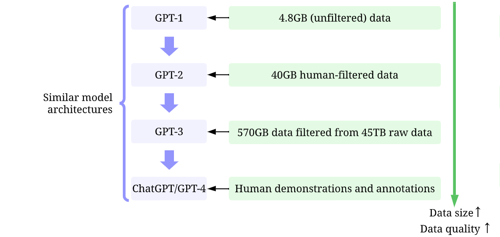
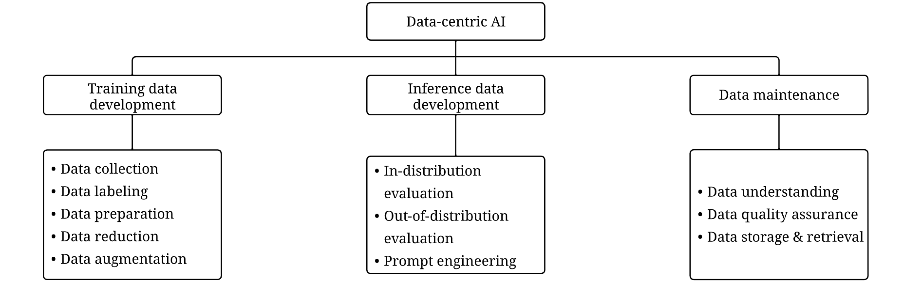
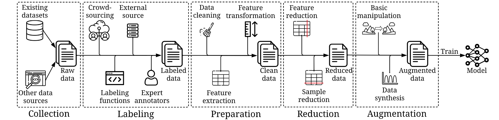
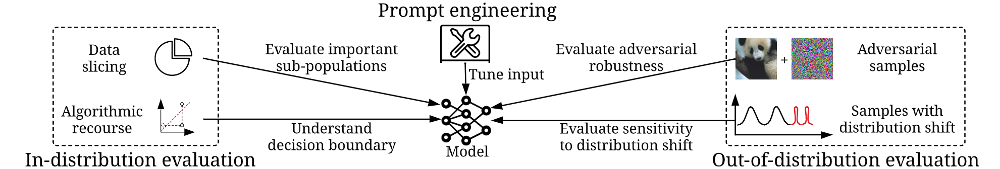
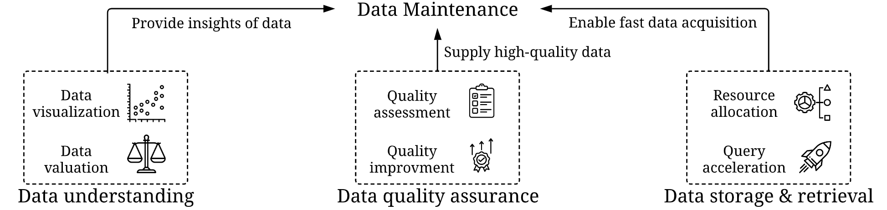
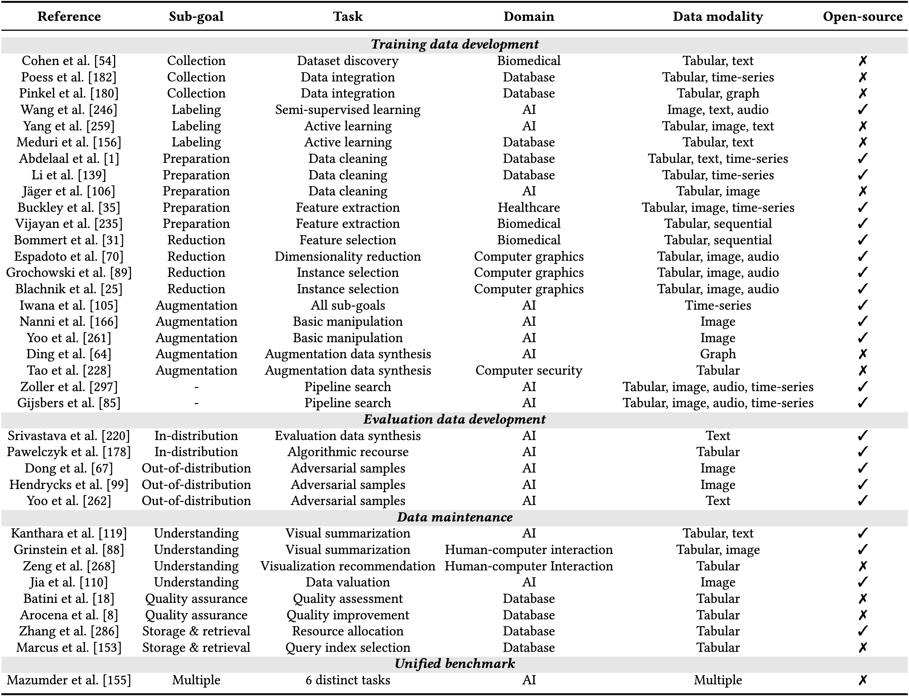

# README

## 前言

- 论文源地址：[Data-centric Artificial Intelligence: A Survey](https://arxiv.org/abs/2303.10158)

- 背景简介：在 AI 领域许多重大突破背后的一个重要推动因素是大规模高质量数据的可用性，即当且仅当我们得到正确的高质量训练数据后才可能取得重要成果，比如 AlexNet 。再比如，对 ChatGPT 这类大语言模型的迭代实际也是基于数据的迭代，而模型框架（算法）本身并没有大幅改动，见下图 。因此无论是学界还是业界，越来越多的人意识到数据的重要性，并转而投身于以数据为中心所构建的人工智能系统（以下简称 “数据中心型 AI” ）中来。

  

- 数据中心型 AI 的定义：为人工智能系统开发、迭代和维护数据的框架。以数据为中心的人工智能涉及构建有效的训练数据、设计适当的推理数据和维护数据的任务和方法。

## 1. 核心要点

- 数据可用性和质量是 AI 成功的关键驱动因素，导致了数据中心型 AI 的出现；
- 数据中心 AI 专注于系统地改进数据，而不仅仅是推进模型设计；
- 数据中心的三个一般目标是：训练数据开发、推理数据开发和数据维护；
- 现有方法涵盖自动化和人机协作方法，以确保数据质量、数量和可靠性；
- 提供了数据中心型 AI 的全面概述，包括定义、任务、算法、挑战和基准；
- 旨在帮助读者了解该领域并为数据中心型 AI 系统开发提供技术和研究思路。

## 2. 数据中心型 AI 的任务

作者将数据中心型 AI 分为三个目标：训练数据开发、推理数据开发和数据维护，其中每个目标与几个子目标相关联，每个子目标都有对应的任务，如下图所示：

### 2.1 训练数据开发

训练数据开发的目标是**收集和生成丰富且高质量的训练数据**，以支持机器学习模型的训练，这项工作包含以下五个子目标：

- 用于收集原始训练数据的数据收集；

- 用于添加信息标签的数据标记；

- 用于清理和转换数据的数据准备；
- 用于减少数据大小并可能提高性能的数据缩减；
- 用于在不收集更多数据的情况下增强数据多样性的数据增强。

### 2.2 推理数据开发

推理数据开发的目标是**创建新的评估集，以此对模型进行更细粒度的洞察**，或者使用工程化数据输入以触发模型的特定功能。这项工作包含以下三个子目标：

- 分布内评估；
- 分布外评估旨在分别生成遵循或不同于训练数据分布的样本；
- 提示工程调整语言模型中的提示以获得所需的预测。

推理数据开发中的任务是相对开放的，因为它们通常被设计为评估或解锁模型的各种功能。

### 2.3 数据维护

在实际应用程序中，数据不是一次性创建的，而是需要持续维护的。数据维护的目标是**在动态环境中保证数据的质量和可靠性**。涉及以下三个基本的子目标：

- 数据理解。目标是提供复杂数据的可视化和评估，使人类获得有价值的见解；
- 数据质量保证。目标是制定定量测量和质量改进策略来监测和修复数据；
- 数据存储和检索。目标是设计有效的算法，通过合理分配资源和有效处理查询来提供所需的数据。数据维护在以数据为中心的AI框架中起着基础性和支持性的作用，确保训练和推理中的数据准确可靠。

### 2.4 自动化与人类参与

- 随着可用数据规模日益增大，在数据中心型 AI 的任务里针对数据增强、特征变换等工作必须使用自动化算法。这种方式高效、准确，在提高了一致性的同时降低了人为犯错的机会。通常有以下几种自动化方式：
  - 基于编程的自动化：使用程序自动处理数据。这些程序通常是基于一些启发式和统计信息设计的。
  - 基于学习的自动化：学习具有优化的自动化策略，例如，最小化目标函数。该方法通常更灵活，适应性更强，但需要额外的学习成本。
  - 基于管道的自动化：跨多个任务集成和调整一系列策略，有助于确定全局最优策略。然而对此调优可能会产生更多成本。
- 当然在某些任务中也必须有人类参与，才能确保最终构建的数据是符合人类意图的，也就是我们所期望的。比如，在数据标注领域，人类的参与是不可或缺的。关于人机协作的方法通常需要人类以不同的形式参与具体工作。作者总结了三种人类参与的程度：
  - 全面参与：人类完全控制整个过程。这种方法帮助人们做决定。需要充分参与的方法通常可以很好地符合人类的意图，但可能代价高昂。
  - 部分参与：机器控制过程。然而，人类需要密集或持续地提供信息，例如，通过提供大量的反馈或频繁的交互。
  - 最小参与：机器完全控制整个过程，只在需要时咨询人类。人类只有在被提示或要求时才会参与。当遇到大量的数据和有限的人力预算时，属于这种程度的方法通常更可取。

自动化和人机协作中的各种方式不分优劣，具体方法的选择取决于应用领域和涉众的需求。

## 3. 训练数据开发

训练数据开发的整体概览如下图所示，该图仅作为一个通用的管道进行展示，并不强制固定使用所有步骤和顺序：

### 3.1 数据收集

数据收集是从多种来源收集和获取数据的过程，这一过程对数据质量和数量至关重要。作者强调了领域知识在有效收集数据方面的重要性，并介绍了几种现代的数据收集策略，它们有助于更有效地利用现有的数据资源。

#### (1) 数据收集的作用

- 领域知识：深入理解应用领域或行业是至关重要的，因为这有助于收集相关且具代表性的数据。例如，在构建推荐系统时，基于应用领域决定要收集哪些用户/项目特征是非常重要的。此外，特定领域的知识还可以帮助合成数据，如利用金融市场和交易策略的知识来生成更逼真的合成异常情况。

#### (2) 高效的数据收集策略

传统方式通常是手动从零开始构建数据集，但这既耗时又耗力。因此，现在更多的是通过利用现有的数据来开发更高效的方法，包括数据集发现、数据集成和数据合成。

- 数据集发现：随着可用数据集数量的增长，可以通过组合现有感兴趣的集合来构建符合需求的新数据集。数据集发现的目标是在存储原始格式数据的数据湖中识别出最相关和最有用的数据集。研究中一种代表性的策略是将数据集抽象成一个图，节点表示数据源的列，边表示两个节点之间的关系。另一种方法是表格联合搜索，通过属性重叠来衡量数据集的联合可能性。

- 数据集成：面对不同来源的多个数据集时，目标是将它们合并成一个统一的数据集。难点在于匹配不同数据集之间的列，并转换源数据集记录的值为目标数据集的值。传统的解决方法依赖于基于规则的系统，但这些方法不能很好地扩展。最近，机器学习被用来以更可扩展的方式自动化数据集成过程。例如，数据值的转换可以被表述为一个分类问题，其中输入是来自源数据集的数据值，输出是目标数据集的转换值。这样，我们就可以使用由规则生成的训练数据来训练一个分类器，并将其推广到未见过的数据记录。

- 原始数据合成：在某些情况下，合成数据可以弥补现实世界数据的不足。一个典型的场景是异常检测，由于异常情况非常罕见，难以收集到足够的实际异常。因此，研究人员经常在没有异常的数据集中插入异常模式。例如，提出了一种针对时间序列数据的一般性异常合成标准，其中时间序列被建模为趋势、季节性和形状的参数化组合。通过改变这些参数的不同点状和模式异常可以被生成。然而，这样的合成策略可能并不适用于所有领域，因此正确地设计数据合成策略仍然需要领域知识。

### 3.2 数据标记

作者在此详细讨论了数据标注在数据为中心的人工智能中的重要性和面临的挑战。

#### (1) 数据标注的需求
数据标注是给数据集分配描述性标签或标记的过程，这对于使算法能够从数据中学习并做出预测至关重要。如果缺乏适当的标注，模型可能无法产生预期的预测结果，因为模型的性能最多只能达到输入数据的质量水平。尽管无监督学习技术在诸如大型语言模型和异常检测等领域取得了成功，但这些模型的表现可能并不完全符合人类的期望。因此，为了获得更好的性能，通常还需要使用人工标签对大型语言模型（如 ChatGPT ）或异常检测器进行微调。

#### (2) 高效的标注策略
- **众包标注**：这是一种经典的方法，通过将标注任务分解为较小的部分，并外包给大量的非专家标注者来完成。为了减少不一致，可以采用小规模的预实验来迭代改进标注任务的设计，或者让多个工作者标注相同的样本以推断共识标签。
- **半监督标注**：这种方法的核心思想是利用少量的标注数据来推断未标注数据的标签。自我训练是一种流行的半监督方法，通过训练分类器然后使用该分类器来标注未标注数据，再将这些新标注的数据添加到训练集中来进一步训练分类器。
- **主动学习**：通过选择最能减少模型不确定性的样本进行标注，以减少所需的标注量。
- **数据编程**：这类方法通常要求最少的人工参与或部分人工参与，因此当需要快速生成大量标签时，这些方法往往更为理想。
- **远程监督**：这是一种弱监督的方法，通过利用外部资源来分配标签。例如，在关系抽取中，可以根据外部数据来标记文本中实体之间的语义关系。

#### (3) 挑战
数据标注的主要挑战在于平衡标注质量、标注数量和财务成本。如果资金充足，可以雇佣足够的专业标注者来获得足够数量的高质量标签。但在预算有限的情况下，则需要采取更高效的标注策略。选择合适的标注策略通常需要领域知识来平衡人工劳动与标注质量和数量的关系。此外，标注的主观性也是一个难题，即使指令对设计者来说是明确的，也可能被标注者误解，导致标注噪声。最后，考虑伦理，如数据隐私和偏见，特别是在将标注任务分发给大量不明确群体时，仍然是一个紧迫的问题。

### 3.3 数据准备

#### (1) 数据准备的需求

数据准备是一个清理和转换原始数据的过程，目的是使其适合作为模型训练的输入。由于原始数据常常包含噪声、不一致性或不必要的信息，这些问题可能会导致模型训练结果不准确或有偏差。例如，模型可能会在噪声、离群点和无关特征上过拟合，从而影响其泛化能力。另外，如果没有去除敏感信息（如种族、性别），模型可能会无意中学到偏向性的预测。此外，如果原始特征值处于不同的尺度或呈现倾斜分布，也会影响模型的性能。根据《福布斯》的一项调查，数据科学家的工作中有大约 80% 的时间都花费在数据准备上。

#### (2) 方法

为了实现数据准备的三个关键目标——数据清洗、特征提取和特征转换，本文介绍了几种技术手段。

- 数据清洗：这里涉及识别和修正数据集中的错误、不一致和不准确之处。传统方法倾向于使用程序自动化来修复数据，比如用均值或中位数填补缺失值，扫描所有数据查找重复项。然而，这些启发式方法可能是不准确或效率低下的。因此，已开发出基于学习的方法，如训练回归模型来预测缺失值，高效估计重复项，并纠正标签错误。当代数据清洗方法不仅关注清洗本身，而是更多地关注如何通过学习提升最终模型的性能。
- 特征提取：从原始数据中挖掘有用信息的过程。这可能包括从复杂的原始数据（如文本、图像或音频）中提取出有意义的特征。这些特征应当能够捕捉到数据中的关键模式，并且有助于后续的分析或建模。例如，对于文本数据，特征提取可能涉及将文本转换为词向量，而对于图像数据，则可能涉及提取图像的边缘或颜色直方图等。

- 特征变换：对提取出来的特征进行处理，使其更适合用于模型训练。这其中包括标准化、归一化或其它形式的转换，以便使特征在数值上更加一致或更容易被机器学习算法处理。特征变换的一个例子是将所有特征缩放到同一范围内，或者将非线性关系线性化，从而简化模型的学习过程。

这两项任务都是为了确保输入给机器学习模型的数据是干净的、格式统一的，并且能够最大程度地反映数据的真实特性。通过自动化的方法，如采用搜索算法来确定最佳的特征提取和变换策略，可以进一步提高数据准备的效率和效果。此外，学习型方法也被广泛应用于特征提取和变换中，以期提高最终模型的性能。

通过这些技术手段，数据准备的过程得到了优化，减少了手工操作的繁琐工作，提高了数据质量，进而提升了模型训练的效果。

#### (3) 挑战

因不同数据集的独特性，正确清洗和转换数据是一项具有挑战性的任务。例如，文本数据中的错误和不一致与时间序列数据中的问题有很大差异。即使是相同类型的数据集，它们的特征值和潜在问题也可能千差万别。这意味着研究人员和数据科学家通常需要投入大量的时间和精力来进行数据清洗。尽管基于学习的方法可以自动搜索最优的数据准备策略，但设计适当的搜索空间仍是一大挑战，并且搜索过程往往需要相当长的时间。这表明在数据准备阶段，面对多样化的数据集特性和问题，实现自动化的高效数据准备仍然存在困难。

### 3.4 数据缩减

数据缩减即通过减少特征尺寸或样本数量来降低数据集复杂度的过程，同时保持数据集的核心信息。以下是该节内容的总结：

#### (1) 数据缩减的需求

通过减少样本数量，可以得到一个更简单但仍具有代表性的数据集，这有助于减轻内存和计算压力，并缓解数据不平衡问题。此外，减少特征的数量还可以降低过拟合风险，加快训练和推理速度，并使模型专注于最重要的信息，从而提高准确性、效率和可解释性。

#### (2) 减少特征尺寸的方法

减少特征尺寸可以通过两种常见策略实现：特征选择和降维。

特征选择方法包括过滤法 (Filter) ，封装法 (Wrapping) ，嵌入法 (Embedding) 等。

降维技术如主成分分析 (PCA) 、线性判别分析 (LDA) 以及非线性方法如自编码器 (auto encoders) 可以将高维数据映射到低维空间，同时保留尽可能多的信息。

#### (3) 减少样本数量的方法

减少样本数量主要是通过实例选择 (Instance Selection) 来实现的，这涉及选择一个代表性子集的数据样本，以保留数据集的原始特性。实例选择技术分为过滤法和封装法。过滤法通过评分函数选择实例，封装法则根据模型性能来选择实例。此外，下采样多数类样本可以缓解数据不平衡问题，而最近的一些工作利用强化学习来学习最佳的下采样策略。

#### (4) 挑战

数据缩减面临着两大挑战：

- 选择最具代表性的数据或将数据投影到低维空间的同时尽量减少信息损失并非易事。尽管基于学习的方法可以在一定程度上应对这些挑战，但它们可能会消耗大量的计算资源，尤其是在处理极大数据集时。
- 数据缩减有可能放大数据偏差，引发公平性问题。例如，所选特征可能过度关联受保护属性，因此公平意识的数据缩减是一个关键但探索不足的研究方向。

### 3.5 数据增强

本节中讨论了数据增强在机器学习中的重要性以及其方法论。数据增强是通过人为创造变体来增加数据集大小和多样性的一种技术，它能够提高模型的性能。

#### (1) 数据增强的需求

现代机器学习尤其是深度学习算法通常需要大量的数据才能有效学习。然而，收集大量的数据特别是带有标注的数据是很费时费力的。数据增强通过生成具有变化的类似数据点，帮助模型接触到更多的训练示例，从而提高准确性、泛化能力和鲁棒性。在数据有限的应用中，数据增强尤为重要。例如，获得良好标注的医学数据通常既昂贵又耗时。数据增强还可以缓解类别不平衡问题，通过扩增少数类别的数据来平衡各类别间的训练样本比例。

#### (2) 常见的数据增强方法

数据增强通常通过操纵现有数据来生成变化或合成新数据。常见的基本操作包括缩放、旋转、翻转和模糊处理。在计算机视觉领域，这些策略被广泛应用。例如，Mixup 技术通过插值现有数据样本来创建新样本，充当正则化器，鼓励模型优先考虑更简单的线性模式。最近的研究还使用基于学习的算法自动搜索增强策略，AutoAugment 便是使用强化学习来逐步改进增强策略的一个例子。此外，针对特定数据类型（如时间序列、文本和图形数据）的增强方法也有所发展。

#### (3) 针对类别不平衡的方法

类别不平衡是机器学习中的基础挑战之一，其中多数类别的样本数量远多于少数类别。数据增强可用于通过上采样少数类别来平衡数据分布。SMOTE 方法就是一种流行的技术，通过在线性插值少数类实例与其邻居之间生成合成样本。ADASYN 方法则是 SMOTE 的延伸，为那些较难学习的数据点生成额外的合成样本。AutoSMOTE 则是使用强化学习来搜索最优的过采样策略。

#### (4) 挑战

数据增强的一个主要挑战是没有单一的增强策略适用于所有情况。不同类型的数据可能需要不同的策略。例如，与图像数据相比，图数据是不规则排列的，因此像Mixup这样的方法不能直接应用。即便两个数据集属于同一类型，最佳的策略也可能不同。基于搜索的算法虽可通过试错找到最佳策略，但这也增加了计算和存储成本。因此，需要更有效和高效的增强技术来克服这些挑战。

### 3.6 管道搜索

作者指出管道搜索是近期的一种趋势，旨在自动搜索最佳的数据处理流水线组合。代表性的管道搜索算法包括：

- AutoSklearn：执行预处理模块、模型和相关超参数的组合搜索，以优化验证性能。但其预处理模块的搜索空间较小。

- DARPA 的 D3M 项目：建立了一个用于管道搜索的基础设施，最初专注于自动模型发现，后来也开发了许多以数据为中心的处理模块。
- AlphaD3M：基于 D3M，使用蒙特卡罗树搜索来识别最佳管道。
- Deepline：使用多步强化学习在大量数据处理模块中进行搜索。
- ClusterP3S：利用聚类技术提高搜索效率，为不同特征创建个性化的管道。

尽管取得了一些进展，管道搜索仍面临着巨大的计算开销挑战，因为搜索算法需要反复尝试不同的模块组合。因此需要更高效的搜索策略来实现 pipeline search 在实际应用中的广泛应用。

## 4. 推理数据开发

在模型评估阶段，设计推理数据以评估训练好的模型或解锁模型的特定功能是建立 AI 系统中的另一个关键组件。传统上，我们常采用未包含在训练数据中的保留集来评估模型性能，但仅依靠性能指标并不能充分反映模型的许多重要特性，如鲁棒性、泛化能力及决策的合理性。随着模型规模的增大，通过工程化输入数据即可得到预期的预测结果成为可能。因此，第 4 章从更细致的角度介绍了评估模型或工程化输入数据的方法，具体分为：

### 4.1 分布内评估

作者指出构建与训练数据分布一致的评估数据集的重要性。评估数据集的构建旨在识别模型在特定子人群上的表现不佳情况，并校准这些代表性不足的群体以避免偏差和错误，尤其是在高风险应用中。此外，理解决策边界并在部署前检查模型伦理也非常重要。而后又进一步讨论了通过数据切片识别重要子人群以及通过算法补救评估决策边界的方法。

- 数据切片 (data slicing) 通过预定义的标准（如年龄、性别、种族等）将数据集划分为相关的子群体，并分别评估模型在每个子群体上的性能，以发现模型在某些子群体上的弱点。为了减少人工努力，也有一些自动化的数据切片方法，如 SliceFinder 和 SliceLine 等。

- 算法追溯 (algorithmic recourse) 旨在检查模型的决策边界，以确保模型的决策是可解释和公平的，特别是在高风险应用中。

### 4.2 分布外评估

分布外评估的目标是生成与训练数据分布不同的样本，以测试模型在面对不同于训练数据的情况下的鲁棒性和泛化能力。常用方法包括生成对抗样本和模拟分布偏移。

### 4.3 提示词工程

提示词工程即调整语言模型中的提示以获得所需的预测。这部分包括手动提示工程和自动化提示工程，前者依赖于人工设计提示，后者利用自动化技术来寻找最佳提示。这是一种相对开放的方法，旨在评估或解锁模型的各种能力。

### 4.4 总结

推理数据开发旨在通过精心设计的数据输入，全面地评估和探索模型的各种能力，而不仅仅局限于传统的整体性能指标，这对于构建可靠和可解释的 AI 系统至关重要。

## 5. 数据维持

### 5.1 数据理解

数据理解是确保数据维护的基础，它涉及到通过可视化和估价来提供对数据的见解，其必要性体现在以下几个方面：

- 大量的数据样本使人难以理解，因此需要将数据总结并以更简明的形式展现。
- 数据的高维度特性超出了人类的直观感知范围，所以需要将其可视化为更低维度的空间以方便理解。
- 组织和利益相关者需要了解数据资产的价值，并认识到每个数据样本对性能的影响。

### 5.2 数据质量保证

数据质量保证对于确保持续的数据供应至关重要，它包括质量评估和质量改进两个方面：

- 质量评估：开发评估指标来测量数据质量，检测潜在的缺陷和风险，这些指标可以分为客观或主观评估。
- 质量改进：一旦模型受到低质量数据的影响，就需要实施质量改进策略以增强数据质量，从而提升模型性能。

### 5.3 数据存储与检索

数据存储与检索系统对于提供构建人工智能系统所需的高效数据获取至关重要。随着数据量的指数级增长，拥有能够有效处理大数据量和速度的稳健且可扩展的数据管理系统变得越来越重要。这包括两方面的内容：

- 设计查询策略，以实现数据的快速获取，确保数据的及时和准确处理。
- 数据管理系统的高效运行，例如Hadoop和Spark，需要储存和合并来自不同来源的数据，并需仔细管理内存和计算资源。

整体而言，数据维护涉及确保数据的理解、质量的保障以及高效的数据存储与检索，这些都是构建可靠的人工智能系统不可或缺的组成部分。

## 6. 数据基准

首先，作者介绍了数据基准测试的收集策略。主要使用 Google Scholar 搜索相关的基准测试论文，并根据不同的数据相关任务使用关键词进行查询，如 "benchmark data cleaning" 、"quantitative analysis for data cleaning" 等。由于很多基准测试更关注模型性能而非数据本身，因此作者还进行了人工筛选，确保所收集的基准测试主要评估数据而非模型。

然后，作者总结了收集到的 36 个数据基准测试，涵盖了数据收集、标注、预处理、降维、增强等各个数据生命周期阶段。其中 23 个基准测试提供了开源代码，如下图所示：

此外，作者还对这些基准测试进行了元分析：

- 基准测试来自不同领域，包括计算机科学以外的医疗保健、生物医学等领域，体现了数据中心型 AI 是一个跨学科的努力。

- 最常见的数据模态是表格数据,其次是图像、时间序列、文本、音频和图数据。

- 相比于评估数据开发和数据维护，训练数据开发受到更多关注，这可能是因为之前很多数据预处理任务被视为模型训练的前置步骤。

总的来说，该章节系统地梳理了现有的数据基准测试，为数据中心型 AI 的研究提供了有价值的参考。

## 7. 讨论和未来方向

作者首先回答了文章开头提出的 4 个研究问题：

1. 什么是数据中心型 AI 的必要任务？

   数据中心型 AI 包括开发训练数据、推理数据和维护数据等一系列任务，如数据清洗、标注、准备、降维和增强等。

2. 为什么自动化对于开发和维护数据很重要？

   随着数据量的急剧增加，开发自动化算法来简化数据开发和维护过程变得非常必要。现有研究已经在各个子目标上开发了不同程度的自动化算法，从编程自动化到基于学习的自动化再到管道自动化。

3. 在哪些情况下以及为什么人类参与对数据中心型 AI 很关键？

   人类参与对于很多数据中心型 AI 任务是必要的,如大部分数据标注任务和一些推理数据开发任务。人类参与在很多场景下是确保AI系统行为符合人类意图的唯一方式。

4. 数据中心型 AI 的当前进展如何？

   尽管数据中心型 AI 是一个相对较新的概念，但在很多相关任务上已经取得了显著进展，其中大部分之前被视为模型训练的前置步骤。同时也出现了许多新的任务，研究仍在持续进行。第 6 章的元分析表明进展主要集中在训练数据开发上，表格数据和图像数据是主要关注对象。随着相关论文指数级增长，未来这一领域将会有更多进展。

最后，作者讨论了数据中心型 AI 的整体现状和未来方向，指出数据在构建 AI 系统中的作用将越来越重要，但仍有许多挑战需要解决。希望这篇综述能够激发社区内的协作，推动这一领域的发展。

## 8. 总结

本文作为一份对数据中心型 AI 这一新兴领域的全面概述，首先讨论了数据中心AI的必要性，指出这种方法强调系统地设计数据来构建 AI 系统，并与主要关注模型设计的传统模型中心型 AI 形成对比。其次本文提供了三个一般数据中心型 AI 的目标：训练数据开发、推理数据开发和数据维护，以帮助读者从整体视角进行理解。此外，本文还从自动化和人机协作角度梳理了现有文献，并讨论了各种任务的挑战和基准。作者旨在帮助读者有效地掌握该领域的一般情况，并为他们提供系统地设计数据以构建有效 AI 系统的技术和研究思路。
