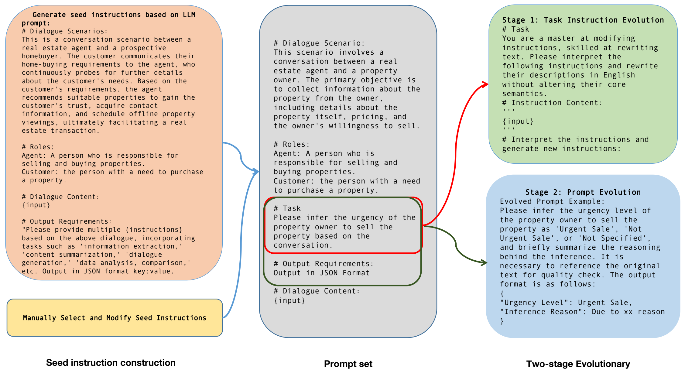
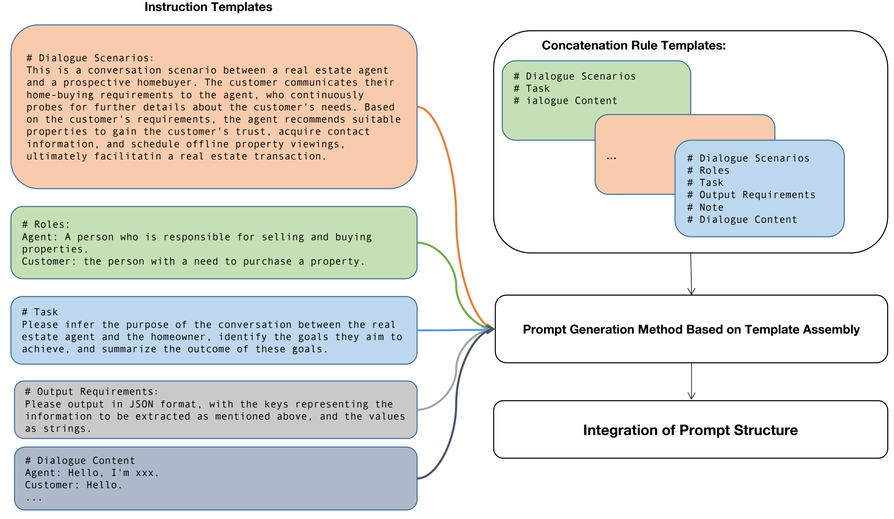
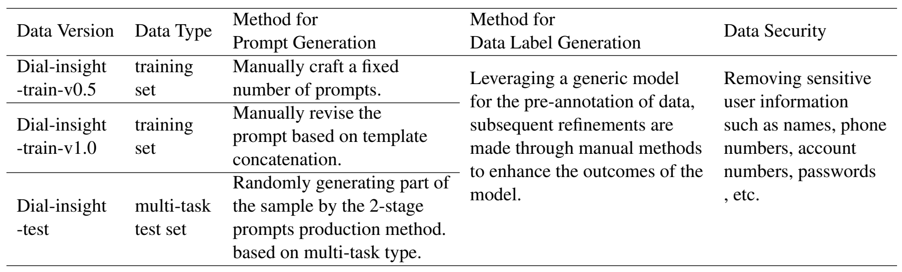
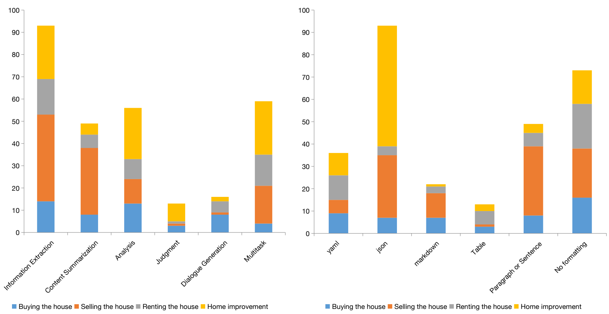
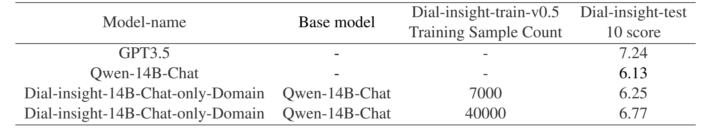
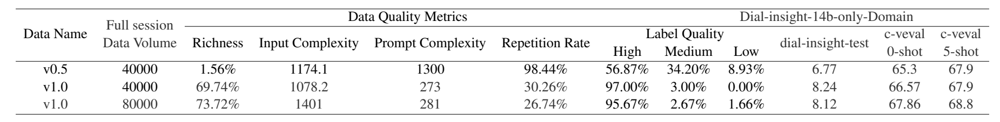
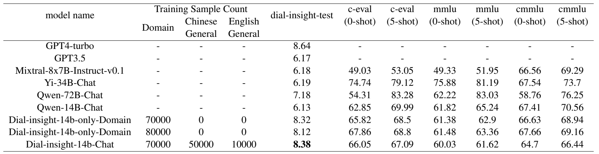

# Dial-insight：利用高质量特定领域数据微调大型语言模型防止灾难性遗忘

## 摘要

大型语言模型（LLM）的性能很大程度上依赖于底层数据的质量，特别是在专业领域。在针对特定领域应用微调LLM时，一个常见的挑战是模型泛化能力的潜在下降。为了解决这些问题，我们提出了一种两阶段方法来构建提示词（production prompts），旨在产生高质量的数据。该方法包括生成涵盖广泛任务的多样化提示词，这些提示词展现出丰富的表达形式。此外，我们引入了一个成本效益高、多维度的质量评估框架，以确保生成标注数据的完整性。利用来自房地产行业的服务提供商与客户互动的真实数据集，我们展示了数据质量和模型性能之间的正相关关系。值得注意的是，我们的研究发现表明，通过使用我们提出的方法生成的数据进行微调，可以在不牺牲模型整体泛化能力的情况下，提高通用LLM在特定领域的熟练度，即使仅使用特定领域的数据进行微调也是如此。

## 引言

随着大型语言模型（LLM）能力的提升，对其在专业领域应用的期望和要求也相应提高。将LLM集成到特定领域以提供专家级服务成为新兴的研究焦点，目的是利用其潜力创造重要价值。为了增强LLM在特定领域的熟练度，必须根据这些领域的独特数据特性和情境需求定制其能力。然而，特定领域通常包含一系列复杂、开放性的问题，这些问题与LLM的一般能力紧密相关，如服务质量评估、价格计算和信息提取等。如果LLM在特定领域增强过程中的一般能力下降，那么每个新的领域内问题都需要进一步的模型优化，这不仅不切实际而且成本高昂。因此，特定领域的LLM还必须保持强大的一般能力，以有效应对开放性的领域挑战。高质量的数据是解决这些挑战的关键因素。

在追求高质量数据的过程中，学者们探索了多种方法，涵盖了数据源收集、任务指令制定和数据质量评估等方面。Chathome从书籍、网站和资料库等多种来源收集了一个家居装饰数据集，以增强通用型LLM在特定领域的能力。然而，由于数据的开源性质，相比商业来源，可能在领域专业知识方面有所限制。此外，在没有多任务预训练（MIP）的情况下，使用这些数据对语言模型进行微调会显著削弱基础模型的一般能力，尽管能增强特定领域的技能。CSDS开发了一个中文客户服务对话摘要数据集，并研究了使用传统文本摘要技术的算法方法。然而，这个数据集仅限于总结问答对，缺乏对模型多任务处理能力的评估。在任务指令构建方面，结合指令或提示来优化语言模型输出的方法已经非常成熟。例如，SELF-INSTRUCT方法和WizardLM提出的指令演化算法都提高了指令构建的效率。关于数据质量评估，Llama2等研究反复强调了数据质量对LLM能力的影响。为了通过数据质量评估建立高质量数据，有研究提出了指令遵循难度（IFD），使模型仅通过5%-10%的原始数据进行微调就能达到良好的效果。不过，这一质量指标的计算既复杂又昂贵。如何以低成本准确评估整个训练集的数据质量仍然是一个挑战。

本文介绍了一种在特定领域生成高质量数据的方法，该方法基于对房地产服务提供商与客户之间对话数据的分析。我们还提出了一套成本效益高、多维度的数据质量评估指标。实验表明，使用这种方法生成的高质量数据不仅能够增强通用LLM的专业能力，同时还能确保领域模型的一般能力不会下降。与现有研究相比，我们用高质量领域特定数据微调LLM的方法具有三个显著特点：

1. **更复杂的指令构建。**我们提出了一种两阶段的演化方法来构建融合了领域特定信息、角色细节和任务指令的提示。使用我们方法构建的提示比一般指令演化算法产生的提示展现出了更高的复杂性和丰富性。
2. **一种成本效益高、全面的数据质量评估系统。**不同于单一的数据质量评估，我们设计了一种多维度、成本效益高的综合质量评估系统，以客观衡量数据质量。该系统基于提示、输入和目标，从丰富性、复杂性、冗余性和标签质量四个维度评估整个训练数据集的质量。通过广泛的对比实验，我们证实了使用该系统获得的数据质量评估结果与相应数据的模型训练结果呈正相关，为模型的优化方向提供了可解释性。
3. **在特定领域微调过程中保持一般能力。**先前的研究已认识到，增强领域能力通常会导致模型一般能力的下降，因此需要包含一般数据以维持整体熟练度。相比之下，我们的高质量领域数据即使在仅使用领域数据进行微调的情况下，也不会导致模型一般能力的下降。我们在不同数据质量下的领域特定对话分析实验中发现，随着数据丰富性和质量的提升，领域微调模型在特定任务上的表现显著增强，无需添加一般多任务数据，同时模型固有的诸如英语和中文的语言能力和一般的多任务处理能力等一般能力得以保持。

## 两阶段演化式提示词数据生成法

在命令构建和使用领域，通用命令与针对特定垂直领域定制的命令之间存在显著差异。主要区别如下：

- **指令复杂性：**特定垂直领域的命令需要一个考虑多种因素的多层面构建过程，这些因素包括业务场景、角色特定任务以及严格的任务要求。因此，这些指令的复杂性超过了通用命令输入。

- **领域特定任务指令：**与通用命令不同，专业领域的指令表达更加精确，通常包含许多详细的子项。这些指令的特点在于其专业的语气和对高可靠性的要求。

鉴于这些差异，通用数据集的指令算法演化遇到了若干限制：

- 不可控的演化：通用指令算法的演化基于指令本身，而未融入扩展文本对话的完整上下文。当模型的迭代提示与完整的文本输入结合时，这可能导致算法演化的不可控。

- 受限的指令复杂性：仅专注于指令而不整合业务需求及指令在业务场景中的完整上下文的演化算法，会产生有限的复杂性。由此产生的指令通常与实际业务环境中使用的指令存在显著差异。

- 提示构建的专业化：大规模模型基于种子任务自动演化生成的提示，其风格和复杂性往往与现实业务环境中由人类专家制作的提示有显著差异。这种差异可能会降低生成提示的实际效用。
- 为了解决这些问题，我们提出了一种基于指令演化的两阶段提示演化方法。该方法的框架如图1所示。

<b>图 1: 两阶段演化式提示词方法</b> 

| 种子指令                                                     | Prompt                                                       | 两阶段演化                                                   |
| ------------------------------------------------------------ | ------------------------------------------------------------ | ------------------------------------------------------------ |
| 基于LLM提示生成种子指令： # 对话场景： 这是一个房地产经纪人与潜在购房者之间的对话场景。客户向经纪人传达他们的购房需求，经纪人则不断询问以获取更多关于客户需求的详细信息。根据客户的需求，经纪人推荐合适的房产，以赢得客户的信任，获取联系方式，并安排线下看房，最终促成房地产交易。 # 角色： 经纪人：负责买卖房产的人。 客户：有购买房产需求的人。 # 对话内容： {input} # 输出要求： “请根据上述对话提供多个{指令}，包括‘信息提取’、‘内容摘要’、‘对话生成’、‘数据分析与比较’等任务。以JSON格式键值对输出。” | # 对话场景： 此场景涉及一名房地产经纪人与房产所有者之间的对话。主要目标是从所有者那里收集有关房产的信息，包括房产本身的详情、定价及所有者出售意愿。  # 角色： 经纪人：负责买卖房产的人。 客户：有购买房产需求的人。（注：此处“客户”应改为“房产所有者”以符合场景描述） # 任务： 请根据对话推断房产所有者出售房产的急迫性。  # 输出要求 以JSON格式输出。  # 对话内容： {input} | 第一阶段：任务指令演化 # 任务： 您是一位修改指令的高手，擅长重写文本。请解读以下指令，并在不改变其核心语义的前提下，将其描述重新撰写成英文。  # 指令内容： ''' {input} '''  # 解读指令并生成新指令： |
| 手动选择和修改种子指令                                       |                                                              | 第二阶段：提示演化 演化后的提示示例： 请推断房产所有者出售房产的急迫程度为“紧急出售”、“非紧急出售”或“未指定”，并简要总结推断的理由。必要时需引用原文本以进行质量检查。输出格式如下： {   "Urgency Level": "紧急出售",   "Inference Reason": "由于xx原因" } |

### 阶段1：任务指令演化

**步骤1：种子指令生成**：在初始阶段，我们借鉴自我指导范式，为给定任务创建一套多样化的种子指令。这些指令通过融合任务场景、角色和对话的多方面信息来构建，从而确保生成的指令与任务背景高度契合。这种方法与传统仅关注任务本身的方法有所不同，因为它在指令生成过程中引入了更高程度的领域特定性。

在生成大量种子指令后，我们意识到可能存在诸如低有效性、语义重复等问题。为缓解这些问题，我们采用人工数据管理过程。这包括对种子指令进行全面审查，在此过程中保留高质量的指令，而淘汰质量较低的指令。

**步骤2. 任务指令演化：**经过人工筛选后，我们得到了一组初步的种子指令，虽然这些指令已经过筛选，但仍可能缺乏所需的复杂性。为了解决这一问题，我们引入了一种半自动的指令演化方法，该方法结合了大型语言模型的能力与演化算法。具体过程如下：

**步骤2.1. 自动指令增强**：利用大型语言模型与演化算法相结合，我们自动重写种子指令以增加其复杂性和丰富性。这一步骤旨在使指令超越其初始形态，引入可能提高其有效性的变化。

**步骤2.2. 演化指令的手动筛选：**随后，演化后的指令将接受手动筛选过程。根据以下标准识别高质量的指令：它们必须易于理解且无歧义，不需要人工修改；并且相比原始种子指令，它们应该提供更详细和改进的任务描述。

**步骤2.3. 人工指导的指令精炼：**最后，我们进行一个人工指导的精炼过程，其中选定的高质量指令将被扩展或重写。这一步骤的目标是纠正自动化演化阶段中引入的任何语义扭曲或表达问题，从而使指令在规范性和连贯性方面得到优化。

通过实施这一两步方法论，我们成功生成了一组具有显著多样性和复杂性的对话分析指令。这套精炼的指令集有望提升大型语言模型在执行特定领域任务时的表现。

### 阶段二：提示词演化

所提出的方法论旨在模拟专业任务场景的复杂性，在这些场景中，提示描述通常是格式规定和任务指令的复杂融合。这反映了用户与复杂模型互动时的期望和实践，他们习惯于使用能够将格式指南与示例说明和谐结合的提示。提示构建的整个方法如图2所示，技术流程简要描述如下：

**步骤1. 多模板设计。**我们首先设计一系列多样的模板，包括各种场景描述和任务指令叙述。这一基础步骤确保了提示基于丰富的背景，能够适应广泛的潜在场景。

**步骤2. 组装式提示生成。**随后，我们采用内容填充策略，随机组合从初始模板中提取的子组件。这一组装过程产生了如图2所示的综合提示。该技术的主要优点在于其简便性和易于扩展。然而，它并非没有局限性。生成的模板虽然功能完备，但在组成部分的连贯性上表现出一定的僵硬性。

**步骤3. 提示结构优化。**为克服上述局限，我们引入了额外的步骤来优化提示结构。借鉴人类编写的示例，我们首先整合输出格式、总体指南和任务指令，以重构指令叙述。之后，我们应用之前建立的模板拼接方法，将背景上下文、角色介绍、对话元素和修订后的指令叙述无缝融合，形成一个连贯的提示。

<b>图 2:阶段2：提示词演化方法</b> 

### 数据标签生成

为了解决数据分布不平衡的挑战，并在训练过程中优先发展特定的模型能力，我们在数据标签生成过程中采用了加权随机抽样的策略选择任务指令。这种方法确保了训练样本的平衡分布，促进了任务指令和表达方式的多样性。同时，它允许对特定场景的能力进行有针对性的增强。这种细致的数据管理方法对于自然语言处理任务中稳健且多功能模型的发展至关重要。该方法概述如下：

**步骤1.** 基于场景的对话数据加权——根据场景和任务的重要性随机选择对话数据。
**步骤2.** 根据两阶段提示演化方法生成完整的任务描述提示。
**步骤3.** 基于通用模型，自动生成相应的数据标签。

## 实验与分析

### 数据集构建

在房地产领域，对话场景众多，来自不同来源和场景的对话数量庞大。我们根据业务性质和角色行为对原始数据进行了整理。
根据实际交易业务的性质，对话场景大致可以分为四种：“购房”、“售房”、“租房”和“房屋改善”。

按照数据来源的不同，数据可以分为10种类型，包括“电话录音”、“大屏录音”、“智能徽章录音”、“VR录音”、“PAD录音”、“手机录音”、“单文本记录”、“即时消息对话”、“企业微信群消息”和“个人企业微信消息”。

**任务类型分类：**在场景中，服务提供者包括“房地产经纪人”、“室内设计师”、“房屋租赁云经理”、“租赁资产管理者”、“客户经理”和“家庭顾问”等多种角色，他们执行的日常任务可以产生各种任务，如“经纪人与业主之间的沟通”、“新客户来源”等。基于服务提供者的实际业务内容，我们收集并总结了主要任务类型，如表5所示。

在实验过程中，我们不断改进和完善数据生产方法，构建并完善了多个版本的房地产对话洞察数据集，包括用于训练的"Dial-insight-train-v0.5"、"Dial-insight-train-v1.0"以及用于多任务测试的"Dial-insight-test"数据集。这些数据集的构建方法如表1所示。

<b>表 1: 数据生成方法</b> 

### 模型训练

**Baseline：**我们基于Qwen-14B-chat，通过加入垂域对话训练集对大型语言模型进行微调。然后，我们将对话洞察模型的性能与GPT-4、GPT-3.5、Mixtral-8x7B-Instruct-v0.1（MoE）、Qwen-72B-Chat、Yi34B-Chat和Qwen-14B-Chat在垂直任务数据集和开源通用任务基准上进行比较。

**训练参数：**epoch：3，lr：2e-5，GPUs：8，batch size：128，full-parameter-tuning

### 数据综合质量评估

我们设计了一套全面的质量评估系统，用于评估数据质量并选择高质量数据进行模型领域微调。该系统包括六个指标：提示复杂性、输入复杂性、数据丰富性、数据冗余性和数据标签质量。

提示词复杂度计算方法：
$$
C_{Prompt} = \sum_0^n(L_P)/n
$$
其中，$L_P$代表提示词的token长度，$n$代表数据集的总数。

输入复杂度计算方法：
$$
C_{input} = \sum_1^{n}\left(\frac{1}{3}L_{C} + \frac{2}{3}L_P\right)/n
$$
其中，$L_C$代表每次对话的tokens长度。

丰富性指标的计算方法简述如下。首先，使用Qwen14B-Chat模型的分词器对数据进行文本向量表示。然后，利用community detection算法进行聚类。这里的核心概念是通过计算两个样本之间的余弦相似度来评估它们的相似性；当相似度超过一定阈值（本研究中经实验验证设定为0.82）时，样本被视为相似，因而有资格被纳入选择池；否则，将被排除在外。一旦选择池中的样本数量达到预定数量，多样性过滤即视为完成。丰富性方法：
$$
R_i = \sum_1^{N}(C_i \cdot N_{Top_{n}}) / n,(n >= 1, N >= 1)
$$
其中，$N$表示聚类后的中心点数量，$C_i$表示数据集的第$i$个聚类中心，$N_{Top_n}$ 表示每个类别的前$n$个数量。

数据冗余为：
$$
R_e = 1 - R_i
$$
数据标签质量为：
$$
Q = \frac{N_x}{N_{total}}, (x = high, medium, low)
$$

其中，$N$代表属于某一质量类别的样本总数。

通过对比表3中的两个数据版本，可以看出v0.5与v1之间的数据质量存在显著差异。经过两阶段的提示演化迭代，训练数据集的丰富性得到了大幅提高，数据冗余指标也明显减少。总体而言，数据质量有了显著的提升。

### 模型性能测评

测试数据集：我们使用了两个中文开源通用任务评估集、一个英文开源通用任务评估集和一个中文房地产对话分析领域任务评估集，来评估多个大型模型的能力。

**C-Eval：**C-Eval 是一个涵盖52个不同学科的中文评估数据集。我们展示了0-shot和5-shot的结果。

**CMMLU：**CMMLU 旨在评估中文的语言理解能力。我们展示了0-shot和5-shot的结果。

**MMLU：**大规模多任务语言理解旨在测量语言理解能力。我们展示了0-shot和5-shot的结果。

**Dial-insight-test：**该数据集基于286段房地产服务提供者与客户之间的对话构建，涵盖了信息提取、内容摘要、推理能力、言语生成、数据分析和比较等多项任务。测试集中任务类型的分布统计和任务输出格式的分布统计如图3所示。

<b>图 3: 测试数据集中任务类型的分布统计（a）和任务输出格式的分布统计（b）。请注意，纵轴上的单位代表测试数据样本的数量。</b> 

评估方法：需要注意的是，我们要求GPT-4模型参考测试集中的标注答案，对特定领域内模型的输出结果进行评估。

### 实验结果

我们使用不同规模的v0.5数据对Qwen-14B-chat模型进行了微调，结果如表2所示。通过对比可以看到，增加数据规模可以提升模型性能。然而，使用该数据集的模型性能提升有限。

<b>表 2: 比较训练数据量对训练效果的影响</b> 

此外，我们通过提高数据的整体质量和对训练数据进行全面质量评估，进行了多组对照实验。如表3所示，我们发现随着数据整体质量的提升，模型在垂直领域的能力显著增强。同时，模型的一般性能也会有所提高。值得注意的是，就数据规模而言，并不是越大越好。在实际的模型训练中，有必要进一步探讨数据集的适当规模，以优化模型性能。

<b>表 3: 数据质量对模型性能的影响</b> 

我们将特定领域的模型与多个开源通用模型进行了比较，比较结果如表4所示。其中，Dial-insight-14B-Chat模型以Qwen-14B-Chat为基础模型，使用Dial-insight训练数据及部分开源的中文和英文通用数据进行训练，是一个经过全参数微调的房地产领域对话分析大型模型。Dial-insight14b-only-Domain模型与前者不同之处在于，在微调过程中仅使用Dial-insight训练数据作为微调数据，不使用任何开源通用数据。从表4可以看出，经过Dial-insight训练数据加强后，与基础模型相比，在特定领域场景下有显著提升。同时，仅使用Dial-insight数据对通用模型进行加强后，包括语言能力在内的原有通用能力没有显著下降。

<b>表 4: 各模型性能对比</b> 

通过上述实验，我们观察到，随着垂直领域数据丰富性和标签质量等数据质量指标的显著提升，仅使用垂直领域数据微调后的模型在垂直领域的能力上显示出明显的增强。重要的是，这种增强并没有导致模型原有的通用能力出现显著退化。

## 结论

本文提出了一种高质量领域数据构建生产方法，主要包括两阶段提示演化方法和基于大型模型的数据标注方法。随后，基于一个全面的数据质量评估体系，对生成数据的质量进行监控。最后，基于生产的数据，通过全参数微调在垂直领域训练大型模型，并通过多个模型对比实验验证了高质量领域数据在提升大型模型垂直领域性能方面的有效性，同时不会导致模型原有通用能力的下降。
