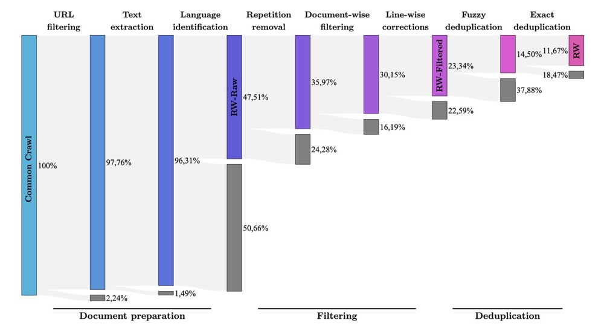

# README

## 前言

- 论文源地址：[The RefinedWeb Dataset for Falcon LLM: Outperforming Curated Corpora with Web Data, and Web Data Only](https://arxiv.org/abs/2306.01116)

- 宏量数据提炼 MacroData Refinement (MDR) ：

  

  本文主要介绍了一种对大规模 web data 进行过滤和去重的数据管道 MDR 。实验表明，在做好过滤筛选和去重的条件下，即使只使用网页数据也依然能提炼得到适用于LLM预训练的大规模、高质量数据集。我们对 MDR 管道中各步骤的目的及其所用到的技术梳理如下。

## Document Preparation 文档准备

### 1. URL filtering 网址过滤

#### 1.1 目的

基于URL对欺诈和成人网站（色情、暴力赌博等）进行过滤

#### 1.2 实现方法

##### URL BLOCKLIST：

- 来源：使用了一个约 460 万条 URL 的聚合列表，该列表按类别（如成人、网络钓鱼、约会、赌博、-文件托管、DDoS 攻击、攻击性、聊天、混合成人、法国受监管的赌博网站等）进行划分。
- 整理：将该列表应用于 8.32 亿页的子集时，发现一些良性域名（如流行文化新闻网站或博客平台）被误屏蔽，手动检查了匹配次数超过 4000 次的所有 URL（这些 URL 在数据集中占比较大），并从列表中删除了这些误屏蔽的域名。

##### URL SCORING WITH A WORD-LIST：
   - 匹配模式：基于软、硬和严格违规的单词列表，使用了三种匹配模式来对 URL 进行评分。
     - 严格子词匹配：如`http://foobann.edsub-wo.rdbar.com/any/bar`，匹配诸如`xvideos`、`groupsex`等明确与成人内容相关的单词。避免了部分不明确的匹配（如`ass`，可能是`massachusetts`等中性词的一部分）。
     - 硬全词匹配：如`http://www.foo.bannedword-bar.com`，匹配单词如`porn`、`xxx`、`orgy`等。
     - 软词匹配：如`http://www.foo.soft1-bar-soft2.com`，当列表中的多个词匹配时（如单个匹配的`dick`），这些词虽然不足以单独作为丢弃文档的充分理由，但会引起怀疑。
   - 严重性等级：每个列表都与不同的严重程度级别相关。对于最严格的级别（严格子词匹配），任何在子字符串中匹配禁用词的 URL 都将被禁止；对于硬全词匹配，包含列表中全词匹配的 URL 将被禁止；对于软词匹配，至少需要两个匹配。
### 2. Text extraction 文本提取
#### 2.1 目的

从网页中提取出主要内容，忽略菜单、页眉、页脚和广告等无关内容，以获取高质量的文本数据用于模型的训练。

#### 2.2 实现方法

使用 trafilatura 进行文本提取，并通过正则表达式设置额外的格式：将新行限制为连续两个，并且删除所有的 URL。

## Filtering 数据过滤

### 1. Repetition removal 重复项移除

#### 1.1 目的

减少数据中的重复内容，因为这些重复内容可能会导致模型出现病态行为，同时也不利于模型的泛化能力

#### 1.2 实现方法
文档级重复内容去除：在早期阶段，通过检测文档中是否存在过多的行、段落或 n - gram 重复，来捕获由于爬行错误和低质量来源导致的重复内容。如果文档存在这些问题，就将其移除，这样做成本较低且更容易实现。作者采用了Rae .et.al的启发式方法，并删除任何行、段落或n-gram重复过多的文档。

### 2. Document-wise filtering 逐文档过滤

#### 2.1 目的

在移除重复文档后，仍有很大一部分文档不具备逻辑性和准确性。例如，关键字、样板文本、特殊字符序列列表等。对此，作者采用 [Rae et al. (2021)](https://arxiv.org/abs/2112.11446) 等人的质量过滤启发式方法进行剔除。

#### 2.2 实现方法

Quality filtering heuristics：基于文档总体长度、符号与单词比率以及其他标准去除文档异常值，以确保文档是真正的自然语言。

### 3. Line-wise corrections 逐行校正

#### 3.1 目的

过滤文档内部可能存在与自身内容不相关的行。例如，社交媒体计数器（如：`<kbd>`3 likes`</kbd>`）、导航菜单等。

#### 3.2 实现方法

通过构建逐行校正过滤器，针对这些无关项进行剔除。具体来说，在逐行拆分文档后基于以下规则丢弃或编辑行内文本：

- 如果该行主要由大写字符组成 $\rightarrow$ **丢弃**；
- 如果该行只由数字字符组成 $\rightarrow$ **丢弃**；
- 如果该行是社交媒体计数器 $\rightarrow$ **丢弃**；
- 如果该行只包含一个单词 $\rightarrow$ **丢弃**；
- 如果该行很短（$\le$10 个单词），则启用匹配模式 $\rightarrow$ 编辑：
  - 在行的开头（例如：`<kbd>`sign-in`</kbd>`）；
  - 在行的末尾（例如：`<kbd>`read more...`</kbd>`）；
  - 在行内的任何位置（例如：`<kbd>`items in cart`</kbd>`）。
    过滤器会在文档的每一行中寻找这些无用的元素，并累计这些无用行的单词数，计算其在整个文档中的比例。如果无用行单词数占当前文档总单词数的 5% 以上，则丢弃整个文档。至此原始数据集 CommonCrawl 中大约仅 23% 的文档被保留。

## Deduplication 数据去重

### 1. Fuzzy deduplication 模糊去重

#### 1.1 目的

在逐行校正的基础上，识别并去除那些内容相似但不完全相同的文档（文档级别）。

#### 1.2 实现方法

##### (1) 文本规范化：

- 删除标点符号、重音符号，应用 Unicode 的 NFD 规范化，并规范化所有空格以提升召回率。

##### (2) 文档签名计算：

- 使用 GPT-2 分词器进行分词后，每个文档得到一组唯一的 n-gram 集合。
- 使用哈希函数计算每个文档的签名：对于每个哈希函数，从文档中的每个唯一 n-gram 的哈希值中选择最小值，这也是 MinHash  [(Broder, 1997)](https://www.cs.princeton.edu/courses/archive/spring13/cos598C/broder97resemblance.pdf) 的由来。

##### (3) 相似度测量：

- 基于 MinHash 算法通过比较文档签名之间的重叠程度来估算文档间的 Jaccard 相似度 [(Jaccard, 1912)](https://biocomparison.ucoz.ru/_ld/0/92_jaccard_1912.pdf) 。
- 如果两个文档相似度很高，则它们在某些哈希函数上的最小哈希值很有可能相同。通过这种方式，可以高效地识别出那些模板页面或其他非常相似的内容。
- 两个文档之间匹配哈希的比率近似于二者 n-gram 集合（设集合为 $d_i, d_j$）的Jaccard相似度：

```math
J(d_i, d_j) = \frac{| d_i\cap d_j |}{| d_i \cup d_j|}
```

##### (4) 局部敏感哈希 (LSH)：

比对每个文档的 MinHash 签名的计算成本较高，故采用 MinHash LSH 技术提升相似文档的查找效率。
文档签名被分割成 $r$ 个桶，每个桶包含 $b$ 个哈希值。如果两个文档至少在一个桶中具有完全相同的 $b$ 个哈希值，则将它们标记为潜在的重复文档。

- 其中参数 $r$ 和 $b$ 决定了检测到类似文档的概率：
  对于两个文档 $i$ 和 $j$，两者匹配哈希的比率假定为 $s_{i, j}$，则在给定桶中存在匹配的概率为 $`s^{b}_{i, j}`$；进而在任何一个桶中都没有匹配的概率是 $`(1 - s^{b}_{i, j})^{r}`$；最后，至少有一个桶是匹配的概率：

```math
P = 1 - (1 - s^{b}_{i,j})^{r}
```
  
- 作者使用与 [Lee et al. (2022)](https://export.arxiv.org/pdf/2107.06499v2.pdf) 相同的参数：$`n=5`$（即 5-gram），$`r=450`$，$`b=20`$。因此对于每个文档，共需计算 9000 个 MinHash 值，相似度为 0.75 或 0.8 的文档对被标记为重复的概率分别为 76% 和 99.4% ，对于较小的相似度值，概率会迅速降低。
- 最后，对所有存储桶中的文档进行集群：例如文档 A 和 B 在一个存储桶中匹配，而 B 和 C 在另一个中匹配，则令 A-B-C 成为集群，并随机保留每个集群中的一个文档。
- 通过这种方式，可以找到并移除很多模板化文档（例如只有特定实体不同而其余内容重复的许可证；或跨网站重复的占位符 SEO 文本等）。

### 2. Exact deduplication 精确去重

#### 2.1 目的

基于模糊去重的结果，识别并去除那些在多个文档中完全一致的文本片段（序列级别）。

#### 2.2 实现方法

使用 [Lee et al. (2022)](https://export.arxiv.org/pdf/2107.06499v2.pdf) 发表的 EXACT SUBSTR 实现精确文本匹配：EXACT SUBSTR 将在多个文档中逐个字符地查找存在的长字符串文本。精确去重可以筛查出一些在 Repetition removal 重复项移除阶段的漏网之鱼（这可能是由于它们在文档中的占比不够大；或者一个文档可能有来自许多不同文档的重复部分；又或者由于 MinHash 只是近似匹配，导致根本没发现），精确去重具体过程如下：

##### (1) 文档内容的预处理

- 规范化和分词：首先与模糊去重初期相同，执行文本规范化和分词步骤。即文档内容中的标点符号被移除，所有文本被转换为小写，并进行了Unicode的NFD归一化。这里必须再次执行规范化和分词的原因见本文 2.3 节备注。

##### (2) 创建后缀数组

- 拼接文档：将数据集中所有的文档内容串联成一个长文本序列 span 。
- 构建后缀数组：使用线性时间算法 (Manber&Myers, 1993) 来构建一个后缀数组，该数组是序列中所有后缀按字典顺序排列的一个索引数组。

##### (3) 查找重复序列

- 比较后缀：后缀数组允许我们在线性时间内找到重复的序列，只需遍历有序的后缀列表，并比较每一对相邻后缀的起始部分即可识别出重复的序列。

##### (4) 处理重复序列

- 移除超过 50 个 token 重复的文本序列，具体有 4 种处理方式：
  - EXACT-SUBSTR-CUT：
    - 操作：移除重复序列，并丢弃剩余不重复字符数低于 20 的文档。
    - 弊端：可能会删除句子中间的文本，导致文本断连。
  - EXACT-SUBSTR-MASK：
    - 操作：对重复的文本片段应用损失掩码 loss-mask，即不对数据集本身进行改动，但在计算损失时忽略这些重复的文本片段。
    - 弊端：计算效率低，大部分训练 token 未必有助于模型权重的更新。
  - EXACT-SUBSTR-DROP：
    - 操作：移除重复序列，如果重复片段占文档的比例超过 20% ，则丢弃该文档。
    - 弊端：可能仍然会保留大量重复的部分，特别是在较大规模的文档上。
  - EXACT-SUBSTR-ANY：
    - 操作：只要文档中存在重复序列，则丢弃该文档。
    - 弊端：过于激进。
- 作者最终使用 EXACT-SUBSTR-CUT 处理重复序列，因为上述 4 种方法在零样本性能方面没有显著差异。

#### 2.3 备注

- 前一阶段在计算 MinHash 签名时，文档被规范化和分词，但最终目的是为了生成签名。在此过程中，文档内容本身并不需要保留其原始形式，因为签名是用来近似比较文档相似性的。
- 当前阶段需要精确地找到并移除重复的文本片段。为了保证这一过程的准确性，文档内容必须保持其原始形态，以便在识别到重复片段后能够准确地回溯到原始文本，并对其进行移除。因此，需要再次进行规范化和分词，并且这次处理必须是可逆的，即能够从处理后的形式恢复到原始文本。
