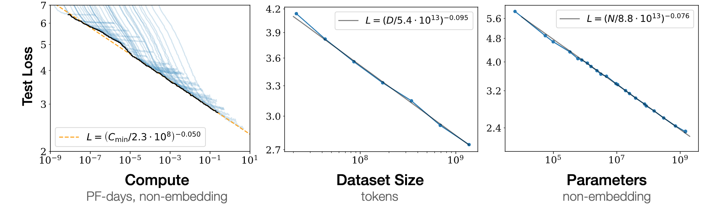
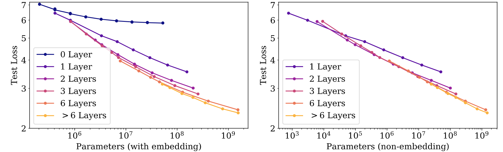
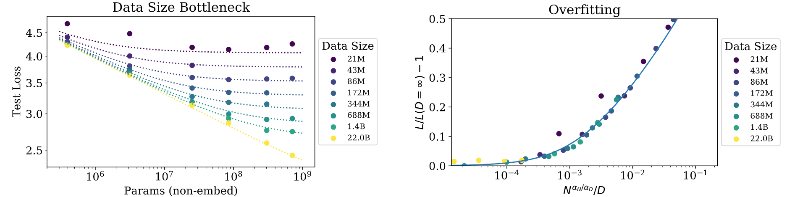
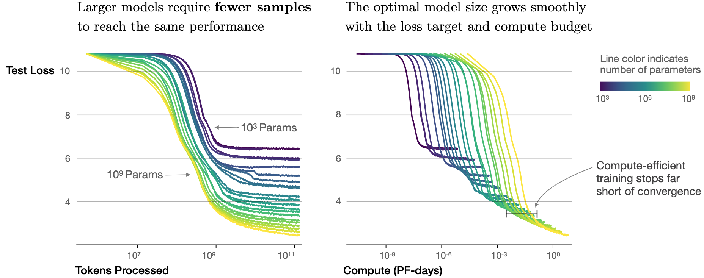
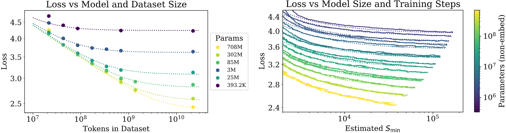

# 前言

- 论文源地址：[Scaling Laws for Neural Language Models](https://arxiv.org/abs/2001.08361)

# 语言模型性能研究

本文针对 Transformer 架构的语言模型在交叉熵损失下的经验缩放定律进行了深入探讨。作者通过实证研究发现，语言模型的测试损失随模型大小、数据集大小和用于训练的计算量而扩展为幂律函数（一个量作为另一个量的幂而变化），有些趋势跨越超过 7 个数量级。

这意味着我们可以通过简单的方程控制这些变量之间的关系，这些方程可用于创建最高效的训练配置，以训练非常大的语言模型。此外，在一个较为合理的范围内，其他架构的超参数（比如网络宽度或深度）对模型性能的影响很小。

从实验和推导的方程中可以推断，较大的模型明显具有更高的样本效率 (sample efficiency) ，这意味着大模型可以使用更少的数据并且以更少的优化步骤达到与小模型相同的性能水平。因此，最佳计算效率训练涉及在相对适量的数据上训练非常大的模型，并在收敛之前就显著停止。

# 实验要素

为了研究语言模型缩放规律，作者使用不同的影响因素训练各种模型，包括：

- Model size (N) ：模型大小，大小从 768 到 15 亿个非嵌入层的参数不等。

- Dataset size (D) ：数据集大小，从 2200 万到 230 亿个 token 不等。

- Model shape：模型形状，包括深度、宽度、注意力头和前馈维度。

- Context length：上下文长度，多数为 1024 ，也有一些较短上下文的实验。

- Batch size：批次大小，多数为 $`2^{19}`$，也有一些变化用以测量关键批次大小。以关键批量大小进行训练可在时间和计算效率之间提供大致最佳的折衷方案。关键批次大小 $`B_{crit}(L) = \frac{B^{*}}{L^{\frac{1}{\alpha_{B}}}} \;, \quad B^{*} \sim 2 \cdot 10^{8} \; tokens, \quad \alpha_{B} \sim 0.21`$ 。

作者还定义了训练相关的变量：

- 设 L 为测试交叉熵损失。
- 设 C 为用于训练模型的计算量。

# 主要发现

## 1. 性能在很大程度上取决于模型规模，而弱则取决于模型形状

作者在此探讨了语言模型的性能与其规模 (scale) 和形态 (shape) 之间的关系。研究发现，模型的性能高度依赖于模型的规模，而规模则由模型的参数量 N（不包括嵌入层参数）、数据集的大小 D 以及用于训练的计算量 C 三个因素所构成。

然而，在合理的范围内，性能对模型中其他架构的超参数（如深度与宽度）依赖程度较弱。这意味着，对于相同的非嵌入层参数数量，模型的性能在很大程度上是恒定的，尽管模型的深度、宽度、注意力头数以及前馈网络的维度等超参数可能会有所不同。

具体来说，模型的性能在固定非嵌入层参数总数的情况下，对模型的形状变化反应不大。例如，模型的长宽比可以在很大范围内变化，同时对性能的影响却很小。另外，对于那些少于两层或者具有极端 “深宽比” 的模型，它们的表现有可能会显著偏离这一趋势。

个人认为，作者的这一结论对于设计和优化大型语言模型具有重要意义，因为它表明在给定参数数量的情况下，模型的具体架构细节可能不如整体规模重要。这为开发高性能语言模型提供了指导原则，即重点应放在增加模型的整体规模而不是微调其架构特性。

## 2. 平滑幂律

当不存在其他两个缩放因素的限制时，模型的性能与三个缩放因素（参数量 N、数据集大小 D、计算量 C）中的每一个都具有幂律关系，并且两者之间的变化趋势跨越六个数量级以上，如图 1 所示：

<I><b>图 1 ：随着用于训练的计算量、数据集大小和模型大小的增加，语言模型的性能会线性提高。为了获得最佳性能，图中 3 个因素必须同时放大。</b></I>

作者区分了嵌入层和非嵌入层的参数，因为它们的大小与模型性能的相关性不同。当包括嵌入层参数时，性能似乎在很大程度上取决于层数以及参数数量。当排除嵌入层参数时，具有不同层数深度的模型，其性能会收敛到一个相似的趋势，如图 2 所示：

<I><b>图 2 ：（左图）当包含嵌入参数时，性能似乎在很大程度上取决于层数以及参数数。（右图）排除嵌入参数时，具有不同深度的模型的性能会收敛到一个趋势。</b></I>

总结来说，只要模型的参数量 N 、数据集大小 D 和计算量 C 三个因素同时扩大，模型性能就会平滑提升（近似线性）。而当参数量 N 和数据集 D 中的任一因素固定而只增加另一因素则会导致边际效益递减。

个人认为，这些发现为理解语言模型如何随规模变化而表现提供了有价值的洞见，并且对于如何在给定固定计算预算 (compute budget) 时，最优地分配这些资源来实现最大化模型性能提供了思路。

## 3. 过拟合的普遍性

作者发现只要同时扩大参数量 N 和 数据集 D 的规模，模型性能就会得到可预测的提高，但如果模型大小 N 或数据集大小 D 保持其中一个不变而扩大另一个，则性能会进入收益递减的状态，如图 3 所示：

<I><b>图 3 ：提前停止的测试损失可预测地取决于数据集大小 D 和模型大小 N。（左图）对于较大的数据集 D，模型性能是参数量 N 中的直线幂律。对于较小的固定数据集 D，模型性能则会随着参数量 N 的增加而停止提高，并且开始出现过拟合。（右图）过拟合的程度主要取决于参数量 N 和数据集 D 之间的关系。</b></I>

作者还发现这种性能损失可预测地取决于比率 $\frac{N^{0.74}}{D}$，因此，每当我们将模型大小扩大 8 倍时，我们只需要将数据增加大约 5 倍就基本可以避免过拟合。

此外，如果训练过程不重复使用任何数据，那么随着计算资源的增加，数据集大小 D 将以较慢的速度增长。这表明，即使训练过程从未重复使用任何数据，计算高效的训练最终仍可能遇到过拟合的问题。

当数据集成为瓶颈时（即发生过拟合），损失会随着数据集大小的增加而以D的负0.095次方的比例减少。这意味着一旦数据成为限制因素，损失值将随着计算资源的增加而减少。然而，这一趋势最终将与数据受限条件下的损失减少趋势相交。交点处表示了一个临界点，在这一点之后，模型规模的增加将不再带来显著的效果改进，这可能是由于自然语言数据中的可靠信息已经被充分提取。

总结来说，作者在此阐述了模型规模与数据集大小之间的关系，以及如何避免过拟合，同时探讨了在特定条件下模型性能达到饱和的可能性。

## 4. 训练的普遍性

训练曲线同样遵循可预测的幂律，其参数大致与模型大小无关。通过推断训练曲线的早期部分，可以粗略预测如果训练时间更长能达到多少损失值。

因而不论模型的大小如何，训练过程中的损失下降趋势具有一致性，使得可以根据训练初期的数据来预测长期训练的结果。这意味着训练过程中的某些特征是普遍存在的，与具体模型的规模无关，从而使得在实际应用中可以更好地规划训练时间和资源。

## 5. 迁移随着测试性能的增加而提高

作者在此讨论了关于模型在不同分布数据上的迁移能力：当模型在不同于其训练分布的数据上进行评估时，其表现与在训练验证集上的表现呈现出强烈的关联性，只是存在一个大致恒定的损失偏移。

简单来说，这意味着当模型在其训练数据上的表现更好时，它同样也会在新的、不同分布的数据上表现出更好的迁移性能，只是会有一定的性能损失。因此，提高模型在训练集上的表现，可以预期模型在面对新任务或新数据时也能有更好的适应能力。

## 6. 样本效率

大型模型比小型模型具有更高的样本效率，以更少的优化步骤（如图 4 所示）和更少的数据点达到相同的性能水平（图 5 所示）：

<I><b>图 4 ：一系列语言模型的训练运行情况，模型大小从 10^3 到 10^9 个参数（不包括嵌入层）不等。</b></I>

<I><b>图 5 ：（左图）提前停止的测试损失 L(N, D) 随数据集大小 D 和模型大小 N 而变化。（右图）经过初始的瞬变期之后，当以大批量训练时，所有模型大小 N 的学习曲线都可以用一个根据步骤数（Smin）参数化的方程进行拟合。</b></I>

## 7. 收敛效率

当在固定的计算预算 C 内工作，但对模型大小 N 或可用数据 D 没有任何其他限制时，作者通过训练非常大的模型并明显未收敛时停止来获得最佳性能。

这是因为大型模型相比小型模型更能高效地利用样本，在达到相同的性能水平时，大型模型所需要的优化步骤和数据点都更少。**换言之，从计算效率的角度来看，训练大型模型比训练小型模型直到收敛更为高效，因为随着计算量的增加，所需的数据量的增长速度非常缓慢。**

这一结论意味着在实际操作中，我们应当优先考虑训练更大的模型，并且不需要等到训练彻底完成就可以停止，以便在同等计算成本下获得更好的模型性能。

## 8. 最优批次大小

就模型训练而言，理想的批次大小基本也是损失值的一个幂函数。对于研究中能够训练的最大模型而言，在收敛时批次大小大约为 1~2 百万个 token 。这暗示了随着模型规模的增大，为了保持训练的有效性，批次大小也应当相应地增加。实际上，批次大小的选择应当基于对梯度噪声尺度的测量来决定，这对于确保训练过程的稳定性与效率至关重要。

# 结论与思考

在本文中，我们了解了语言模型性能与模型大小、模型形状和计算预算之间的关系。这些关系可用于推导出我们想要训练的固定大型语言模型的最佳有效计算预算，反之亦然，在给定固定计算预算的情况下，推导出最佳有效模型（就模型大小和形状而言）进行训练。
